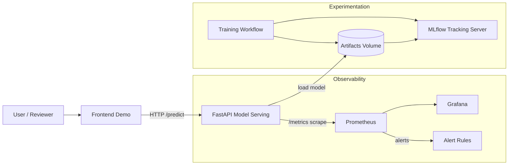
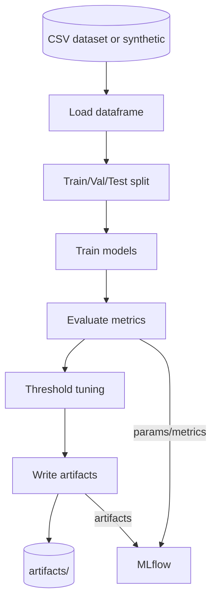
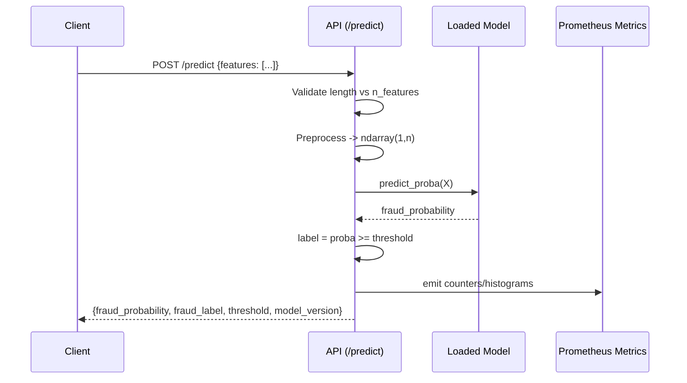

# Architecture

This document describes the end-to-end design of the fraud detection ML system: components, data flows, artifacts, monitoring/alerting, and key technology decisions.

## High-Level System



### Responsibilities
- **Frontend** (`frontend/`): simple UI calling the API and rendering results.
- **API** (`src/api/main.py`): validates input, loads model artifact, produces probability + label, emits Prometheus metrics.
- **Artifacts** (`artifacts/`): model binary + metadata + metric reports.
- **MLflow**: tracks params/metrics/artifacts for experiments (Compose service).
- **Prometheus**: scrapes `/metrics` and evaluates alert rules.
- **Grafana**: dashboards for API + model-serving health signals.

## Data Flows

### Training Flow


Key outputs:
- `artifacts/model.joblib`: model/pipeline artifact loadable by the API
- `artifacts/model_info.json`: `model_version`, `threshold`, `n_features`
- `artifacts/metrics_report.json`: evaluation report for submission evidence

### Inference Flow


### Monitoring Flow
```mermaid
flowchart LR
  API[FastAPI /metrics] -->|scrape| PROM[Prometheus]
  PROM -->|dashboards| GRAF[Grafana]
  PROM -->|evaluate rules| RULES[alerts.yml]
  RULES -->|fires| NOTIF[Alert channel (demo: Prom UI)]
```

## Observability Design

### Metrics emitted by the API
- **Request count**: `api_requests_total{endpoint,method,http_status}`
- **Latency histogram**: `api_request_latency_seconds_bucket{endpoint,method,...}`
- **Prediction counts**: `fraud_predictions_total{label}`
- **Score distribution (avg)**: `fraud_scores_sum_total` / `fraud_scores_count_total`

### Alerts (Prometheus rules)
Alerts are evaluated in Prometheus and visible in the Prometheus UI:
- High 5xx error rate
- High p95 latency
- Prediction rate anomaly (too low or too high)

## Technology Stack and Trade-offs

### Serving (FastAPI + Uvicorn)
- Pros: simple, typed schema via Pydantic, built-in OpenAPI, easy metrics endpoint.
- Trade-offs: no auth/rate-limit by default (documented as future work).

### Model training (scikit-learn + LightGBM fallback)
- Pros: strong baseline models for tabular data; LightGBM typically improves PR-AUC on imbalanced fraud datasets.
- Trade-offs: native dependencies (LightGBM wheels) can complicate CI; training is offline batch workflow (not streaming).

### Experiment tracking (MLflow)
- Pros: standard MLOps tool for metrics/params/artifacts; supports versioning and reproducibility.
- Trade-offs: local file backend is simplest but not multi-user; production would use remote store.

### Monitoring (Prometheus + Grafana)
- Pros: standard, composable, works well with FastAPI + prometheus_client.
- Trade-offs: does not detect model drift automatically; drift monitoring is documented as future work.

## Artifact Strategy and Versioning
- The serving API loads a single model artifact path (`MODEL_PATH`).
- Model metadata (`model_info.json`) defines:
  - `threshold`: business-calibrated operating point
  - `model_version`: version string used in responses
  - `n_features`: prevents silent feature mismatch at inference

## Security and Production Notes (out of scope for demo)
- Add auth (API keys/JWT), rate limiting, and request logging redaction.
- Use a secure artifact store, model signing, and controlled rollout with canary/A-B tests.
- Add drift detection (e.g., Evidently) and automated retraining triggers.
