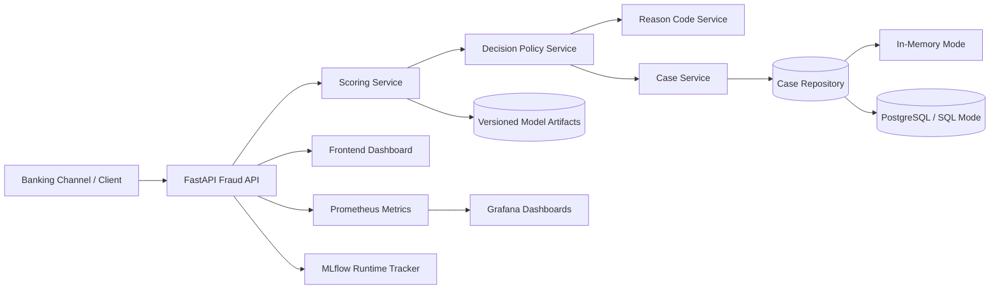
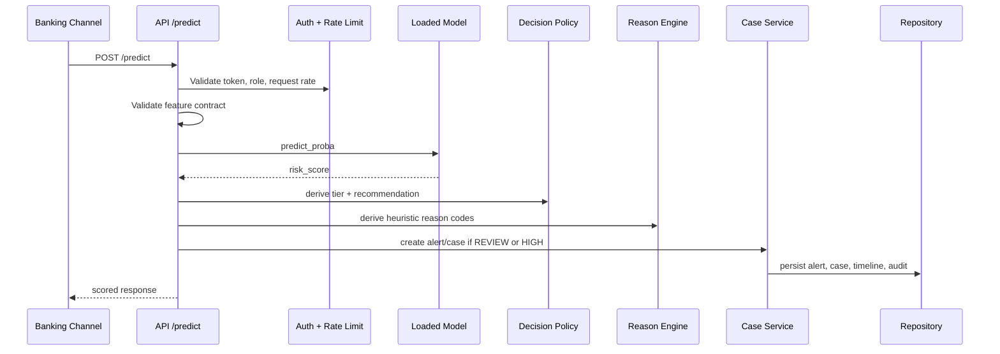
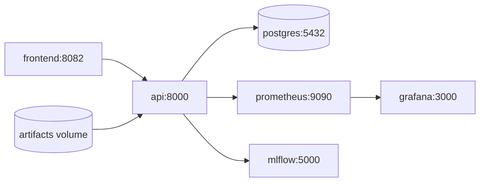

# Architecture

This document describes the current implemented architecture of the Real-Time Banking Fraud Detection and Decision Support System. It is aligned to the repository as it exists now, including configurable SQL persistence, token-based access control, Prometheus/Grafana observability, MLflow runtime tracking, and Docker Compose deployment.

## 1. Architectural Intent

The system is intentionally structured as a decision-support platform rather than a pure classifier demo.

- ML scoring layer: produces `risk_score` from transaction features.
- Decision policy layer: converts score into `risk_tier` and `decision_recommendation`.
- Workflow layer: creates and manages alerts, cases, and timelines for analyst operations.
- Observability layer: exposes system and operational metrics to Prometheus, Grafana, and MLflow.
- Deployment layer: packages API, frontend, PostgreSQL, Prometheus, Grafana, and MLflow into one local stack.

The design goal is to preserve a clean separation between prediction, decision policy, and case operations so that the repository can be explained, tested, and evolved without turning into a monolith.

## 2. High-Level Component View

## 3. Runtime Transaction Flow

## 4. Request and Error Handling

Key edge cases are explicitly handled in the serving layer:

- `422 Unprocessable Entity`: malformed request, invalid feature length, or mutually exclusive input violation.
- `401/403`: missing token or insufficient role for protected endpoints.
- `429`: request rate exceeds configured sliding-window limits.
- `503`: model artifact is unavailable or not loaded.

This matters for grading because the API is not only functional; it is defensive and predictable under failure conditions.

## 5. Main Modules and Code Ownership Areas

### API and schemas

- `src/api/main.py`
- `src/api/schemas.py`

Responsibilities:

- expose HTTP endpoints
- validate request/response contracts
- orchestrate scoring, workflow, and monitoring calls

### Service layer

- `src/services/scoring_service.py`
- `src/services/decision_service.py`
- `src/services/reason_code_service.py`
- `src/services/case_service.py`

Responsibilities:

- execute fraud scoring
- map score to tier and recommendation
- generate operational reason codes
- coordinate alert/case lifecycle logic

### Repository layer

- `src/repositories/factory.py`
- `src/repositories/in_memory_case_repository.py`
- `src/repositories/sql_case_repository.py`

Responsibilities:

- choose persistence mode from environment
- support lightweight demo mode through in-memory storage
- support durable SQL/PostgreSQL-backed storage for alerts, cases, timeline events, and audit events

### Security and controls

- `src/security/auth.py`
- `src/security/rate_limit.py`
- `src/security/audit.py`

Responsibilities:

- token parsing and role mapping
- configurable endpoint protection
- sliding-window rate limiting
- audit event collection

### Monitoring and runtime tracking

- `src/monitoring/metrics.py`
- `src/monitoring/mlflow_runtime_tracker.py`

Responsibilities:

- Prometheus metrics emission
- operational counters and latency measurement
- optional MLflow runtime traffic logging

## 6. Persistence Strategy

The repository supports two persistence modes:

1. `in_memory`
   - fastest path for local demo
   - process-bound storage
   - suitable for rapid testing and presentation rehearsal

2. `postgres` / `sql`
   - durable storage through `SQLCaseRepository`
   - supports stored alerts, cases, timelines, and audit history
   - enabled in the Docker Compose stack via `CASE_REPOSITORY_MODE=postgres`

The abstraction is resolved in `src/repositories/factory.py`, which can fall back to in-memory mode when configured for `auto` and no valid database is available.

## 7. API Surface

### Scoring and metadata

- `POST /predict`
- `GET /health`
- `GET /features/schema`
- `GET /features/random`
- `GET /stream/pull`
- `GET /metrics`

### Alert and case workflow

- `GET /alerts`
- `GET /alerts/{alert_id}`
- `POST /alerts/{alert_id}/status`
- `GET /cases`
- `GET /cases/{case_id}`
- `POST /cases/{case_id}/status`
- `POST /cases/{case_id}/resolve`
- `GET /cases/{case_id}/timeline`
- `GET /audit/events`

### Dataset and internal utilities

- `GET /dataset/samples`
- `GET /internal/dataset/samples`

FastAPI also exposes live OpenAPI/Swagger docs, which strengthens the documentation and API design rubric.

## 8. Security and Access Model

The current implementation includes configurable, token-based controls:

- `API_AUTH_ENABLED` toggles authentication
- `API_TOKENS` maps tokens to roles
- role checks protect protected endpoints
- rate limiting is enforced by middleware
- audit events provide traceable operational history

This is stronger than an unprotected demo API, but it is still not equivalent to enterprise IAM, secret rotation, or bank-grade identity governance.

## 9. Observability and Monitoring

Prometheus metrics include both technical and operational visibility:

- request count and latency
- fraud prediction totals
- `risk_tier` and decision-recommendation distributions
- alert and case totals
- case-status distributions
- review queue size
- confirmed-fraud and false-positive counts

Prometheus alert rules cover:

- API 5xx rate
- p95 latency
- review queue backlog
- traffic anomalies
- false-positive spikes

Grafana dashboards visualize these metrics for live presentation and operations review. MLflow runtime tracking adds a second observability path focused on traffic and scoring behavior over time.

## 10. Deployment Topology

The Docker Compose stack includes:

- `postgres`
- `api`
- `frontend`
- `mlflow`
- `prometheus`
- `grafana`

Health checks are configured for PostgreSQL, the API, and the frontend. CI also validates Docker image builds and Compose configuration.

## 11. Technology Decisions and Trade-Offs

| Decision | Why it was chosen | Trade-off |
|---|---|---|
| FastAPI | Typed schemas, automatic OpenAPI docs, strong input validation | More structure than a minimal Flask service |
| Logistic regression as promoted model | Best validation PR-AUC and better review-tier recall under the current top-K policy | Less expressive than tree ensembles |
| Threshold-based decision policy | Matches analyst-capacity constraints instead of pretending score is a calibrated probability | Thresholds must be explained carefully |
| Repository abstraction | Supports both demo simplicity and upgrade path to durable storage | Extra implementation complexity |
| Prometheus + Grafana + MLflow | Strong grading evidence for monitoring and MLOps | More services to coordinate in demo |

## 12. Honest Limitations

Implemented but still limited:

- reason codes are heuristic, not causal explanations
- the benchmark dataset uses anonymized PCA-style features rather than real banking features
- token auth is practical for demo but not enterprise-grade IAM
- some runtime tracking paths have lighter direct unit coverage than the core API and scoring paths

Not implemented yet:

- drift detection and automated retraining
- full regulatory controls and approval workflow
- richer feature sources such as device, merchant, and account-network telemetry

## 13. Source of Truth

For the full grading-aligned narrative and evidence map, use:

- `README.md`
- `CONTRIBUTING.md`
- `latex/COMPLETE_FRAUD_DETECTION_REPORT.tex`
- `latex/COMPLETE_FRAUD_DETECTION_REPORT.pdf`
