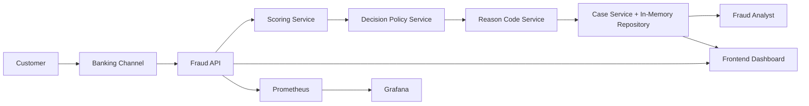
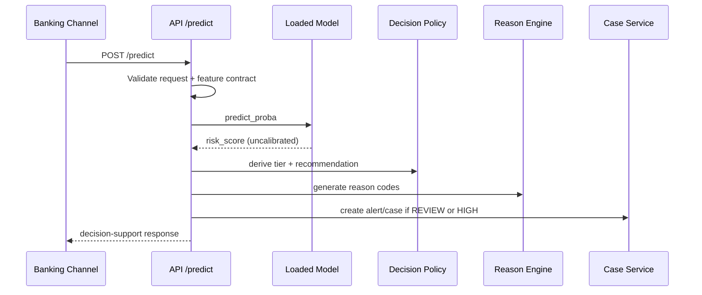
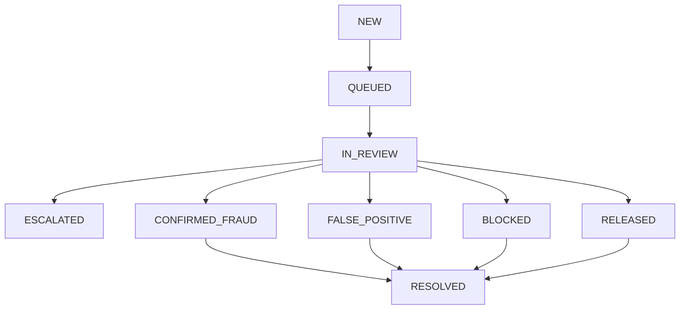
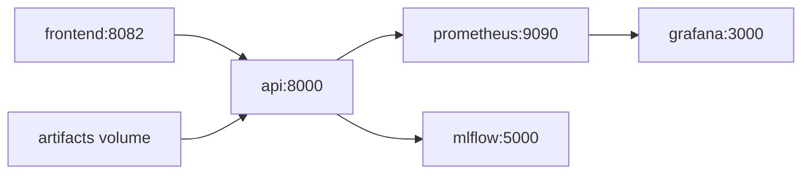

# Architecture

This document describes the current implemented architecture of the Real-Time Banking Fraud Detection and Decision Support System.

## 1. Architectural Intent

The system separates ML scoring from decision operations:
- Risk scoring layer: model inference returns uncalibrated ranking score.
- Decision policy layer: maps score to tier and recommendation.
- Case operations layer: creates and tracks alerts/cases for analyst workflow.

## 2. Actor and Component View

## 3. Runtime Transaction Flow

## 4. Case Lifecycle

## 5. Timeline Event Model

Timeline events recorded per case include:
- TRANSACTION_RECEIVED
- RISK_SCORED
- FLAGGED
- ALERT_CREATED
- CASE_ASSIGNED
- INVESTIGATION_STARTED
- CONFIRMED_FRAUD
- FALSE_POSITIVE
- CASE_CLOSED

## 6. Module Layout

- API and schemas:
  - `src/api/main.py`
  - `src/api/schemas.py`
- Service layer:
  - `src/services/scoring_service.py`
  - `src/services/decision_service.py`
  - `src/services/reason_code_service.py`
  - `src/services/case_service.py`
- Repository layer:
  - `src/repositories/in_memory_case_repository.py`
- Monitoring:
  - `src/monitoring/metrics.py`

## 7. API Surface

### Scoring and metadata
- `POST /predict`
- `GET /health`
- `GET /stream/pull`
- `GET /metrics`

### Case operations
- `GET /alerts`
- `GET /alerts/{alert_id}`
- `POST /alerts/{alert_id}/status`
- `GET /cases`
- `GET /cases/{case_id}`
- `POST /cases/{case_id}/status`
- `POST /cases/{case_id}/resolve`
- `GET /cases/{case_id}/timeline`

## 8. Monitoring Design

Metrics include both technical and operational views:
- `api_requests_total`
- `api_request_latency_seconds`
- `fraud_predictions_total`
- `risk_tier_total`
- `decision_recommendations_total`
- `fraud_alerts_total`
- `fraud_cases_total`
- `fraud_case_status_total`
- `review_queue_size`
- `confirmed_fraud_total`
- `false_positive_total`

Prometheus alert rules include:
- API 5xx rate
- API p95 latency
- Prediction rate low/high anomalies
- Review queue backlog
- False-positive spike

## 9. Deployment Topology

## 10. Honest Limitations

Implemented but demo-level:
- Alert/case persistence is in-memory and process-bound.

Not implemented yet:
- Durable DB-backed case store
- Auth/RBAC and audit trails
- Streaming bus and exactly-once semantics
- Drift detection and retraining orchestration

## 11. Source of Truth

For the full audit, gap matrix, and staged roadmap, see:
- `docs/FINAL_DECISION_SUPPORT_UPGRADE_REPORT.md`
