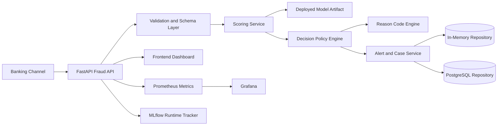
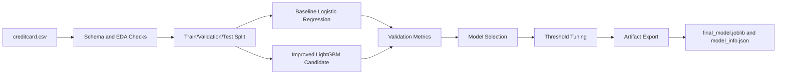
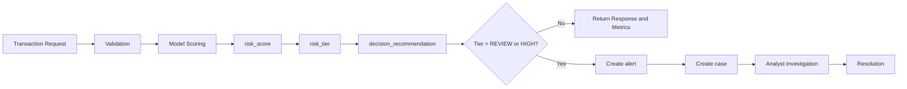
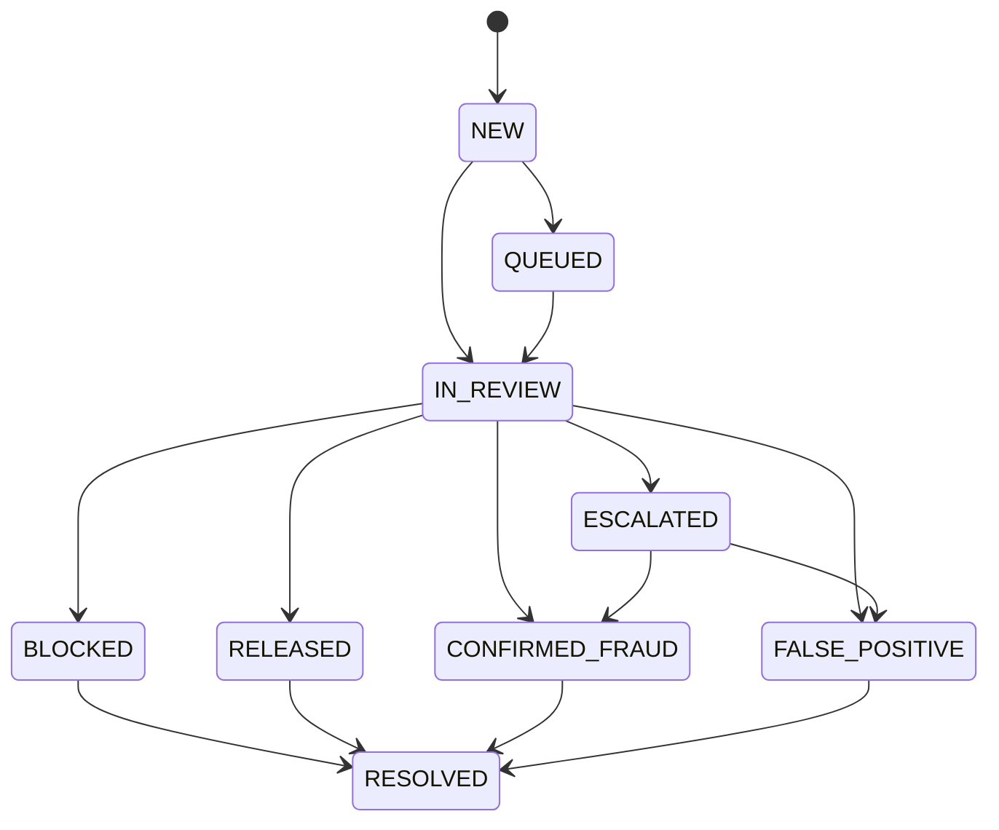
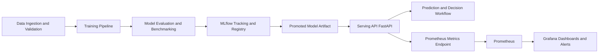
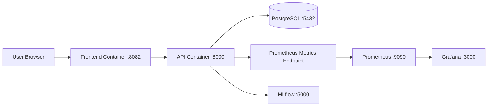

<!-- markdownlint-disable MD025 MD032 MD013 MD012 -->

# 1. Executive Summary

The Real-Time Banking Transaction Fraud Detection and Decision Support System is an end-to-end platform that transforms transaction inputs into operational fraud-handling outcomes. Rather than acting as a standalone classifier, the system combines machine learning inference, threshold-based policy logic, analyst-facing workflow support, alert and case generation, investigation timelines, operational monitoring, and deployment assets into one coherent fraud decision-support system.

The project matters because banking fraud is not only a modeling problem. Fraud operations must balance fraud loss prevention, customer friction, analyst workload, and governance requirements. A technically strong model is insufficient if it cannot be translated into actionable decisions, review queues, auditable case handling, and observable operational behavior. This project addresses that broader operational need.

What is implemented in the repository today:
- artifact-backed model loading and transaction scoring
- `risk_score`, `risk_tier`, and `decision_recommendation` generation
- alert and case creation for flagged transactions
- case lifecycle transitions and investigation timelines
- a FastAPI backend with explicit request and response contracts
- a browser-based analyst dashboard
- Prometheus metrics, Grafana provisioning, and MLflow runtime tracking hooks
- Docker Compose deployment assets with PostgreSQL, API, frontend, Prometheus, Grafana, and MLflow services

What remains limited or incomplete:
- the deployed `risk_score` is uncalibrated and must be interpreted as a ranking signal, not a calibrated fraud probability
- fairness validation is limited by the source dataset
- reason codes are heuristic and operational rather than causal
- not every deployment path has been re-verified in the current environment
- some automated tests are blocked by local Windows temporary-directory permission issues rather than application failures

The result is a technically meaningful and operationally useful project for academic submission, demonstration, and defense. It is strong as a decision-support prototype and system report, while still requiring production hardening before any real banking deployment.

# 2. Introduction

Banking transaction fraud is a high-impact problem because fraudulent activity occurs at scale, evolves quickly, and imposes direct and indirect costs on financial institutions. Direct costs include monetary loss, operational investigation cost, reimbursement expense, and downstream remediation work. Indirect costs include customer dissatisfaction, trust erosion, regulatory attention, and reputational damage.

Real-time handling matters because delayed fraud response reduces the opportunity to block or contain suspicious activity. In many banking contexts, the time window for useful intervention is narrow. Transactions that are not flagged early may settle, cascade into additional fraudulent activity, or trigger more costly incident handling.

Pure rule-based systems remain useful in fraud operations, but they are limited. Static rules often struggle to balance sensitivity and precision across changing traffic patterns, especially under severe class imbalance. They can also produce excessive false positives, which overload analysts and increase customer friction. Machine learning helps by ranking transactions based on learned patterns rather than relying only on manually maintained rules.

However, model output alone does not solve the operational problem. Once a transaction is identified as suspicious, the institution still needs to decide whether to allow it, step up authentication, hold it, block it, or send it to manual review. Analysts need an alert, a case, a timeline of decisions and updates, and system visibility into workload and outcomes. This report therefore frames the project as a real-time banking transaction fraud detection and decision-support system, not merely a fraud classification model.

# 3. Problem Definition

The project addresses real-time banking transaction fraud detection under class imbalance and operational constraints.

The core technical difficulty is that fraud is rare relative to legitimate activity. In the project dataset, fraud prevalence is approximately 0.17 percent. This means a model can appear strong under weak metrics while still being operationally poor. Accuracy is not a sufficient measure because it obscures how well the system identifies the rare cases that matter.

The operational difficulty is that classification mistakes have asymmetric costs:
- false negatives allow fraud loss to proceed
- false positives generate customer friction and manual investigation cost
- overly broad review policies can overwhelm analysts
- overly narrow thresholds can miss actionable fraud

For that reason, the project defines the problem more broadly than binary classification. The system must convert incoming transaction data into operationally useful outputs:
- `risk_score`
- `risk_tier`
- `decision_recommendation`
- `alert`
- `case`

A decision-support system is preferable to raw binary classification because banking operations require prioritization, escalation, traceability, and human review. A binary label alone does not tell the bank whether to intervene immediately, request additional verification, or place the transaction into an analyst workflow.

# 4. Business Context and Operational Needs

Fraud detection systems exist to reduce business loss while preserving a workable customer experience. A bank faces several simultaneous pressures:
- prevent fraud loss quickly enough to be operationally useful
- avoid blocking legitimate customer activity unnecessarily
- keep analyst workload within manageable review capacity
- produce auditable records of why decisions were taken
- support governance and supervisory scrutiny when necessary

Queue prioritization is central to this problem. Analyst teams cannot manually investigate every scored transaction. Thresholds and tiers therefore serve a business purpose: they concentrate human attention on the subset of transactions most likely to justify review or intervention. In this context, PR-AUC matters not only as a statistical metric but because queue precision matters operationally. A poorly tuned review queue wastes analyst time and increases customer friction without corresponding fraud benefit.

Manual review carries real cost. Analysts need structured investigation support:
- an `alert` that identifies a suspicious event
- a `case` that persists workflow state
- a case lifecycle that reflects current handling status
- an investigation timeline that supports traceability and auditability
- reason-code style context that supports quick interpretation

Governance and auditability also matter. In banking operations, institutions need to demonstrate what happened, who changed a case, and how a transaction moved from model output to business action. The project's case lifecycle, investigation timeline, audit events, and monitoring metrics address this requirement at a prototype but operationally meaningful level.

The system therefore solves a real banking operations problem: not just "detect fraud," but "translate transaction risk into controlled, observable, reviewable operational action."

# 5. Project Scope

The project scope is intentionally broader than a model benchmark and narrower than a production banking platform.

Included in scope:
- fraud risk scoring from transaction feature vectors
- explicit `risk_tier` and `decision_recommendation` mapping
- alert and case creation for suspicious transactions
- case lifecycle management and investigation timeline exposure
- frontend support for analyst workflow
- operational monitoring instrumentation
- local deployment assets using Docker Compose
- model training, evaluation, artifact generation, and metadata export

Out of scope:
- integration with live core banking transaction streams
- enterprise identity management and secret vault integration
- production-grade model governance, approval workflows, and retraining automation
- direct use of rich real-bank telemetry such as device graphs, merchant history, account network analysis, or customer behavior baselines
- full regulatory compliance packaging for a real bank deployment

Demo-level or prototype-grade areas:
- in-memory persistence fallback when no SQL repository is configured
- heuristic reason codes
- locally configured analyst tokens and admin credentials
- static-file-served frontend interaction model

Future work areas:
- stronger authentication and secrets management
- richer transaction features and model calibration
- drift detection and closed-loop learning from case outcomes
- broader deployment verification and production runbooks

Assumptions:
- transaction requests provide either an ordered feature vector or a feature map aligned to the model metadata
- the deployed artifact metadata remains the source of truth for thresholds and model identity
- analysts interpret outputs as decision support, not as final proof of fraud

# 6. Stakeholders and Actors

The system involves the following stakeholders and runtime actors.

Customer:
- the bank customer initiating a legitimate or fraudulent transaction
- indirectly affected by false positives, holds, blocks, and step-up authentication

Banking Channel:
- the upstream transaction source such as mobile app, internet banking, API, ATM, branch, or card-not-present channel
- provides the transaction context that the system evaluates

Fraud API:
- the backend application that validates requests, executes scoring, applies decision policy, creates workflow records, and exposes operational endpoints

Fraud Scoring Engine:
- the model-loading and inference layer that produces `risk_score`
- implemented through model artifact loading and scoring services

Decision Policy Engine:
- converts `risk_score` into `risk_tier` and `decision_recommendation`
- makes operational handling explicit rather than leaving interpretation implicit

Fraud Analyst:
- reviews `alert` and `case` records
- updates case status, adds notes, and resolves investigations
- uses the frontend dashboard and case APIs to progress fraud workflow decisions

Monitoring / Operations:
- observes system health, request volume, queue size, prediction distribution, alert creation, and case outcomes
- uses Prometheus and Grafana assets to monitor operational behavior

ML / Model Ops:
- manages training workflows, artifacts, threshold metadata, and runtime model selection
- uses artifact outputs and MLflow-related components to support model lifecycle visibility

# 7. Functional Requirements

The following functional requirements are stated in SPS style and aligned to the current repository implementation.

- FR-1: The system shall accept transaction features and return `risk_score`, `risk_tier`, `action`, and `decision_recommendation`.
- FR-2: The system shall document score semantics as uncalibrated risk ranking, not calibrated probability.
- FR-3: The system shall map scores to explicit decision tiers using threshold metadata.
- FR-4: The system shall apply policy-level actions: `LOW -> ALLOW`, `REVIEW -> STEP_UP_AUTH or MANUAL_REVIEW`, `HIGH -> HOLD or BLOCK`.
- FR-5: The system shall ingest the Kaggle credit card fraud dataset and validate schema before training.
- FR-6: The system shall split data into train, validation, and test partitions using stratification.
- FR-7: The system shall train baseline and improved candidate models and compare them.
- FR-8: The system shall tune decision thresholds using top-K review-rate policy.
- FR-9: The system shall generate reproducible model artifacts and model metadata.
- FR-10: The system shall support `/predict` using either `features` or `features_by_name`.
- FR-11: The system shall expose `/health` with model and threshold metadata.
- FR-12: The system shall expose `/metrics` in Prometheus format.
- FR-13: The system shall expose `/features/schema` for feature contract discovery.
- FR-14: The system shall expose `/stream/pull` for scored event simulation.
- FR-15: The system shall return deterministic HTTP 422 validation errors for malformed inputs.
- FR-16: The system shall return HTTP 503 when no model artifact is loaded.
- FR-17: The system shall expose alert and case workflow endpoints for investigation lifecycle handling.
- FR-18: The system shall enforce endpoint access with configurable authentication and role checks.
- FR-19: The system shall expose audit event listing for governance visibility.
- FR-20: The system shall enforce mutually exclusive input mode (`features` XOR `features_by_name`).
- FR-21: The system shall return decision explanation fields including recommendation and reason summary.
- FR-22: The system shall support case timeline retrieval for investigations.
- FR-23: The system shall expose internal labeled sample endpoints behind token validation.
- FR-24: The system shall emit Prometheus metrics for requests, latency, and prediction outcomes.
- FR-25: The system shall support Prometheus scraping and Grafana dashboard visualization.
- FR-26: The system shall evaluate configured Prometheus alert rules.
- FR-27: The system shall track queue and case workflow metrics (for example review queue size and case status).
- FR-28: The system shall expose runtime tracking status through health metadata.
- FR-29: The system shall support local deployment using Docker Compose.

# 8. Non-Functional Requirements

The non-functional requirements are defined as follows.

Performance:
- single-request scoring should remain low latency for local/demo operations
- monitoring instrumentation should not materially block request handling
- model startup and readiness should complete within practical local runtime targets

Reliability:
- invalid inputs shall produce deterministic validation errors
- case state transitions shall preserve coherent workflow state
- the API shall expose health information and model-loading status

Scalability:
- the repository shall support an upgrade path from in-memory demo storage to SQL-backed persistence
- deployment topology shall separate API, persistence, and monitoring services
- services should be container-friendly and horizontally extensible

Observability:
- request counts, latency, prediction tiers, case metrics, and review queue size shall be measurable
- monitoring outputs shall support both technical and operational visibility

Maintainability:
- the backend shall remain modular across API, services, repositories, and monitoring layers
- explicit schema models shall define public API contracts
- the architecture should preserve service separation for scoring, policy, and workflow modules

Portability:
- local development should be supported on Windows and Linux environments
- deployment should be reproducible through Docker Compose
- environment-variable based configuration shall control runtime behavior

Security:
- the system shall support token authentication, role-based access control, and rate limiting
- internal labeled-data access shall remain protected
- the current implementation is not a full enterprise security platform and requires further hardening for production use

Usability:
- analyst-facing views shall expose queue context, decision support fields, and lifecycle actions with minimal navigation
- analyst workflows should keep key actions (status update, resolve) low-friction

Testability:
- the system shall include unit, integration, data, and model tests
- frontend-to-API smoke validation shall be available through dedicated scripts
- deterministic behavior should be preserved where seeded workflows are used

# 9. System Overview

The end-to-end operational flow is:

Transaction -> Validation -> Feature Preparation -> Risk Scoring -> Decision Policy -> Alert Generation -> Case Creation -> Investigation -> Resolution -> Monitoring -> Future Feedback Loop

In more detail:
1. A transaction arrives from a banking channel.
2. The API validates request structure, feature length, numeric integrity, and optional metadata.
3. The backend resolves the feature vector expected by the deployed model artifact.
4. The scoring layer produces `risk_score`.
5. The decision layer maps `risk_score` to `risk_tier` and `decision_recommendation`.
6. If the transaction is suspicious enough to require review or intervention, the system creates an `alert` and a linked `case`.
7. The case begins an investigation lifecycle, and timeline events are recorded.
8. Analysts inspect the case, review context, update status, and store the final resolution.
9. Monitoring components expose operational behavior through metrics and dashboards.
10. In future extensions, resolved cases can become part of a feedback loop for retraining or policy refinement.

This structure reflects the project's central design principle: model output is not the end of the system; it is an input to operational fraud handling.

# 10. System Architecture

The architecture integrates data artifacts, an ML pipeline, a decision-support backend, an analyst frontend, monitoring assets, and a deployment stack.

## 10.1 Overall Architecture Diagram



## 10.2 Architecture Narrative

Dataset and artifacts:
- training data is loaded from the credit-card fraud dataset
- the pipeline exports trained models, metadata, figures, and reports under `artifacts/`

ML pipeline:
- trains baseline and improved candidate models
- selects the deployed model based on validation evidence
- exports threshold metadata and score semantics for runtime use

Backend API:
- validates requests
- performs scoring
- applies decision logic
- creates workflow objects
- exposes analyst and monitoring endpoints

Decision layer:
- maps ranking outputs into operational handling tiers and recommendations
- provides the business bridge between model inference and workflow action

Reason code engine:
- generates heuristic operational explanations
- improves analyst interpretation speed without claiming causal explanation

Alert and case services:
- create alerts and cases for flagged transactions
- support case lifecycle transitions and timeline access

Frontend:
- provides a live dashboard and review-oriented interaction surface for analysts

Monitoring:
- captures technical and operational metrics
- supports queue monitoring, traffic visibility, and case outcome tracking

Deployment stack:
- packages API, frontend, PostgreSQL, Prometheus, Grafana, and MLflow in a local Docker Compose topology

## 10.3 ML Pipeline Diagram



## 10.4 Fraud Workflow Diagram



## 10.5 Case Lifecycle Diagram



## 10.6 Data-Training to Serving Architecture

The end-to-end technical delivery flow is explicitly:

Data and Training -> MLflow (experiment tracking, benchmark comparison, model registry/promotion) -> Serving API -> Monitoring



Operational interpretation:
- Data and training produce candidate models and benchmark evidence.
- MLflow is used for experiment lineage, benchmark comparison, and model lifecycle control.
- The promoted artifact is loaded by the serving API for real-time scoring and decisions.
- Monitoring closes the loop with request, latency, decision, and queue-health visibility.

# 11. Repository and Component Mapping

| Folder / Area | Layer | Responsibility | Key Files | Notes |
|---|---|---|---|---|
| `src/` | Core application | Backend logic for scoring, decisions, workflow, monitoring, and security | `src/api/main.py`, `src/services/decision_service.py`, `src/repositories/factory.py` | Main implementation layer |
| `frontend/` | Presentation | Analyst dashboard, API client, review workflow UI | `frontend/index.html`, `frontend/app.js`, `frontend/api-client.js` | Plain JS frontend, backend-integrated |
| `artifacts/` | ML and evidence | Models, figures, benchmark tables, reports, deployment evidence, MLflow data | `artifacts/models/model_info.json`, `artifacts/reports/model_selection_summary.json` | Source of truth for deployed model metadata |
| `deployment/` | Deployment and observability | Dockerfiles, Compose stack, Prometheus, Grafana, MLflow assets | `deployment/docker-compose.yml`, `deployment/prometheus/prometheus.yml`, `deployment/grafana/dashboards/` | Local containerized stack |
| `tests/` | Validation | Unit, data, model, integration, and smoke validation | `tests/integration/`, `tests/unit/`, `tests/verify_system.py` | Some tests currently blocked by environment temp-path issue |
| `.github/workflows/` | CI/CD support | Repository automation definitions | `ci.yml`, `docker.yml` | Workflow definitions exist; runtime behavior not re-verified here |
| `docs/` | Documentation area | Legacy project documentation location | directory retained | Legacy content has been superseded by `MASTER_REPORT.md` |

## 11.1 System Components Table

| Component | Type | Responsibility | Business Value | Status |
|---|---|---|---|---|
| Scoring service | Backend service | Produces `risk_score` from transaction features | Enables ranked fraud prioritization | Fully implemented |
| Decision policy engine | Backend service | Maps `risk_score` to `risk_tier` and `decision_recommendation` | Converts model output into operational action | Fully implemented |
| Reason code engine | Backend service | Generates heuristic explanation signals | Supports analyst interpretation speed | Partially implemented |
| Alert service | Workflow service | Creates `alert` objects for suspicious transactions | Enables queue-based handling | Fully implemented |
| Case service | Workflow service | Creates and updates `case` records and lifecycle state | Supports investigation and governance | Fully implemented |
| Timeline service | Workflow feature | Exposes investigation event history | Supports traceability and auditability | Fully implemented |
| Frontend dashboard | UI | Displays stream, cases, and review actions | Supports analyst workflow | Fully implemented |
| Monitoring stack | Operations | Exposes metrics and dashboards | Supports operational monitoring | Fully implemented |
| SQL persistence path | Infrastructure | Supports durable case storage | Supports more realistic operational persistence | Fully implemented |
| In-memory fallback | Demo infrastructure | Supports local/demo case storage | Enables simple local usage | Demo-level |

# 12. Dataset Description

The project uses the Kaggle Credit Card Fraud Detection dataset stored locally at `data/archive/creditcard.csv`.

Dataset characteristics from artifact outputs:
- records: 284,807
- total columns: 31
- model features: 30
- target column: `Class`
- fraud prevalence: 0.001727485630620034

The feature layout includes:
- `Time`
- `V1` to `V28`
- `Amount`
- `Class` as the target variable

The `V1` to `V28` features are PCA-transformed and anonymized. This matters because it improves privacy for the published dataset but reduces domain interpretability. The system can learn ranking behavior from these signals, but feature meaning is not directly translatable into operational business language the way real banking telemetry might be.

The dataset is useful for demonstrating:
- severe fraud rarity
- precision-recall trade-offs
- threshold-based triage logic
- deployment and workflow integration around a trained fraud model

The dataset is limited compared with real banking production data because it lacks:
- customer history
- merchant profiles
- device identity signals
- session and behavioral telemetry
- account network relationships
- rich channel-specific contextual fields

This limitation affects both model realism and explainability.

# 13. Data Challenges

The project faces several data challenges.

Class imbalance:
- fraud is extremely rare, so the learning problem is dominated by legitimate transactions
- this makes threshold choice and PR-oriented evaluation more important than simple accuracy

Limited interpretability:
- the anonymized PCA features support modeling but do not support direct operational storytelling
- this is one reason the project uses heuristic reason codes rather than claiming native model interpretability

Lack of real banking telemetry:
- real fraud platforms often use velocity, device, beneficiary, merchant, account, channel, and network signals
- those fields are largely absent from the dataset, so the system cannot claim production-grade behavioral detection breadth

Synthetic or demo gap:
- the frontend stream and demo flows may rely on sampled or generated transaction payloads
- these are useful for demonstration, but they are not the same as live transaction ingestion from a bank

These challenges justify the project's careful scope definition and its emphasis on honest status labeling.

# 14. Machine Learning Pipeline

The machine learning pipeline is implemented primarily in `src/pipelines/run_model_workflow.py`.

Pipeline stages:
1. load the dataset and validate expected schema
2. perform EDA and data-quality exports
3. split the data into train, validation, and test partitions
4. train a baseline logistic regression pipeline
5. train an improved LightGBM candidate
6. evaluate candidate performance using fraud-appropriate metrics
7. perform threshold sweeps and capacity-driven threshold selection
8. export figures, reports, benchmark tables, model artifacts, and metadata
9. register model version information
10. support MLflow-related experiment and artifact tracking

Recorded split strategy from artifact outputs:
- train rows: 199,364
- validation rows: 42,721
- test rows: 42,722
- random seed: 42

Preprocessing:
- the deployed artifact is a logistic regression pipeline that includes scaling behavior within the pipeline
- runtime scoring uses the loaded artifact directly rather than reconstructing the model logic manually

Baseline model:
- logistic regression pipeline

Improved candidate model:
- LightGBM with tuned parameters recorded in the model selection summary

Threshold tuning:
- the project stores `threshold_review` and `threshold_high`
- threshold selection is explicitly tied to review-capacity assumptions through a `top_k_rate` policy

Artifact export:
- `final_model.joblib`
- model metadata in `model_info.json`
- benchmark and figure outputs under `artifacts/`

Experiment tracking:
- MLflow support is implemented in the repository and in the deployment stack
- runtime MLflow traffic logging is configured in Docker Compose

# 15. Model Evaluation

The project evaluates models using metrics appropriate for highly imbalanced fraud detection.

Metrics used:
- ROC-AUC
- PR-AUC / Average Precision
- precision
- recall
- F1
- confusion matrices
- threshold sweeps

Why PR-AUC matters:
- in fraud operations, most transactions are legitimate
- the bank does not only need a model that ranks fraud above non-fraud globally; it needs a model that yields useful precision in the top-scoring region that drives the review queue
- for that reason, PR-AUC is closer to the operational question of whether analyst effort is concentrated on high-value cases

Why ROC-AUC still matters:
- it remains a useful general ranking metric
- but it can appear strong even when rare-event precision is not operationally acceptable

## 15.1 Model Comparison Table

| Model | Role | Validation PR-AUC | Validation ROC-AUC | Review Threshold | High Threshold | Selection Outcome |
|---|---|---:|---:|---:|---:|---|
| Logistic Regression Pipeline | Baseline and deployed model | 0.6301 | 0.9684 | 0.7391262534904803 | 0.9999047447184487 | Selected for deployment |
| LightGBM Candidate | Improved benchmarked candidate | 0.6289 | 0.9288 | 0.0000003771 | 0.0002998399 | Benchmarked only |

The deployed model is logistic regression. This is a critical implementation-aligned truth because some earlier project materials emphasized LightGBM. The artifact metadata and model selection summary clearly indicate that logistic regression is the final deployed artifact.

## 15.2 Deployed Model Test Metrics

At `threshold_review`:
- precision: 0.1462
- recall: 0.8514
- F1: 0.2495
- ROC-AUC: 0.9652
- PR-AUC: 0.7694

At `threshold_high`:
- precision: 0.8429
- recall: 0.7973
- F1: 0.8194
- ROC-AUC: 0.9652
- PR-AUC: 0.7694

These values support the business framing:
- the `REVIEW` threshold is recall-oriented and suited to analyst triage
- the `HIGH` threshold is high-precision and suited to stronger intervention

# 16. Risk Scoring and Decision Logic

This section is the core operational bridge between ML output and fraud handling.

## 16.1 `risk_score` Semantics

The system exposes `risk_score` as an uncalibrated risk score. The artifact metadata explicitly labels score semantics as `risk_score_uncalibrated`.

This means:
- `risk_score` is a ranking signal
- larger values indicate higher relative concern under the deployed model
- the value should not be interpreted as a calibrated probability of fraud

This distinction is important for academic correctness, business governance, and honest system communication.

## 16.2 Thresholds

The deployed metadata stores two operational thresholds:
- `threshold_review = 0.7391262534904803`
- `threshold_high = 0.9999047447184487`

These thresholds are capacity-driven, not arbitrary. The metadata states that they are chosen under a `top_k_rate` threshold policy:
- review top rate: 1 percent
- high top rate: 0.2 percent

Business implication:
- thresholds exist because analyst capacity is limited
- the review queue must be selective enough to remain workable
- the high-risk tier must remain precise enough to justify strong action

## 16.3 Mapping Logic

```text
risk_score -> risk_tier -> decision_recommendation
```

The mapping implemented in the repository is:
- if `risk_score < threshold_review`, then `risk_tier = LOW`
- if `threshold_review <= risk_score < threshold_high`, then `risk_tier = REVIEW`
- if `risk_score >= threshold_high`, then `risk_tier = HIGH`

Decision recommendation mapping:
- `LOW` -> `ALLOW`
- `REVIEW` -> `STEP_UP_AUTH` for digital channels, otherwise `MANUAL_REVIEW`
- `HIGH` -> `HOLD` by default, or `BLOCK` for sufficiently high transaction amount

Legacy action labels also remain available for compatibility:
- `allow`
- `review`
- `block`

This separation is valuable because it distinguishes:
- model evidence
- operational priority
- business action

# 17. Fraud Workflow and Case Lifecycle

The fraud workflow translates suspicious transaction handling into a structured operational process.

Operational steps:
1. A transaction is scored.
2. If the result falls in a suspicious tier, it is flagged.
3. An `alert` is created.
4. A linked `case` is created.
5. The case status is initialized.
6. An analyst performs an investigation.
7. Timeline events are recorded throughout the workflow.
8. A final case resolution is stored.

## 17.1 Fraud Workflow Summary Table

| Step | System Action | Output | Business Purpose |
|---|---|---|---|
| 1 | Validate request | Clean scoring input | Prevent invalid or misleading decisions |
| 2 | Score transaction | `risk_score` | Rank transaction risk |
| 3 | Apply policy | `risk_tier`, `decision_recommendation` | Translate ML output into operational action |
| 4 | Create alert | `alert` | Surface suspicious transaction for review |
| 5 | Create case | `case` | Persist investigation workflow state |
| 6 | Record timeline | timeline events | Support traceability and auditability |
| 7 | Analyst investigation | notes and status updates | Support human-in-the-loop review |
| 8 | Resolution | final case outcome | Capture operational closure and future feedback value |

## 17.2 Supported Case Statuses

The repository supports these case lifecycle statuses:
- `NEW`
- `QUEUED`
- `IN_REVIEW`
- `ESCALATED`
- `CONFIRMED_FRAUD`
- `FALSE_POSITIVE`
- `BLOCKED`
- `RELEASED`
- `RESOLVED`

Business meaning:
- `NEW` and `QUEUED` support intake and review ordering
- `IN_REVIEW` and `ESCALATED` support investigation handling
- `CONFIRMED_FRAUD` and `FALSE_POSITIVE` support outcome capture
- `BLOCKED` and `RELEASED` reflect action outcomes
- `RESOLVED` closes the case lifecycle

The timeline model preserves event history across creation, scoring, flagging, assignment, and later lifecycle changes. This is important because banking fraud operations need more than a current state; they need a traceable process history.

# 18. Backend System Design

The backend is implemented using FastAPI and organized around explicit schemas and modular services.

Backend design elements:
- FastAPI application lifecycle for model and repository initialization
- request and response schemas defined with typed models
- feature validation before scoring
- dedicated scoring service for inference
- dedicated decision service for `risk_tier` and `decision_recommendation`
- dedicated reason code service for heuristic interpretability
- case service for alert and case handling
- repository abstraction with in-memory and SQL-backed implementations
- configurable auth, RBAC, rate limiting, and audit behavior

Persistence mode:
- local default behavior can fall back to `in_memory_demo`
- SQL persistence is implemented and used in Docker Compose through PostgreSQL

Security features:
- bearer-token or API-key style auth
- roles: `viewer`, `analyst`, `admin`
- role-based dependencies for endpoint protection
- configurable sliding-window rate limiting
- audit-event recording without breaking API response flow

## 18.1 API Endpoint Table

| Method | Endpoint | Purpose | Key Inputs | Key Outputs | Status |
|---|---|---|---|---|---|
| GET | `/health` | Health and model status | none | model status, thresholds, repository mode | Fully implemented |
| GET | `/features/schema` | Feature contract discovery | none | feature names, expected count | Fully implemented |
| GET | `/features/random` | Demo feature generation | optional params | generated features | Fully implemented |
| GET | `/metrics` | Prometheus metrics | none | metrics payload | Fully implemented |
| POST | `/predict` | Score transaction and apply policy | `features` or `features_by_name`, metadata | `risk_score`, `risk_tier`, `decision_recommendation`, alert/case ids | Fully implemented |
| GET | `/stream/pull` | Return already scored stream events | `pace_ms`, `max_events` | scored event list | Fully implemented |
| GET | `/alerts` | List alerts | status, limit | alert list | Fully implemented |
| GET | `/alerts/{alert_id}` | Alert detail | path id | single alert | Fully implemented |
| POST | `/alerts/{alert_id}/status` | Update alert-linked case status | case status, note, actor | updated case | Fully implemented |
| GET | `/cases` | List cases | status, limit | case list | Fully implemented |
| GET | `/cases/{case_id}` | Case detail | path id | case detail | Fully implemented |
| POST | `/cases/{case_id}/status` | Update case status | case status, note, actor | updated case | Fully implemented |
| POST | `/cases/{case_id}/resolve` | Resolve case | resolution, note, actor | resolved case | Fully implemented |
| GET | `/cases/{case_id}/timeline` | Investigation timeline | path id | timeline events | Fully implemented |
| GET | `/audit/events` | Audit event listing | filters | audit event list | Fully implemented |
| GET | `/dataset/samples` | Dataset sample utility | `n`, strategy, seed | unlabeled samples | Fully implemented |
| GET | `/internal/dataset/samples` | Protected labeled sample utility | token, params | labeled samples | Fully implemented |

# 19. Frontend System Design

The frontend is a browser-based dashboard implemented with plain HTML, CSS, and JavaScript. It is not a mock-only interface; it is integrated with the backend APIs.

Frontend design includes:
- connection health polling
- model metadata display
- streaming dashboard view
- case review panel
- display of `risk_score`, `risk_tier`, and `decision_recommendation`
- reason code and summary display
- case timeline inspection
- case status and resolution controls
- pagination and filters for analyst workflow handling

Dashboard behavior:
- the frontend can operate in live mode against the API
- it can consume scored events from the pull-based stream endpoint
- it supports analyst token usage through configurable UI inputs

Analyst workflow support:
- alerts and cases are visible through queue-like review views
- analysts can open cases, inspect status, review timeline context, and update workflow state
- this supports a realistic decision-support interaction pattern rather than a simple model demo screen

Frontend classification:
- backend-integrated: yes
- partial: no, core workflow is integrated
- demo-oriented: yes, in the sense that it supports local operational demonstration
- mock-free or mixed: mostly mock-free for backend-integrated flows, though demo data and local assumptions remain present

This combination makes the frontend suitable for academic demonstration and defense because it shows how model output becomes analyst-facing operational workflow.

# 20. Monitoring and Observability

Fraud systems require observability because operational failure can take several forms:
- API failure or latency problems
- queue overload
- unexpected shifts in scoring distribution
- case workflow bottlenecks
- imbalance between alerts, confirmed fraud, and false positives

Prometheus metrics implemented in the backend include:
- request counters
- request latency histograms
- scored transaction counts by tier
- action and `decision_recommendation` counters
- alert creation counters
- case creation and case status transition counters
- review queue size
- confirmed fraud count
- false positive count
- aggregate score accumulation counters

Grafana dashboards are provisioned in the deployment stack to visualize this data.

MLflow runtime tracking:
- the deployment stack includes runtime MLflow logging configuration for online traffic metrics
- this connects model operations visibility with live API behavior

Operational value:
- request latency metrics support technical reliability
- fraud tier distribution supports drift suspicion or traffic-shape review
- alert and case metrics support workforce planning
- queue size supports escalation and staffing awareness
- confirmed fraud and false positive counters support outcome monitoring and future policy refinement

Monitoring is essential in fraud operations because the system must be managed not only as software, but also as an ongoing operational control process.

# 21. Deployment Architecture

The deployment architecture is defined in `deployment/docker-compose.yml`.

## 21.1 Deployment Topology Diagram



## 21.2 Container Roles

PostgreSQL:
- durable storage for case persistence in Compose mode

API:
- serves scoring, workflow, monitoring, and utility endpoints
- mounts artifacts containing the deployed model

Frontend:
- serves the analyst dashboard as static web assets

MLflow:
- supports experiment and runtime tracking visibility

Prometheus:
- scrapes operational metrics from the API

Grafana:
- visualizes metrics and dashboards

## 21.3 Ports

Default host ports:
- API: `8000`
- frontend: `8082`
- PostgreSQL: `5432`
- MLflow: `5000`
- Prometheus: `9090`
- Grafana: `3000`

## 21.4 Persistence Configuration

In Docker Compose:
- `CASE_REPOSITORY_MODE=postgres`
- PostgreSQL DSN is provided to the API
- automatic migration behavior is enabled

## 21.5 Health Checks

Defined health checks include:
- PostgreSQL readiness check
- API `/health` check
- frontend `index.html` check

## 21.6 Runtime Verification Status

Implemented deployment assets:
- Dockerfiles exist
- Compose topology exists
- health checks are defined
- monitoring stack services are defined

Current status in this report:
- deployment assets are implemented
- repository evidence of prior deployment exists under `artifacts/deploys`
- full live-stack re-verification was not performed during the current report update

This distinction is important to avoid overstating runtime evidence.

# 22. Testing and Validation

The repository includes multiple validation layers.

Unit tests:
- utility and preprocessing behavior

Integration tests:
- API health
- prediction behavior
- stream pull behavior
- alert and case lifecycle workflow
- security behavior
- SQL persistence path

Data tests:
- dataset path handling
- sample loading behavior

Model tests:
- training-artifact and loaded-model validation

Frontend API tests:
- smoke-style validation through `tests/test_frontend_api.py`

System verification script:
- `tests/verify_system.py`

## 22.1 Current Environment Verification

Observed in the current environment:
- a focused run across `tests/unit` and `tests/integration` produced 18 passing tests
- one SQL persistence integration test was blocked by a local Windows `pytest` temporary-directory permission issue
- a broader test run produced 19 passing tests, with the remaining blocked tests failing for the same environment issue rather than assertion failures

## 22.2 What Is Verified

Verified:
- core scoring and prediction endpoints
- backend validation behavior
- alert and case workflow
- stream pull endpoint behavior
- auth, RBAC, and audit behavior in tested paths
- unit-level utility behavior

## 22.3 What Was Blocked

Blocked by environment issues:
- tests that rely on temporary-directory setup affected by Windows permission errors
- complete verification of SQL persistence test path under the current machine conditions

## 22.4 What Remains Unverified in This Report Update

Not re-verified in the current report update:
- full Docker Compose runtime bring-up
- browser-based end-to-end walkthrough
- complete model-test and data-test suite completion under a temp-path-safe environment

The testing narrative is therefore evidence-based and intentionally conservative.

# 23. Responsible AI

Responsible AI in this project is grounded in honest score semantics, human-in-the-loop review, and clear acknowledgment of limitations.

Uncalibrated score semantics:
- `risk_score` is explicitly labeled as uncalibrated
- the system does not claim that score values are calibrated fraud probabilities

Heuristic reason codes:
- the reason code engine provides operational interpretation support
- these outputs are heuristic and policy-informed, not causal explanations

Human-in-the-loop review:
- suspicious outcomes generate `alert` and `case` workflow records
- analysts can inspect, update, and resolve cases
- the system is therefore positioned as a decision-support system rather than an autonomous adjudication engine

Protected-attribute limitations:
- the dataset lacks explicit protected attributes
- direct fairness claims across demographic groups cannot be made from the available data

Fairness limitations:
- slice-based monitoring can be discussed across amount, time, or channel
- but this does not substitute for full fairness assessment on appropriate banking data

Privacy and security notes:
- configurable auth, RBAC, and rate limiting are implemented
- internal labeled-data access is protected
- the project does not yet provide enterprise-grade identity integration, transport controls, or tamper-resistant audit storage

Governance recommendations:
- require policy owner review of thresholds and handling logic
- periodically review false positives and confirmed fraud outcomes
- tighten access controls for production deployment
- use investigation outcomes to improve future model governance and monitoring

# 24. Implementation Status

## 24.1 Fully Implemented

- model artifact loading and inference
- `risk_score`, `risk_tier`, and `decision_recommendation` generation
- reason summary output
- alert and case creation
- case lifecycle status updates
- case timeline exposure
- in-memory and SQL repository implementations
- FastAPI backend and schema contracts
- frontend dashboard with backend integration
- token auth, RBAC, and rate limiting in configurable form
- Prometheus metrics instrumentation
- Grafana and MLflow deployment assets
- Docker Compose stack definition

## 24.2 Partially Implemented

- heuristic interpretability through reason codes
- end-to-end deployment verification across all environments
- production-grade security hardening
- fairness evaluation breadth
- runtime verification breadth for all deployment variants

## 24.3 Demo-Level

- in-memory persistence fallback
- local token and credential setup
- local static frontend serving assumptions
- demo-oriented streaming and sample-generation flows

## 24.4 Future Work

- stronger secrets and identity integration
- calibration or percentile-oriented operator presentation
- drift detection and policy-governance loops
- richer banking features and closed-loop retraining

## 24.5 Implementation Status Matrix

| Capability | Status | Notes |
|---|---|---|
| Scoring API | Fully implemented | Artifact-backed model inference is live in code |
| Decision policy | Fully implemented | Tier and recommendation mapping is explicit |
| Alert creation | Fully implemented | Created for `REVIEW` and `HIGH` outcomes |
| Case lifecycle | Fully implemented | Status transitions and resolution endpoints exist |
| Investigation timeline | Fully implemented | Timeline endpoint and repository support exist |
| Frontend analyst workflow | Fully implemented | Backend-integrated dashboard is present |
| SQL persistence | Fully implemented | PostgreSQL repository path exists and Compose uses it |
| Reason codes | Partially implemented | Heuristic, not causal |
| Monitoring dashboards | Fully implemented | Prometheus/Grafana assets exist |
| Runtime deployment verification | Unverified runtime | Assets exist, not fully re-run in this update |
| Fairness validation | Future work | Limited by dataset and scope |

# 25. Limitations

The project's limitations should be stated explicitly.

- `risk_score` is uncalibrated and should not be interpreted as calibrated fraud probability.
- Threshold behavior depends on assumed review capacity; different analyst capacity or risk appetite would require retuning.
- The dataset lacks real banking telemetry and protected-attribute fields, limiting realism and fairness assessment.
- Reason codes are heuristic and should not be treated as causal explanations.
- Local fallback persistence can be in-memory and therefore non-durable outside SQL-backed modes.
- Not all runtime deployment paths were re-verified in the current environment.
- Some tests remain blocked by Windows temporary-directory permission issues in the current environment.
- The project is suitable as a strong prototype and academic system submission, but not yet as a production banking control platform.

# 26. Future Work

Recommended next steps are:
- make SQL-backed persistence the default operational mode outside explicit demo settings
- strengthen authentication, authorization, and secret-management practices
- add calibration or percentile-based score presentation to reduce misuse of raw score values
- add drift detection and richer monitoring of data and decision distribution changes
- add closed-loop retraining based on `CONFIRMED_FRAUD` and `FALSE_POSITIVE` case outcomes
- enrich the feature space with more realistic banking telemetry
- expand CI and deployment verification for the full container stack
- add analyst productivity and queue-aging analytics

# 27. Conclusion

This project demonstrates a technically meaningful and operationally useful real-time banking transaction fraud detection and decision-support system. It combines machine learning, workflow services, analyst interaction, observability, and deployment assets into a coherent platform that goes beyond raw fraud classification.

From an academic perspective, the project shows:
- appropriate problem framing under class imbalance
- evidence-based metric selection
- honest model-selection discussion
- clear documentation of limitations

From a business perspective, the project shows:
- why thresholding must reflect analyst capacity
- why false positives and fraud loss must be balanced
- why alerts, cases, timelines, and monitoring matter operationally

From an SPS perspective, the project shows:
- explicit requirements
- a clear architecture
- defined interfaces and deployment topology
- implementation-status classification

The system is strong for demonstration, defense, and academic submission. It also provides a credible foundation for future hardening toward more realistic operational deployment, while remaining honest about the work still required for real banking production use.

# 28. Documentation Cleanup Summary

The documentation consolidation achieved the following:

- removed duplicated project narratives that previously existed across multiple Markdown reports
- standardized terminology around `risk_score`, `risk_tier`, `decision_recommendation`, `alert`, and `case`
- reconciled inconsistent statements about the deployed model by aligning to artifact truth
- reconciled inconsistent statements about persistence by distinguishing implemented SQL support from local fallback behavior
- reconciled security-status inconsistencies by distinguishing configurable implementation from production hardening
- consolidated academic, business, and SPS perspectives into one source of truth
- established `MASTER_REPORT.md` as the authoritative project report for submission, review, presentation preparation, and technical reference
