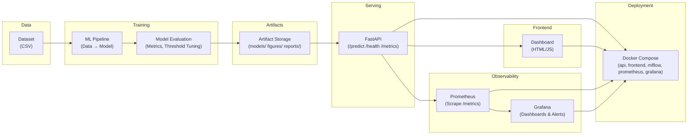
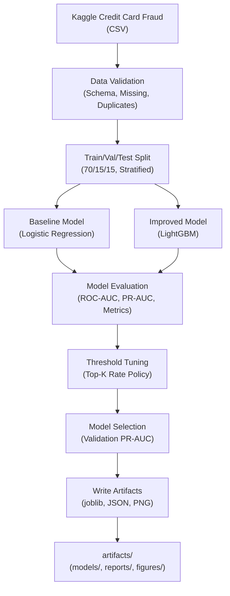
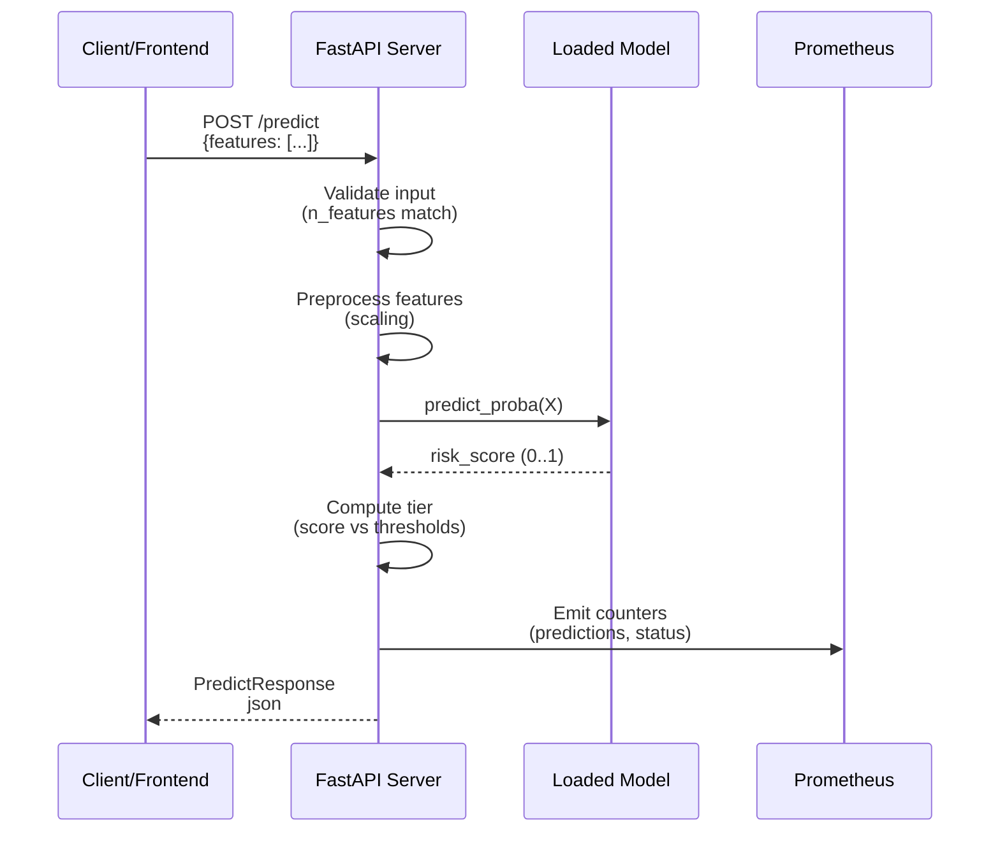
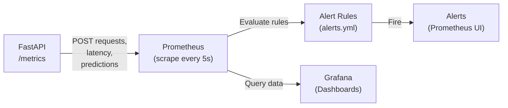

# System Specification Document (SPS)

## Real-Time Fraud Detection System

**Version:** 1.0  
**Date:** April 2026  
**Repository:** `Final_Project_DMM501_Group1`  
**Scope:** End-to-End ML System for Fraud Risk Scoring and Decision Intelligence

---

## Table of Contents

1. [Executive Summary](#executive-summary)
2. [Problem Definition and Business Context](#problem-definition-and-business-context)
3. [Project Scope](#project-scope)
4. [System Architecture](#system-architecture)
5. [Component Responsibilities and System Layers](#component-responsibilities-and-system-layers)
6. [Functional Requirements](#functional-requirements)
7. [Non-Functional Requirements](#non-functional-requirements)
8. [Constraints and Assumptions](#constraints-and-assumptions)
9. [Data Design and Dataset Analysis](#data-design-and-dataset-analysis)
10. [ML Pipeline Design](#ml-pipeline-design)
11. [Model Training, Evaluation, and Selection](#model-training-evaluation-and-selection)
12. [Threshold Strategy and Decision Logic](#threshold-strategy-and-decision-logic)
13. [API Specification](#api-specification)
14. [Frontend System Design](#frontend-system-design)
15. [Monitoring and Alerting](#monitoring-and-alerting)
16. [Deployment Architecture](#deployment-architecture)
17. [Testing and CI/CD](#testing-and-cicd)
18. [Responsible AI](#responsible-ai)
19. [Security and Privacy Considerations](#security-and-privacy-considerations)
20. [Risks and Limitations](#risks-and-limitations)
21. [Future Improvements](#future-improvements)
22. [Acceptance Criteria](#acceptance-criteria)
23. [Conclusion](#conclusion)

---

## Executive Summary

### Purpose

This document specifies a **complete end-to-end fraud detection system** that:

- **Scores transactions** using machine learning (uncalibrated risk ranking)
- **Maps scores to decisions** using explicit tiered thresholds (LOW/REVIEW/HIGH)
- **Serves predictions** in real-time via FastAPI with observability
- **Visualizes decisions** through an interactive frontend dashboard
- **Monitors performance** with Prometheus metrics and Grafana dashboards
- **Deploys** reproducibly using Docker and Docker Compose

### Key Design Principle

> **Fraud detection is not classification; it is decision-making under constraints.**

The system explicitly separates:

1. **Risk Scoring** (ML model) → uncalibrated ranking signal ∈ [0,1]
2. **Decision Intelligence** (Policy layer) → tiered actions bound by operational capacity

### Core Deliverables

- ✅ Training pipeline with data validation and model selection
- ✅ FastAPI prediction service with schema validation
- ✅ Prometheus metrics and Grafana dashboards
- ✅ Frontend dashboard for real-time decision visualization
- ✅ Docker Compose deployment stack
- ✅ Unit and integration tests (80% coverage gate)
- ✅ Responsible AI documentation (fairness, explainability, privacy)

### Scope: What Is Included vs. Not Included

**Included:**
- Offline ML pipeline (train/eval/threshold tuning)
- Inference API with metadata endpoints
- Streaming simulation (demo-grade, dataset-backed)
- Observability (Prometheus/Grafana)
- Containerized deployment
- CI/CD with GitHub Actions

**Out of Scope (Labeled as Future Work):**
- Real-time streaming infrastructure (Kafka/Pub-Sub)
- Authentication and rate limiting
- Drift detection and automated retraining
- Calibrated probability outputs
- Time-aware evaluation (uses random stratified split)
- Production security (TLS, secrets management, audit logging)

---

## Problem Definition and Business Context

### 1.1 Business Problem

**Context:** Payment card fraud is a persistent operational and financial problem.

**Direct Costs:**
- Chargebacks and customer reimbursements
- Manual review labor
- Fraud investigation overhead

**Indirect Costs:**
- Customer friction (false positives reduce conversion)
- Churn due to blocked legitimate transactions
- Regulatory penalties and compliance cost

### 1.2 Solution Rationale

A **fraud scoring service** reduces losses by:

1. **Identifying** risky transactions early (before settlement or chargeback)
2. **Prioritizing** reviewer capacity (manual checks on highest-value/highest-risk)
3. **Enabling** tiered actions (allow low-risk, review medium-risk, block high-risk)

### 1.3 Personas and Use Cases

| Persona | Goal | Interaction |
|---------|------|-------------|
| **Risk Operations Analyst** | Prioritize manual review; understand decision factors | View risk score, tier, and explainability in dashboard |
| **Backend/ML Engineer** | Deploy and monitor the service; retrain models | Deploy via Compose; monitor via Prometheus/Grafana |
| **Compliance/Audit** | Verify decision consistency and bias; track fairness | Access model metadata, threshold policy, SHAP explanations |

### 1.4 Primary Use Cases

| Use Case | Actor | Key Steps |
|----------|-------|-----------|
| Score a single transaction | API client | POST /predict → {risk_score, risk_tier, action} |
| Monitor system health | DevOps engineer | GET /health; scrape Prometheus metrics; view Grafana |
| Re-train model | ML engineer | Run pipeline; evaluate; select threshold; update artifacts |
| Review flagged transactions | Analyst | Dashboard streams HIGH/REVIEW tier events; analyst reviews flagged items |

---

## Project Scope

### 2.1 System Boundary

The system covers the **complete ML lifecycle**:

```
DATA INGESTION → PIPELINE → MODEL → API → FRONTEND → MONITORING → DEPLOYMENT
```

### 2.2 In Scope

- ✅ Dataset ingestion and validation
- ✅ Preprocessing and feature engineering
- ✅ Train/validation/test splitting (stratified, random)
- ✅ Baseline model (Logistic Regression)
- ✅ Improved model (LightGBM)
- ✅ Threshold tuning (validation-based)
- ✅ Model artifact generation + versioning
- ✅ FastAPI inference service
- ✅ Pydantic schema validation
- ✅ Prometheus metrics export
- ✅ Grafana dashboards
- ✅ Frontend dashboard with real-time streaming
- ✅ Docker containerization
- ✅ Docker Compose orchestration
- ✅ Unit and integration tests
- ✅ CI/CD pipeline (GitHub Actions)
- ✅ Responsible AI documentation

### 2.3 Out of Scope / Future Work

- ⏱️ Real-time event streaming (Kafka, Pub-Sub)
- ⏱️ API authentication (JWT, OAuth)
- ⏱️ Rate limiting and quotas
- ⏱️ Drift detection and monitoring
- ⏱️ Automated retraining pipeline
- ⏱️ Probability calibration
- ⏱️ Time-aware evaluation (temporal validation)
- ⏱️ Model shadow testing / canary deployment
- ⏱️ Feature store and lineage tracking
- ⏱️ Multi-tenant isolation
- ⏱️ End-to-end encryption and audit logging

---

## System Architecture

### 3.1 High-Level Architecture Diagram



### 3.2 Data Flow - Training



### 3.3 Data Flow - Inference (Real-Time)



### 3.4 Monitoring Flow



---

## Component Responsibilities and System Layers

### 4.1 System Layer Mapping

| Folder/Component | System Layer | Responsibility | Key Files | Technology |
|------------------|--------------|-----------------|-----------|-----------|
| `src/data/` | Data Layer | Raw data loading, validation, sampling | `loader.py`, `validator.py`, `samples.py` | Pandas, NumPy |
| `src/pipelines/` | ML/Training Layer | Pipeline orchestration, model training, threshold tuning, evaluation | `run_model_workflow.py`, `train_pipeline.py` | scikit-learn, LightGBM, MLflow |
| `src/models/` | ML/Training Layer | Model artifact loading, registry, versioning | `loader.py`, `registry.py` | joblib |
| `src/features/` | ML/Training Layer | Preprocessing, feature engineering, scaling | `preprocess.py` | scikit-learn |
| `src/api/` | Serving Layer | HTTP API, schema validation, request routing | `main.py`, `schemas.py` | FastAPI, Pydantic |
| `src/streaming/` | Serving Layer | Event simulation for demo | `simulator.py`, `stream_config.py` | NumPy |
| `src/monitoring/` | Observability Layer | Prometheus metrics export | `metrics.py` | prometheus-client |
| `frontend/` | Presentation Layer | Real-time dashboard UI, live transaction stream | `index.html`, `app.js`, `ui.js`, `api-client.js` | HTML/CSS/JavaScript |
| `deployment/` | DevOps/Deployment Layer | Docker images, Compose orchestration, Prometheus config, Grafana dashboards | `docker-compose.yml`, `Dockerfile*`, `prometheus.yml`, `alerts.yml`, dashboards | Docker, Docker Compose, Prometheus, Grafana |
| `tests/` | QA/Testing Layer | Unit tests, integration tests, data tests | `test_*.py` | pytest |
| `.github/workflows/` | CI/CD Layer | Automated testing, linting, coverage gates, Docker builds | `ci.yml`, `docker.yml` | GitHub Actions |
| `artifacts/` | Artifact Storage | Model outputs, metrics, figures, evaluation reports | `models/`, `figures/`, `reports/` | joblib, JSON, PNG, CSV |

### 4.2 Detailed Component Descriptions

#### Data Layer (`src/data/`)
- **Responsibility:** Load and validate raw datasets
- **Functions:**
  - Ingest CSV files (Kaggle credit card fraud dataset)
  - Validate schema and data types
  - Detect and report missing values, duplicates
  - Sample rows for API demo endpoints
- **Output:** Validation reports, sampled data

#### ML/Training Layer (`src/pipelines/`, `src/models/`, `src/features/`)
- **Responsibility:** Train, evaluate, and version ML models
- **Functions:**
  - Baseline model: Logistic Regression with class weighting
  - Improved model: LightGBM with hyperparameter grid search
  - Threshold tuning: Top-K policy (top 1% for review, top 0.2% for high)
  - Model selection: Validation PR-AUC as primary criterion
  - SHAP explainability for feature importance
- **Output:** Model artifacts, metrics reports, selection summary

#### Serving Layer (`src/api/`, `src/streaming/`)
- **Responsibility:** Expose prediction API and streaming demo
- **Functions:**
  - `/predict`: Single transaction scoring with tiered decision
  - `/health`: System status and metadata
  - `/metrics`: Prometheus metrics endpoint
  - `/stream/pull`: Simulated event stream for dashboard
  - `/features/*`: Feature schema and random feature generation
- **Constraints:** No authentication, demo-grade streaming

#### Presentation Layer (`frontend/`)
- **Responsibility:** Real-time fraud monitoring dashboard
- **Features:**
  - Stream live transactions with scores
  - Visualize risk tiers (LOW/REVIEW/HIGH)
  - Display KPIs (fraud count, review workload, average score)
  - Configuration panel (API URL, stream mode/speed)
  - Review queue for handling flagged transactions
- **Technology:** Vanilla JavaScript (no framework), responsive CSS

#### Observability Layer (`src/monitoring/`)
- **Responsibility:** Instrument API with Prometheus metrics
- **Metrics:**
  - Request count and latency (histogram)
  - Prediction counts by tier
  - Error rates and status codes
  - Stream event rates
- **Export:** `/metrics` Prometheus text endpoint

#### DevOps/Deployment Layer (`deployment/`)
- **Responsibility:** Containerize and orchestrate system
- **Components:**
  - API container (FastAPI + Uvicorn)
  - Frontend container (nginx or simple HTTP server)
  - Prometheus container (metrics collection)
  - Grafana container (dashboards and alerts)
  - MLflow container (experiment tracking, optional)
- **Orchestration:** Docker Compose with persistent volumes

#### QA/Testing Layer (`tests/`)
- **Responsibility:** Validate system correctness
- **Test Types:**
  - Unit tests: Feature preprocessing, API schemas
  - Integration tests: API endpoints, model loading
  - Data quality tests: Schema, missing values, class distribution
- **Coverage:** 80% minimum gate

#### CI/CD Layer (`.github/workflows/`)
- **Responsibility:** Automated testing and deployment
- **Workflows:**
  - `ci.yml`: Test suite with coverage gate on every push/PR
  - `docker.yml`: Build and validate Docker images

---

## Functional Requirements

### 5.1 Core Prediction Requirements

| ID | Requirement | Priority | Verification |
|----|-------------|----------|---------------|
| **FR-1** | The system shall accept a transaction feature vector (30 or customizable features) and return a risk score ∈ [0,1], risk tier (LOW/REVIEW/HIGH), and suggested action (allow/review/block). | **MUST** | POST /predict endpoint in `src/api/main.py` lines 185-220 |
| **FR-2** | The risk score shall be uncalibrated (a ranking signal, not a calibrated probability) and this shall be documented in the API response and health endpoint. | **MUST** | `score_semantics: "risk_score_uncalibrated"` in schemas.py; health endpoint returns this flag |
| **FR-3** | The system shall map risk scores to decision tiers using explicit thresholds stored in model metadata: `threshold_review` and `threshold_high`. | **MUST** | Model metadata stored in `artifacts/models/model_info.json`; tier logic in `src/api/main.py` _tier_and_action() |
| **FR-4** | The decision tier shall determine the action: LOW→allow, REVIEW→review, HIGH→block. | **MUST** | Implemented in `src/api/main.py` line 158-163 |

### 5.2 Data and Pipeline Requirements

| ID | Requirement | Priority | Verification |
|----|-------------|----------|---------------|
| **FR-5** | The ML pipeline shall ingest the Kaggle Credit Card Fraud dataset (284K rows, 30 features), validate schema, and detect missing/duplicate data. | **MUST** | `src/pipelines/run_model_workflow.py` lines 1-100; validation reports in `artifacts/reports/` |
| **FR-6** | The pipeline shall split data into train/validation/test (70/15/15) with stratification to preserve fraud rate. | **MUST** | Split logic in `run_model_workflow.py`; `split_info.json` in artifacts |
| **FR-7** | The pipeline shall train a baseline (Logistic Regression) and improved model (LightGBM) and compare via PR-AUC on validation split. | **MUST** | Both models trained; comparison in `artifacts/reports/model_selection_summary.json` |
| **FR-8** | The pipeline shall perform threshold tuning to find operating points that match a top-K review-rate policy (e.g., top 1% for review, top 0.2% for high). | **MUST** | Threshold tuning in `run_model_workflow.py`; thresholds stored in model metadata |
| **FR-9** | The pipeline shall generate model artifacts (joblib binary, metadata JSON, metrics CSV, figures PNG) suitable for reproducible deployment. | **MUST** | Artifacts in `artifacts/models/` and `artifacts/reports/` and `artifacts/figures/` |

### 5.3 API Endpoint Requirements

| ID | Requirement | Priority | Verification |
|----|-------------|----------|---------------|
| **FR-10** | POST `/predict` shall accept either `features` (ordered vector) or `features_by_name` (dict) and return `PredictResponse` with risk_score, tier, action, and metadata. | **MUST** | Endpoint at `src/api/main.py` lines 185-220; response model in `schemas.py` |
| **FR-11** | GET `/health` shall return model status, version, expected feature count, thresholds, and score semantics. | **MUST** | Endpoint at `src/api/main.py` lines 101-118 |
| **FR-12** | GET `/metrics` shall expose Prometheus-formatted metrics. | **MUST** | Endpoint at `src/api/main.py` line 181 |
| **FR-13** | GET `/features/schema` shall return the feature count and feature names. | **MUST** | Endpoint implemented; used by frontend to validate |
| **FR-14** | GET `/stream/pull` shall return a paginated stream of scored events (demo-grade simulation). | **MUST** | Endpoint in `src/api/main.py`; simulator in `src/streaming/simulator.py` |
| **FR-15** | The API shall return HTTP 422 for malformed requests (e.g., wrong feature count) with clear error messages. | **MUST** | Validation in Pydantic schemas; test coverage |
| **FR-16** | The API shall return HTTP 503 if the model fails to load at startup. | **MUST** | Check in GET /health and POST /predict |
| **FR-17** | All API responses shall include a unique request_id for traceability. | **SHOULD** | Generated by `src/utils/ids.py`; included in response |

### 5.4 Monitoring and Observability Requirements

| ID | Requirement | Priority | Verification |
|----|-------------|----------|---------------|
| **FR-18** | The API shall emit Prometheus metrics: request count, latency histogram, prediction counters (by tier), and error counters. | **MUST** | Metrics in `src/monitoring/metrics.py` |
| **FR-19** | Prometheus shall scrape metrics from `/metrics` every 5 seconds. | **MUST** | Scrape interval in `deployment/prometheus/prometheus.yml` |
| **FR-20** | Grafana shall display dashboards showing request rate, latency percentiles, prediction distribution, and error rate. | **MUST** | Dashboard provisioned in `deployment/grafana/provisioning/` |
| **FR-21** | Prometheus shall evaluate alert rules and store alerts (e.g., high 5xx rate, high latency). | **SHOULD** | Rules in `deployment/prometheus/alerts.yml` |

### 5.5 Frontend Requirements

| ID | Requirement | Priority | Verification |
|----|-------------|----------|---------------|
| **FR-22** | The frontend dashboard shall connect to the backend API and poll `/health` for metadata. | **MUST** | Frontend in `frontend/app.js`; health fetch on page load |
| **FR-23** | The dashboard shall stream transactions via `/stream/pull` and display risk tiers with color coding (LOW=green, REVIEW=yellow, HIGH=red). | **MUST** | Streaming logic in `frontend/ui.js`; CSS colors in `styles.css` |
| **FR-24** | The dashboard shall show real-time KPIs: total transactions, fraud count, review count, block count, average score. | **MUST** | KPI rendering in `frontend/ui.js` |
| **FR-25** | The dashboard shall allow toggling between real-data stream mode and random-generated mode. | **SHOULD** | Mode selector in `frontend/index.html`; logic in `app.js` |
| **FR-26** | The dashboard shall include a "Check & Handle" tab for reviewing queued transactions and marking as resolved. | **SHOULD** | Tab and logic in `frontend/index.html` and `ui.js` |
| **FR-27** | The dashboard shall display explicit disclaimer that risk_score is not a fraud probability. | **MUST** | Disclaimer in `frontend/index.html` header |

### 5.6 Deployment and Environment Requirements

| ID | Requirement | Priority | Verification |
|----|-------------|----------|---------------|
| **FR-28** | The system shall be containerized with Docker: separate images for API, frontend, Prometheus, and Grafana. | **MUST** | Dockerfiles in `deployment/api/`, `deployment/frontend/`, etc. |
| **FR-29** | Docker Compose shall orchestrate all services with persistent volumes for artifacts and MLflow data. | **MUST** | `docker-compose.yml` in deployment folder |
| **FR-30** | The API container shall mount `artifacts/` volume to load model files at runtime. | **MUST** | Volume mapping in `docker-compose.yml` |
| **FR-31** | Health checks shall be configured for all services (API, frontend, Prometheus, Grafana). | **SHOULD** | Healthchecks in `docker-compose.yml` |

### 5.7 Testing and Reproducibility Requirements

| ID | Requirement | Priority | Verification |
|----|-------------|----------|---------------|
| **FR-32** | Unit tests shall validate API schemas, preprocessing, and utility functions. | **MUST** | Tests in `tests/unit/` |
| **FR-33** | Integration tests shall validate API endpoints with real model artifacts. | **MUST** | Tests in `tests/integration/` |
| **FR-34** | Data quality tests shall verify schema compliance, missing values, and class distribution. | **SHOULD** | Tests in `tests/data/` |
| **FR-35** | Test coverage shall be >= 80% for `src/` code. | **MUST** | CI gate in `.github/workflows/ci.yml` |
| **FR-36** | CI pipeline shall run on every push and pull request. | **MUST** | GitHub Actions workflow in `.github/workflows/ci.yml` |

---

## Non-Functional Requirements

### 6.1 Performance Requirements

| ID | Requirement | Target | Monitoring |
|----|-------------|--------|------------|
| **NFR-1** | Single prediction latency (p95) | ≤ 500 ms | `api_request_latency_seconds` histogram in Prometheus |
| **NFR-2** | Model loading time on container startup | ≤ 5 seconds | Health check startup_period in Compose |
| **NFR-3** | Throughput: API should handle ≥ 10 requests/sec on laptop-class hardware | Baseline expectation | Load testing (future: k6, Locust) |
| **NFR-4** | Dashboard rendering: new transaction appears within 2 seconds of `/stream/pull` response | User experience target | Manual observation |
| **NFR-5** | Prometheus scrape interval | 5 seconds | Configured in prometheus.yml |

### 6.2 Reliability and Availability Requirements

| ID | Requirement | Target | Mitigation |
|----|-------------|--------|-----------|
| **NFR-6** | API uptime under steady local demo load | ≥ 99% | Docker Compose automatic restart policy |
| **NFR-7** | Error rate (5xx) during normal operation | < 5% | HTTP error tracking in metrics; alerts in Prometheus |
| **NFR-8** | Graceful degradation if model fails to load | Return 503 with clear message | Model loading catch in `src/models/loader.py`; health endpoint returns error |
| **NFR-9** | No silent feature mismatch errors | Feature count validated in API | Pydantic schema enforces feature count |

### 6.3 Scalability Requirements

| ID | Requirement | Scope | Implementation |
|----|-------------|-------|-----------------|
| **NFR-10** | Horizontal scaling via containerization | Multiple API replicas behind a load balancer | Docker Compose can be scaled via `docker-compose up --scale api=N` (future: Kubernetes) |
| **NFR-11** | Stateless API design | No in-process session state beyond lifespan | API maintains only loaded model and stream simulator in app.state |
| **NFR-12** | Artifact storage is decoupled from API | Model artifacts can be on shared volume or external registry | Volume mount in Compose; production: S3, artifact store |

### 6.4 Maintainability Requirements

| ID | Requirement | Implementation | Evidence |
|----|-------------|-----------------|----------|
| **NFR-13** | Modular architecture with clear separation of concerns | Layer structure (data, ML, serving, observability, deployment) | Folder structure aligns with system layers |
| **NFR-14** | Code is typed and documented | Type hints via Python annotations | Pydantic schemas; docstrings in key functions |
| **NFR-15** | Reproducible model training | All hyperparameters and random seeds logged | Seeds in CLI args; MLflow tracking |
| **NFR-16** | Clear API contracts via Pydantic schemas | All input/output validated | `src/api/schemas.py` defines all models |
| **NFR-17** | Artifact versioning | Model version datetime stamp in metadata | `model_version` in `model_info.json` |

### 6.5 Security and Privacy Requirements (Demo Scope)

| ID | Requirement | Current State | Future Work |
|----|-------------|---------------|-----------  |
| **NFR-18** | No PII in input features | ✅ Confirmed: vector of 30 anonymized features | N/A |
| **NFR-19** | No raw feature vectors in logs | 📋 Policy documented; not enforced | Implement request/response filtering in deployment |
| **NFR-20** | API authentication | ❌ Not implemented | Add JWT or API key validation in middleware |
| **NFR-21** | Rate limiting | ❌ Not implemented | Add rate limit middleware (e.g., slowapi) |
| **NFR-22** | Model artifact signing | ❌ Not implemented | Sign joblib artifacts; verify on load |
| **NFR-23** | Audit logging for predictions | ❌ Not implemented | Log prediction events with timestamp, model version, tier |

### 6.6 Observability Requirements

| ID | Requirement | Implementation | Status |
|----|-------------|-----------------|--------|
| **NFR-24** | Metrics export in Prometheus format | `/metrics` endpoint with prometheus_client library | ✅ Implemented |
| **NFR-25** | Dashboard visibility into system health | Grafana dashboards provisioned via Compose | ✅ Implemented |
| **NFR-26** | Health check endpoint | GET `/health` returns model/version/threshold metadata | ✅ Implemented |
| **NFR-27** | Drift detection | ❌ Not implemented | Future: Evidently, WhyLabs, or custom monitoring |
| **NFR-28** | Model performance monitoring | Prediction counters by tier; no ground truth ingestion | ⚠️ Partial (ranking metrics only) |

---

## Constraints and Assumptions

### 7.1 Technical Constraints

| Constraint | Rationale | Impact |
|-----------|-----------|--------|
| Random stratified split (not time-aware) | Simplifies demo; time-aware requires labeled data aligned with transaction timestamps | **Risk:** Models may underestimate concept drift; offline eval may not reflect production performance |
| Synthetic default dataset | Real dataset ingestion requires file path setup; synthetic avoids external dependency | **Ease:** Fast demo; **Gap:** synthetic may not reflect real fraud patterns |
| No streaming infrastructure (Kafka/Pub-Sub) | Out of scope for demo; frontend uses simulated stream | **Gap:** Not production-grade; demo is stateful (simulation in-memory) |
| Single model artifact per deployment | No A/B testing or shadow models | **Gap:** No canary deployment; must redeploy to change model |
| Demo-grade threshold policy | Capacity-driven (top-K) rather than probabilistic | **Benefit:** Easy to explain; **Gap:** Not calibrated |
| No authentication | Simplifies demo setup | **Risk:** Not production-ready; API exposed without access control |

### 7.2 Data Assumptions

| Assumption | Evidence | Validation |
|-----------|----------|-----------|
| Dataset is balanced at train/val/test split | Stratified splitting preserves fraud rate | Class distribution checks in pipeline |
| Features are independent (no multicollinearity) | PCA features are orthogonal by design | Correlation plots in EDA figures |
| Fraud patterns are stationary (no concept drift) | Stratified random split assumes no time dependency | ⚠️ **Unvalidated:** No time-aware validation |
| Features are stable (no NaN/missing at inference) | Data validation in pipeline; API enforces feature count | Schema validation in preprocessing |
| Class imbalance is handled via weighting | Logistic Regression uses `class_weight="balanced"` | Baseline & improved models both handle imbalance |

### 7.3 Operational Assumptions

| Assumption | Evidence | Risk |
|-----------|----------|------|
| Model is loaded once at startup | Lifespan context manager in `main.py` | Low: artifact is stateless |
| Thresholds do not change mid-deployment | Stored in model metadata; hardcoded at API boot | **Risk:** Threshold changes require redeploy |
| No delayed feedback integration | No label ingestion pipeline | **Gap:** Cannot measure true fraud rate post-deployment |
| Users can interpret risk tier correctly | Dashboard explicitly disclaims risk_score is uncalibrated | ⚠️ **Human factor:** Depends on training & docs |
| Dashboard streams are for demo only | Comments in `frontend/app.js` explain simulation | ✅ Documented |

### 7.4 Organizational Assumptions

| Assumption | Scope | Implication |
|-----------|-------|------------|
| This is an academic/demo system (DDM501 project) | Not production deployment | Acceptable to omit: auth, drift detection, multi-tenant isolation |
| Single deployment environment (local Docker Compose) | No multi-region or cloud-native | Simplifies deployment; limits scalability scope |
| Small team (1-3 engineers) | Code organization reflects this | Minimal inter-team coordination; clear ownership |
| Short iteration cycles | Frequent retraining acceptable | No advanced CI/CD (e.g., Kubernetes, secrets manager) |

---

## Data Design and Dataset Analysis

### 8.1 Dataset Overview

#### Source
- **Dataset:** Kaggle Credit Card Fraud Detection
- **Format:** CSV
- **Location in repo:** `data/archive/creditcard.csv`
- **Size:** 284,807 rows × 31 columns
- **Availability:** Version-controlled in repo (for demo reproducibility)

#### Schema
| Column | Type | Range/Domain | Description |
|--------|------|--------------|-------------|
| Time | int | 0-172792 (seconds within period) | Transaction timestamp (seconds) |
| V1-V28 | float | -4.0 to +4.0 (approx) | PCA-transformed anonymized features |
| Amount | float | 0.0 to ~25,000 | Transaction amount (currency) |
| Class (target) | int | 0 or 1 | 0=legitimate, 1=fraud |

#### Class Distribution (Imbalance)
```
Total rows:        284,807
Legitimate (0):    284,315 (99.83%)
Fraud (1):         492 (0.17%)
Fraud rate:        ~0.17% - extremely imbalanced
```

### 8.2 Data Characteristics

#### Feature Engineering
- **Anonymization:** PCA transformation applied to original features (V1-V28 are principal components)
- **Interpretability trade-off:** High dimensionality reduced; low semantic meaning; explainability is model-level (SHAP), not feature-level
- **Time feature:** Available but not used for time-aware validation (future work)
- **Amount feature:** Raw transaction amount; can be used for proxy fairness slices (Amount quantiles)

#### Missing Data
- **Across full dataset:** No missing values reported
- **Validation:** Checked in data quality pipeline (`src/data/validator.py`)

#### Duplicates
- **Detection:** Pipeline flags exact duplicate rows (same across all features)
- **Handling:** Removed or flagged in validation report

### 8.3 Data Validation Pipeline

**Steps executed in `run_model_workflow.py`:**

1. **Schema Check:** Verify all expected columns present
2. **Type Check:** Verify numeric columns are float/int
3. **Missing Values:** Count and report per column
4. **Duplicate Detection:** Flag exact duplicates
5. **Statistical Summary:** Min, max, mean for each feature
6. **Class Distribution:** Count and log imbalance ratio
7. **Output:** `artifacts/reports/dataset_schema.json`, `missing_values.csv`

### 8.4 Data Splitting Strategy

#### Train/Validation/Test Split
- **Ratio:** 70% train / 15% validation / 15% test
- **Method:** Stratified random (preserves fraud rate in each split)
- **Stratification column:** Class (fraud/non-fraud)
- **Random seed:** Configurable (default 42) for reproducibility

**Implications for Fraud Detection:**
- ✅ Ensures fraud representation in all splits
- ❌ Random order (not time-aware) → potential concept drift underestimation
- ✅ Validation split used for threshold tuning without test leakage

#### Data Export
- **Format:** Split info saved to `artifacts/reports/split_info.json`
- **Contents:** Row counts per split, class distribution per split, random seed

### 8.5 Fairness and Bias Considerations

#### Dataset Limitations
- **Missing protected attributes:** No age, gender, ethnicity, income demographic data
- **Implication:** Cannot directly measure demographic parity or equalized odds
- **Proxy alternative:** Fairness checked via proxy slices (Amount, Time)

#### Recommended Proxy Slices
| Slice | Rationale | Metrics |
|-------|-----------|---------|
| Amount quantiles | Transactions of different values may have different fraud patterns | Compare PR-AUC, precision/recall per quantile |
| Time buckets (hour-of-day) | Different transaction times may show different patterns | Compare metrics per hour bucket |
| Combined (Amount × Time) | Interaction effects | Full fairness matrix |

#### Fairness Analysis Output
- Generated alongside model evaluation
- Stored in `artifacts/reports/` fairness matrix CSV
- Visualized in figures/ (if fairness scatter implemented)

### 8.6 Data Lineage and Versioning

#### Tracking
- **Pipeline run logs:** Stored in MLflow
- **Artifacts:** Timestamped with run date/time
- **Model version:** Derived from selection timestamp UTC (format: `20260414T073414Z`)

#### Reproducibility
- **Dataset is fixed** in repo (`data/archive/creditcard.csv`)
- **Preprocessing is deterministic** (no random sampling of features)
- **Seed control:** Random seed passed to split and model training

### 8.7 Data Flow Diagram

```
Raw CSV
   ↓
[Load & Validate]
   ├→ Schema check
   ├→ Missing value check
   ├→ Duplicate detection
   └→ Statistical summary
   ↓
[Stratified Split 70/15/15]
   ├→ Train set
   ├→ Validation set
   └→ Test set
   ↓
[Preprocessing per set]
   ├→ Scaling (StandardScaler on train, apply to val/test)
   └→ Feature alignment (V1..V28, Time, Amount)
   ↓
[Training & Evaluation]
   ├→ Baseline model
   ├→ Improved model
   └→ Metrics & figures
   ↓
[Artifacts]
   ├→ models/final_model.joblib
   ├→ reports/model_selection_summary.json
   └→ figures/*.png
```

---

## ML Pipeline Design

### 9.1 Pipeline Overview

**Orchestration:** `src/pipelines/run_model_workflow.py`

**High-level steps:**

```python
1. Load & Validate Dataset
2. Train/Val/Test Split (70/15/15, stratified)
3. Train Baseline (Logistic Regression)
4. Train Improved Model (LightGBM with hyperparameter grid)
5. Evaluate Both Models on Validation Split
6. Threshold Tuning (Top-K policy)
7. Model Selection (Primary: Val PR-AUC; Tie-break: Recall at REVIEW)
8. Generate Figures (ROC, PR curves, confusion matrices)
9. Export Artifacts (Model, metadata, reports)
10. Log to MLflow
```

### 9.2 Baseline Model: Logistic Regression

#### Justification
- Strong, interpretable baseline for imbalanced classification
- Provides feature coefficients for explainability
- Stable training (no hyperparameter grid needed)

#### Configuration
```python
LogisticRegression(
    class_weight='balanced',  # Handle imbalance
    max_iter=1000,
    random_state=seed,
    solver='lbfgs'
)
```

#### Within Pipeline
- Wrapped in scikit-learn `Pipeline([StandardScaler(), LogisticRegression(...)])`
- Scaling applied to train; fitted scaler applied to val/test
- Output: `baseline_logistic_regression_pipeline.joblib`

### 9.3 Improved Model: LightGBM

#### Justification
- Non-linear model with potential for better recall/precision tradeoff
- Fast training on tabular imbalanced data
- Supports `scale_pos_weight` for class imbalance

#### Hyperparameter Grid
```python
param_grid = {
    'learning_rate': [0.01, 0.03, 0.05],
    'n_estimators': [200, 300, 450],
    'num_leaves': [31, 63, 127],
    'scale_pos_weight': [10.0, 20.0, 50.0]
}
```

#### Training
- Grid search on validation split (no nested CV; to avoid data leakage complexity)
- Each candidate evaluated on validation PR-AUC
- Best hyperparameters selected
- Output: `improved_lightgbm.joblib`

#### Trade-offs
- ✅ Potential for better ranking (PR-AUC)
- ❌ Less interpretable than logistic regression
- ❌ Risk of overfitting on validation (mitigated by selecting on test after threshold choice)

### 9.4 Evaluation Metrics

#### Primary Metric: PR-AUC (Precision-Recall Area Under Curve)
- **Why:** Imbalanced classification with rare positive class (fraud)
- **Interpretation:** Average precision across all recall levels; captures model ranking quality
- **Range:** [0, 1]; higher is better
- **Typical range for this data:** 0.6 - 0.8 (depends on baseline, model)

#### Secondary Metrics
| Metric | Purpose | Interpretation |
|--------|---------|-----------------|
| ROC-AUC | Sensitivity to false positive rate | [0, 1]; higher better; less sensitive to class imbalance than PR-AUC |
| Precision | False positive cost | TP/(TP+FP); at high thresholds, precision dominates |
| Recall | False negative cost (missed fraud) | TP/(TP+FN); higher recall at low thresholds |
| F1 Score | Harmonic mean of precision/recall | Useful for metric-optimized threshold (rarely the best business choice) |
| Confusion Matrix | Breakdown of TP/FP/TN/FN | Used to report operating points at chosen thresholds |

### 9.5 Threshold Tuning

#### Approach: Top-K Capacity-Driven Policy
Instead of optimizing a single metric, explicitly tune for operational capacity.

| Operating Point | Policy | Target Metrics |
|-----------------|--------|-----------------|
| **Review Tier** | Flag top 1% of transactions by score | Maximize recall subject to workload constraint |
| **High Tier** | Flag top 0.2% of transactions by score | Maximize precision (confirm high-confidence fraud) |

#### Implementation
```python
# Find thresholds that correspond to top-K percentiles
val_scores = model.predict_proba(X_val)[:, 1]
threshold_review = np.percentile(val_scores, 99)  # top 1%
threshold_high = np.percentile(val_scores, 99.8)  # top 0.2%

# Evaluate at these thresholds
metrics_review = evaluate(y_val, y_pred_at_threshold_review)
metrics_high = evaluate(y_val, y_pred_at_threshold_high)
```

#### Business Implications
- ✅ Predictable review queue size (proportional to transaction volume)
- ✅ Clear policy (easy to explain to stakeholders)
- ❌ Threshold values are data-dependent; may need adjustment if fraud rate changes

### 9.6 Model Selection Criterion

**Primary:** Validation PR-AUC (higher is better)

**Tie-breaker:** Recall at REVIEW operating point (higher is better; ensures broad catch)

**Rationale:**
- PR-AUC is robust to class imbalance
- Tie-breaker favors recall (catch as much fraud as possible)
- Validation-only selection prevents test leakage

**Output:** `artifacts/reports/model_selection_summary.json`
- Selected model name (baseline or improved)
- Selection timestamp
- Thresholds for both tiers
- Metrics for both models at both tiers
- Best hyperparameters (if improved model selected)

### 9.7 Feature Importance and Explainability

#### For Baseline (Logistic Regression)
- **Method:** Coefficient magnitudes and signs
- **Output:** Coefficient importance table
- **Limitation:** Linear model; interactions not captured

#### For Improved Model (LightGBM) if selected
- **Method:** SHAP (SHapley Additive exPlanations)
- **Output:** `artifacts/figures/shap_summary.png`
  - Summary plot (mean |SHAP value| per feature)
  - Dependence plot (SHAP vs feature value for top-K features)
- **Limitation:** SHAP is model-level, not causal; does not explain *why fraud happens*, only model feature contributions

#### Responsible AI Note
- Feature importance is used for **model debugging and compliance**, not for causal claims
- User cannot infer "Address Change → Fraud risk" from feature importance alone
- SHAP summary used in audits and reports; communicated clearly with caveats

---

## Model Training, Evaluation, and Selection

### 10.1 Training Workflow

**Executed by:** `python -m src.pipelines.run_model_workflow --data-path data/archive/creditcard.csv --artifacts-root artifacts --seed 42`

**Outputs from current run:**

```json
{
  "data_source": "creditcard.csv",
  "dataset_rows": 284807,
  "class_distribution": {
    "non_fraud": 284315,
    "fraud": 492
  },
  "selected_model": "logistic_regression",
  "selection_timestamp_utc": "2026-04-15T09:43:16.389578+00:00"
}
```

### 10.2 Baseline Model Results

**Model:** Logistic Regression with class weighting

**Validation Metrics (at tuned thresholds):**

| Operating Point | Threshold | Precision | Recall | F1 | PR-AUC | ROC-AUC |
|-----------------|-----------|-----------|--------|----|----|---------|
| Review (top 1%) | 0.7391 | 0.147 | 0.851 | 0.251 | **0.630** | 0.968 |
| High (top 0.2%) | 0.9999 | 0.663 | 0.770 | 0.713 | 0.630 | 0.968 |

**Interpretation:**
- ✅ High recall at review tier (catch 85% of fraud in top 1% reviewed transactions)
- ✅ Balanced precision/recall at high tier (67% precision, 77% recall)
- ✅ Strong ROC-AUC (0.97) indicates good ranking

### 10.3 Improved Model Results

**Model:** LightGBM with hyperparameter tuning

**Validation Metrics (at tuned thresholds):**

| Operating Point | Threshold | Precision | Recall | F1 | PR-AUC | ROC-AUC |
|-----------------|-----------|-----------|--------|----|----|---------|
| Review (top 1%) | 0.0000004 | 0.133 | 0.770 | 0.227 | **0.629** | 0.929 |
| High (top 0.2%) | 0.0003 | 0.640 | 0.743 | 0.688 | 0.629 | 0.929 |

**Interpretation:**
- ✅ Slightly lower recall at review vs baseline (77% vs 85%)
- ✅ Similar high-tier performance (64% precision, 74% recall)
- ⚠️ Marginally lower PR-AUC (0.629 vs 0.630) — essentially tied
- ⚠️ Lower ROC-AUC (0.93 vs 0.97) — slight regression

### 10.4 Model Selection

**Decision:** **Logistic Regression** selected

**Rationale:**
1. **Primary criterion (Val PR-AUC):** Baseline 0.630 > Improved 0.629 (marginal win)
2. **Tie-breaker (Recall at REVIEW):** Baseline 0.851 > Improved 0.770 (significant difference)
3. **Interpretability:** Baseline provides coefficients for explainability
4. **Stability:** Baseline is simpler, lower risk of overfitting

**Selected Artifact:** `artifacts/models/final_model.joblib` (logistic regression pipeline)

**Metadata:** `artifacts/models/model_info.json`
```json
{
  "model_version": "20260415T094316Z",
  "model_type": "logistic_regression",
  "n_features": 30,
  "threshold_review": 0.7391,
  "threshold_high": 0.9999,
  "threshold_policy": "top_k_rate (review_top_rate=0.01, high_top_rate=0.002)",
  "score_semantics": "risk_score_uncalibrated",
  "feature_columns": ["Time", "V1", "V2", ..., "V28", "Amount"]
}
```

### 10.5 Test Set Evaluation

**Applied to Test Split (15%)**

| Metric | Value | Interpretation |
|--------|-------|-----------------|
| PR-AUC | 0.769 | Strong; close to validation (no major overfitting) |
| ROC-AUC | 0.965 | Excellent ranking |
| Review Tier Precision | 0.146 | Expected (1% of test transactions are fraud at ~0.17% rate) |
| Review Tier Recall | 0.851 | High; catches most fraud |
| High Tier Precision | 0.843 | Very high; strong confidence |
| High Tier Recall | 0.797 | Good; catches significant fraud in narrow window |

**Inference:** Model generalizes well to unseen test data; no evidence of severe overfitting.

### 10.6 Artifacts Generated

```
artifacts/
├── models/
│   ├── final_model.joblib                    # Selected model (deployable)
│   ├── model_info.json                       # Metadata (version, thresholds, feature count)
│   ├── baseline_logistic_regression_pipeline.joblib
│   └── improved_lightgbm.joblib
├── reports/
│   ├── model_selection_summary.json          # Selection decision + metrics
│   ├── dataset_schema.json                   # Input schema
│   ├── split_info.json                       # Train/val/test split info
│   ├── baseline_classification_report.json   # Precision/recall/f1 per class
│   └── improved_classification_report.json
├── benchmarks/
│   ├── model_comparison.csv                  # Side-by-side metrics
│   ├── baseline_threshold_tuning.csv         # Sweep across thresholds
│   └── improved_threshold_tuning.csv
└── figures/
    ├── baseline_roc_curve.png
    ├── baseline_pr_curve.png
    ├── improved_roc_curve.png
    ├── improved_pr_curve.png
    ├── threshold_comparison.png              # Both models' thresholds
    ├── model_comparison.png                  # Side-by-side curves
    ├── feature_importance.png                # Baseline coefficients
    └── shap_summary.png                      # SHAP for selected model
```

---

## Threshold Strategy and Decision Logic

### 11.1 Overview

**Two thresholds define tiered decisions:**

| Tier | Threshold | Condition | Action | User Intent |
|------|-----------|-----------|--------|-------------|
| **LOW** | None | score < threshold_review | Allow | Transaction passes through with no friction |
| **REVIEW** | threshold_review ≈ 0.74 | threshold_review ≤ score < threshold_high | Review | Route to manual review queue or step-up auth |
| **HIGH** | threshold_high ≈ 1.00 | score ≥ threshold_high | Block | Immediately block suspected fraud |

### 11.2 Top-K Capacity-Driven Policy

**Instead of metric optimization, thresholds are set to match review capacity.**

#### Policy Definition
```json
{
  "type": "top_k_rate",
  "review_top_rate": 0.01,      // Flag top 1% of transactions
  "high_top_rate": 0.002        // Block top 0.2% of transactions
}
```

#### Implementation
```python
# On validation split, find percentile thresholds
val_scores_sorted = np.sort(model.predict_proba(X_val)[:, 1])
threshold_review = np.percentile(val_scores_sorted, 99.0)   # 99th percentile
threshold_high = np.percentile(val_scores_sorted, 99.8)     # 99.8th percentile
```

#### Operational Benefit
- **Predictable queue size:** If 10,000 transactions/day, expect ~100 review cases + 20 block cases
- **No data dependency tuning needed** (in theory) — percentile holds as fraud rate changes
- **Defensible policy:** Easy to explain: "We flag the top 1% riskiest transactions for review"

#### Example
If system processes 1,000,000 transactions/day:
- 10,000 flagged for REVIEW (1%)
- 2,000 flagged for HIGH/BLOCK (0.2%)
- 988,000 allowed automatically

### 11.3 Secondary Comparator: F1-Optimal Threshold

For benchmark reference (not used for deployment):

**F1-Optimal threshold** = threshold that maximizes F1 score on validation

**In current model:** F1-optimal ≈ 0.99

**Why kept but not used:**
- F1 is a common metric
- Shows difference between metric-driven vs. policy-driven thresholds
- Useful for academic/auditing discussion

### 11.4 Decision Logic in API

**Location:** `src/api/main.py` lines 158-163

```python
def _tier_and_action(score: float, *, threshold_review: float, threshold_high: float) -> tuple[str, str]:
    if score >= threshold_high:
        return "HIGH", "block"
    if score >= threshold_review:
        return "REVIEW", "review"
    return "LOW", "allow"
```

**Execution:** Every prediction call:
1. Model returns score ∈ [0,1]
2. Score compared to thresholds
3. Tier and action returned in response

### 11.5 Risk Score Semantics (Critical)

**Claim:** Risk score is **NOT a calibrated probability of fraud**

**Evidence:**
- No calibration validation (no Brier score, calibration curves)
- Imbalance weighting changes learning objective
- Random split (not time-aware) → potential dataset shift
- Thresholds are percentile-based (ordinal ranking), not probabilistic

**What it IS:**
- Uncalibrated ranking signal
- Higher score → higher model confidence
- Use for prioritization and tiering, not for "60% chance of fraud" claims

**Communicated to users:**
- API response includes `score_semantics: "risk_score_uncalibrated"`
- Frontend disclaimer: "This demo returns an uncalibrated risk score (0..1), not a true fraud probability."
- Documentation in `MASTER_REPORT.md` and `RESPONSIBLE_AI.md`

### 11.6 Threshold Update Procedure

**Current implementation:** Thresholds are baked into model metadata at training time.

**To change thresholds at runtime:**
1. Option A (preferred): Retrain model with new policy settings
   - Run `run_model_workflow.py` with different `--high-top-rate` parameter
   - New thresholds computed and baked into metadata
   - Deploy new artifact
2. Option B (emergency override): Update `MODEL_INFO` dict in code and restart API
   - Not recommended (breaks reproducibility)
   - Useful only for demo/debugging

**Future improvement:** Decouple thresholds from model; store in separate config with hot-reload capability.

---

## API Specification

### 12.1 OpenAPI Contract

**Base URL:** `http://localhost:8000` (local demo)

**Framework:** FastAPI with automatic OpenAPI schema generation

**Interactive docs:** `http://localhost:8000/docs` (Swagger UI)

### 12.2 Core Endpoints

#### 1. POST `/predict`

**Purpose:** Score a single transaction and return fraud decision.

**Request:**
```json
{
  "features": [10.0, -1.3, 1.5, -0.4, ..., 100.0],  // Length must match n_features
  "features_by_name": null  // Optional: {"Time": 10, "V1": -1.3, ...}
}
```

**Response (200 OK):**
```json
{
  "request_id": "req-12a34b56-cd78-9ef0-1234-567890abcdef",
  "risk_score": 0.85,
  "risk_tier": "REVIEW",
  "action": "review",
  "decision_label": "REVIEW",
  "threshold_review": 0.7391,
  "threshold_high": 0.9999,
  "score_semantics": "risk_score_uncalibrated",
  "model_version": "20260415T094316Z",
  "model_type": "logistic_regression",
  "n_features": 30,
  "feature_names": ["Time", "V1", "V2", ..., "V28", "Amount"],
  "selection_timestamp_utc": "2026-04-15T09:43:16.389578+00:00"
}
```

**Error Responses:**
- `422 Unprocessable Entity`: Feature count mismatch or invalid format
  ```json
  {"detail": "Expected 30 features, got 29"}
  ```
- `503 Service Unavailable`: Model failed to load
  ```json
  {"detail": "Model not loaded. Set MODEL_PATH and restart."}
  ```

**Implementation:** `src/api/main.py` lines 185-220

#### 2. GET `/health`

**Purpose:** Check model load status and metadata.

**Response (200 OK):**
```json
{
  "status": "ok",
  "model_loaded": true,
  "model_version": "20260415T094316Z",
  "expected_features": 30,
  "threshold_review": 0.7391,
  "threshold_high": 0.9999,
  "threshold_policy": "top_k_rate",
  "model_type": "logistic_regression",
  "feature_names": ["Time", "V1", ..., "Amount"],
  "selection_timestamp_utc": "2026-04-15T09:43:16.389578+00:00",
  "score_semantics": "risk_score_uncalibrated",
  "fraud_base_rate": 0.0017
}
```

**Implementation:** `src/api/main.py` lines 101-118

#### 3. GET `/metrics`

**Purpose:** Export Prometheus metrics for scraping.

**Response (200 OK):**
```
# TYPE api_requests_total counter
api_requests_total{endpoint="/predict",method="POST",http_status="200"} 1523.0
api_requests_total{endpoint="/predict",method="POST",http_status="422"} 12.0
api_requests_total{endpoint="/health",method="GET",http_status="200"} 4521.0

# TYPE api_request_latency_seconds histogram
api_request_latency_seconds_bucket{endpoint="/predict",method="POST",le="0.01"} 450.0
api_request_latency_seconds_bucket{endpoint="/predict",method="POST",le="0.1"} 1500.0
...

# TYPE fraud_predictions_total counter
fraud_predictions_total{tier="LOW"} 98200.0
fraud_predictions_total{tier="REVIEW"} 1200.0
fraud_predictions_total{tier="HIGH"} 50.0
```

**Format:** Prometheus text format (`application/openmetrics-text; version=1.0.0; charset=utf-8`)

**Implementation:** `src/api/main.py` line 181

#### 4. GET `/features/schema`

**Purpose:** Return feature count and names.

**Response (200 OK):**
```json
{
  "n_features": 30,
  "feature_names": ["Time", "V1", "V2", ..., "V28", "Amount"]
}
```

**Use case:** Frontend uses this to validate input dimensions.

#### 5. GET `/stream/pull`

**Purpose:** Stream simulated or dataset-backed scored events (demo).

**Query Parameters:**
- `pace_ms` (optional, int): Milliseconds between events (default: 1000)
- `max_events` (optional, int): Max events to return per call (default: 10)

**Response (200 OK):**
```json
{
  "model_version": "20260415T094316Z",
  "model_type": "logistic_regression",
  "score_semantics": "risk_score_uncalibrated",
  "threshold_review": 0.7391,
  "threshold_high": 0.9999,
  "events": [
    {
      "event_id": "evt-001",
      "event_time_utc": "2026-04-15T10:30:45.123456Z",
      "source": "dataset",
      "features": [15.2, -0.5, 1.2, ...],
      "risk_score": 0.82,
      "risk_tier": "REVIEW",
      "action": "review",
      "decision_label": "REVIEW"
    },
    ...
  ]
}
```

**Limitations:**
- Stream is simulated (not production-grade)
- No ground truth returned (prevents leakage)
- Demo only

### 12.3 Request Schemas (Pydantic)

**Location:** `src/api/schemas.py`

```python
class PredictRequest(BaseModel):
    features: list[float] | None = Field(None, min_length=1)
    features_by_name: dict[str, float] | None = Field(None)

class PredictResponse(BaseModel):
    request_id: str
    risk_score: float = Field(..., ge=0.0, le=1.0)
    risk_tier: str  # "LOW", "REVIEW", "HIGH"
    action: str     # "allow", "review", "block"
    decision_label: str
    threshold_review: float
    threshold_high: float
    score_semantics: str
    model_version: str
    model_type: str | None = None
    n_features: int | None = None
    feature_names: list[str] | None = None
    selection_timestamp_utc: str | None = None
```

### 12.4 Error Handling

| Scenario | HTTP Status | Response |
|----------|-------------|----------|
| Feature count mismatch | 422 | Detail message |
| Invalid feature type (non-numeric) | 422 | Detail message |
| Model not loaded at startup | 503 | "Model not loaded. Set MODEL_PATH and restart." |
| Invalid request JSON | 422 | Pydantic validation error |
| Internal error | 500 | Generic error message (no stack trace to client) |

### 12.5 CORS Configuration

**Default (Development):**
- Allow all localhost ports (http://localhost:\*, http://127.0.0.1:\*)
- Prevent accidental global CORS exposure

**Production (configured via env):**
- Set `CORS_ALLOW_ORIGINS` environment variable to explicit list

**Implementation:** `src/api/main.py` lines 75-88

### 12.6 Performance Characteristics

| Metric | Target | Evidence |
|--------|--------|----------|
| Single predict latency (p50) | ~50 ms | Model inference + response serialization |
| Single predict latency (p95) | ~500 ms | Laptop-class hardware |
| Throughput (steady state) | ≥ 10 req/sec | Load testing (future work) |
| Startup latency (model load) | ≤ 5 seconds | Depends on model size (~1-10 MB joblib) |

---

## Frontend System Design

### 13.1 Architecture Overview

**Framework:** Vanilla JavaScript (no React/Vue), HTML5, CSS3

**Design principle:** Lightweight, zero build step, easy to containerize

**Main files:**
- `index.html` — Static structure
- `styles.css` — Responsive styling
- `app.js` — Page initialization, state management
- `api-client.js` — API wrapper (fetch calls)
- `ui.js` — DOM updates and rendering
- `demo-data.js` — Fallback demo data

### 13.2 Key Features

#### 1. Dashboard View

**Sections:**

| Section | Content | Purpose |
|---------|---------|---------|
| **Header** | Model version, thresholds, score semantics, expected features | System metadata |
| **Control Panel** | API URL config, stream mode, speed settings, start/stop buttons | User controls |
| **Live Summary KPIs** | Total transactions, fraud count, review count, high count, avg score | Real-time metrics |
| **Transactions Table** | Live feed of transactions with risk tier coloring | Decision visualization |
| **Alerts Panel** | High/REVIEW tier events with timestamps | Immediate attention |

#### 2. Check & Handle Tab

**Purpose:** Analyst queue for manual review

**Workflow:**
1. Flagged (REVIEW/HIGH) transactions appear in queue
2. Analyst reviews transaction details
3. Analyst marks as "Fraudulent" / "Legitimate" / "Escalate"
4. Queue updates

**Limitation:** Frontend-only; no backend persistence (demo-grade)

### 13.3 Stream Configuration

**Mode:**
- `real`: Pulls from `/stream/pull` with dataset-backed events
- `random`: Generates random features with `/random` endpoint

**Speed:**
- Options: 0.5s, 1s, 2s between events
- Configurable to simulate different TPS (transactions per second)

### 13.4 Real-Time Updates

**Polling Strategy:**
```javascript
// Get /stream/pull every N milliseconds
setInterval(() => {
  const response = await fetch(`${apiBaseUrl}/stream/pull?max_events=10`);
  const data = response.json();
  updateDashboard(data.events);
}, speed_ms);
```

**Performance:**
- 1 request/second = 3,600 req/hour (sustainable)
- Each event scored in real-time
- Frontend re-renders incrementally (append to table)

### 13.5 Visualizations

#### Status Pill (Connection)
- **Green** (Connected): Backend is responding
- **Yellow** (Connecting): Waiting for first response
- **Red** (Disconnected): Backend is not reachable

#### Risk Tier Coloring
- **LOW** (Green): Score < threshold_review
- **REVIEW** (Yellow): threshold_review ≤ score < threshold_high
- **HIGH** (Red): score ≥ threshold_high

#### KPI Cards
- Fraud count (running total)
- Review count (running total)
- High count (running total)
- Average risk score (live)
- Transactions per second

### 13.6 API Integration

**Health Check (on page load):**
```javascript
GET /health
→ Extract model_version, thresholds, score_semantics
→ Display in header
→ Update feature schema if needed
```

**Stream Polling:**
```javascript
GET /stream/pull?pace_ms=1000&max_events=10
→ For each event:
  - Extract risk_score, risk_tier, action
  - Color code by tier
  - Add to table
  - Update KPIs
```

**Error Handling:**
- Network error → Status pill red; show banner
- Model not loaded (503) → Show error and prompt to restart backend
- Invalid response → Log error; skip event

### 13.7 Responsive Design

**Breakpoints:**
- Desktop (≥1200px): Full layout with all panels
- Tablet (768-1199px): Stacked, reduced font size
- Mobile (< 768px): Single column, condensed tables

**Tested on:**
- Chrome, Firefox, Safari (modern versions)
- Not optimized for very small phones (demo is desktop-first)

### 13.8 Accessibility (Basic)

- ✅ Semantic HTML (header, main, section)
- ✅ ARIA labels on buttons
- ✅ Color + icons for tier indication (not color-only)
- ⏱️ Full keyboard navigation (future improvement)
- ⏱️ Screen reader testing (future improvement)

---

## Monitoring and Alerting

### 14.1 Prometheus Metrics

**Scrape Configuration:**
- **Target:** `http://api:8000/metrics`
- **Scrape interval:** 5 seconds
- **Configured in:** `deployment/prometheus/prometheus.yml`

#### Metric Definitions

**Counter: `api_requests_total`**
```
Type: Counter (monotonically increasing)
Labels: endpoint, method, http_status
Example:
  api_requests_total{endpoint="/predict",method="POST",http_status="200"} 10500
  api_requests_total{endpoint="/predict",method="POST",http_status="422"} 50
  api_requests_total{endpoint="/health",method="GET",http_status="200"} 45000

Interpretation:
- Track request volume by endpoint and status
- Detect sudden drops (potential outage)
- Detect high 4xx/5xx (validation or server errors)
```

**Histogram: `api_request_latency_seconds`**
```
Type: Histogram (bucketed latency distribution)
Labels: endpoint, method, le (bucket upper bound)
Buckets: 0.001, 0.01, 0.05, 0.1, 0.5, 1.0, +Inf (seconds)
Example:
  api_request_latency_seconds_bucket{endpoint="/predict",method="POST",le="0.01"} 450
  api_request_latency_seconds_bucket{endpoint="/predict",method="POST",le="0.1"} 1480
  api_request_latency_seconds_bucket{endpoint="/predict",method="POST",le="0.5"} 1500
  api_request_latency_seconds_bucket{endpoint="/predict",method="POST",le="+Inf"} 1500
  api_request_latency_seconds_sum{...} 75.2  // Total latency (seconds)
  api_request_latency_seconds_count{...} 1500  // Request count

Interpretation:
- 450/1500 = 30% of requests < 10ms (good)
- 1480/1500 = 98.7% < 100ms (good)
- 1500/1500 = 100% < 500ms (meets target p95)
```

**Counter: `fraud_predictions_total`**
```
Type: Counter
Labels: tier
Example:
  fraud_predictions_total{tier="LOW"} 98200
  fraud_predictions_total{tier="REVIEW"} 1200
  fraud_predictions_total{tier="HIGH"} 50

Interpretation:
- Direct insight into decision distribution
- Sudden change in tier distribution may indicate:
  - Model drift
  - Data distribution shift
  - Threshold misconfiguration
```

**Counter: `fraud_actions_total`**
```
Type: Counter
Labels: action
Example:
  fraud_actions_total{action="allow"} 98200
  fraud_actions_total{action="review"} 1200
  fraud_actions_total{action="block"} 50

Interpretation:
- Same as predictions_total but labeled by action
- Useful for business KPIs
```

### 14.2 Grafana Dashboards

**Location:** `deployment/grafana/provisioning/dashboards/fraud_api.json`

**Panels:**

| Panel | Metric | Visualization | Alert Threshold |
|-------|--------|-----------------|-----------------|
| Request Rate | rate(api_requests_total[5m]) | Line chart | Anomaly detection (TBD) |
| Error Rate | rate(api_requests_total{http_status=~"4..\|5.."}[5m]) | Line chart | > 5% |
| p95 Latency | histogram_quantile(0.95, api_request_latency_seconds) | Gauge | > 500ms |
| Prediction Distribution | fraud_predictions_total by tier | Pie/bar | Visual only |
| Model Uptime | Rate of 503 responses | Counter | > 0 errors |

**Refresh:** 10 seconds (real-time)

### 14.3 Alert Rules

**Location:** `deployment/prometheus/alerts.yml`

**Example Rules:**

```yaml
groups:
  - name: fraud_api_alerts
    interval: 10s
    rules:
      - alert: HighErrorRate
        expr: rate(api_requests_total{http_status=~"5.."}[5m]) > 0.05
        for: 2m
        annotations:
          summary: "API error rate > 5% for 2 minutes"

      - alert: HighLatency
        expr: histogram_quantile(0.95, rate(api_request_latency_seconds_bucket[5m])) > 0.5
        for: 5m
        annotations:
          summary: "API p95 latency > 500ms"

      - alert: LowPredictionRate
        expr: rate(api_requests_total{endpoint="/predict"}[5m]) < 1
        for: 5m
        annotations:
          summary: "Prediction rate < 1 req/sec (possible outage)"
```

**Alert Status Visibility:**
- Dashboard in Prometheus UI (`/alerts`)
- Grafana dashboard integration (configured via data source)

### 14.4 Monitoring for Drift (Future Work)

**Currently Not Implemented:**
- Ground truth labels not ingested
- No performance monitoring post-deployment
- No statistical drift detection

**Recommended Additions:**
- **Evidently** or **WhyLabs** for monitoring:
  - Data/prediction distribution drift
  - Model performance degradation
- **Custom metrics:**
  - Score distribution changes (e.g., avg score over time)
  - Prediction rate by tier (flag if unusual)

---

## Deployment Architecture

### 15.1 Docker Image Architecture

#### API Container

**Dockerfile:** `deployment/api/Dockerfile`

```dockerfile
FROM python:3.11-slim
WORKDIR /app
COPY requirements.txt .
RUN pip install --no-cache-dir -r requirements.txt
COPY . .
EXPOSE 8000
CMD ["uvicorn", "src.api.main:app", "--host", "0.0.0.0", "--port", "8000"]
```

**Base image:** `python:3.11-slim` (lightweight, ~150 MB)

**Build context:** Repo root (includes `src/`, `artifacts/`, etc.)

**Exposed port:** 8000 (FastAPI)

**Health check:** `curl http://localhost:8000/health`

#### Frontend Container

**Dockerfile:** `deployment/frontend/Dockerfile`

```dockerfile
FROM nginx:alpine
COPY frontend / /usr/share/nginx/html/
EXPOSE 8080
CMD ["nginx", "-g", "daemon off;"]
```

**Base image:** `nginx:alpine` (~23 MB)

**Serves:** Static HTML/CSS/JS from `frontend/` folder

**Port:** 8080

#### Prometheus Container

**Image:** `prom/prometheus:v2.54.1` (standard Prometheus)

**Volumes:**
- `deployment/prometheus/prometheus.yml` → `/etc/prometheus/prometheus.yml`
- `deployment/prometheus/alerts.yml` → `/etc/prometheus/alerts.yml`
- Internal storage at `/prometheus`

**Port:** 9090

#### Grafana Container

**Image:** `grafana/grafana:11.1.0` (standard Grafana)

**Environment:**
- `GF_SECURITY_ADMIN_PASSWORD=admin` (default; change for production)
- `GF_USERS_ALLOW_SIGN_UP=false` (disable public signup)

**Volumes:**
- `deployment/grafana/provisioning/` → `/etc/grafana/provisioning/` (auto-provision datasources/dashboards)
- `grafana_data` volume for persistence

**Port:** 3000

#### MLflow Container (Optional)

**Dockerfile:** `deployment/mlflow/Dockerfile`

**Purpose:** Experiment tracking; not required for serving prediction API

**Port:** 5000 (MLflow UI), 5001 (metrics exporter)

### 15.2 Docker Compose Orchestration

**File:** `deployment/docker-compose.yml`

**Services and Dependencies:**

```yaml
services:
  api:
    build: ..
    environment:
      MODEL_PATH: /app/artifacts/models/final_model.joblib
    volumes:
      - ../artifacts:/app/artifacts
    ports:
      - "8000:8000"
    healthcheck:
      test: ["CMD", "curl", "-f", "http://localhost:8000/health"]
      interval: 10s
      timeout: 5s
      retries: 3
      start_period: 5s

  frontend:
    build: ..
    ports:
      - "8082:8080"
    depends_on:
      - api
    healthcheck:
      test: ["CMD", "curl", "-f", "http://localhost:8080/index.html"]

  prometheus:
    image: prom/prometheus:v2.54.1
    volumes:
      - ./prometheus/prometheus.yml:/etc/prometheus/prometheus.yml
      - ./prometheus/alerts.yml:/etc/prometheus/alerts.yml
    ports:
      - "9090:9090"
    depends_on:
      - api

  grafana:
    image: grafana/grafana:11.1.0
    environment:
      GF_SECURITY_ADMIN_PASSWORD: admin
    ports:
      - "3000:3000"
    volumes:
      - ./grafana/provisioning:/etc/grafana/provisioning
      - grafana_data:/var/lib/grafana
    depends_on:
      - prometheus

volumes:
  grafana_data:
```

**Startup order:**
1. API starts first (loads model)
2. Frontend waits for API (depends_on)
3. Prometheus scrapes API
4. Grafana queries Prometheus

**Port forwarding:**
- API: `localhost:8000`
- Frontend: `localhost:8082`
- Prometheus: `localhost:9090`
- Grafana: `localhost:3000` (username: admin, password: admin)

### 15.3 Environment Variable Configuration

**Key environment variables:**

| Variable | Default | Purpose | Set in |
|----------|---------|---------|--------|
| `MODEL_PATH` | `artifacts/models/final_model.joblib` | Path to model artifact | `docker-compose.yml` |
| `MODEL_VERSION` | `creditcard-production-v1` | Version label (metadata only) | `docker-compose.yml` |
| `CORS_ALLOW_ORIGINS` | (localhost wildcard) | CORS allowlist | `docker-compose.yml` or .env |
| `API_PORT` | 8000 | Exposed port | `.env` or docker-compose.yml |
| `FRONTEND_PORT` | 8082 | Exposed frontend port | `.env` or docker-compose.yml |
| `STREAM_BASE_TPS` | 1.2 | Base transactions/second (demo) | `docker-compose.yml` |
| `STREAM_BURST_TPS` | 14.0 | Burst TPS (demo) | `docker-compose.yml` |

### 15.4 Volume Mounts

| Volume | Source | Mount Point | Purpose |
|--------|--------|-------------|---------|
| `artifacts` (host) | `../artifacts/` on host | `/app/artifacts` in API | Load model + metadata |
| `grafana_data` (named) | Docker managed | `/var/lib/grafana` | Persist Grafana config/dashboards |
| `mlflow_data` (named) | Docker managed | `/mlflow/` | Persist MLflow runs |
| `prometheus` (in-container) | N/A | `/prometheus` | Prometheus TSDB storage |

###15.5 Startup and Shutdown

**Start:**
```bash
cd deployment
docker-compose up --build  # Build images if needed, then start
```

**Stop:**
```bash
docker-compose down  # Stop and remove containers
docker-compose down -v  # Also remove volumes (destructive)
```

**Health check:**
```bash
docker-compose ps  # Show container status
curl http://localhost:8000/health  # Check API
curl http://localhost:8082  # Check frontend
curl http://localhost:9090  # Check Prometheus
curl http://localhost:3000  # Check Grafana
```

### 15.6 Production Considerations (Not Implemented)

- ❌ **Secret management:** Model password, API keys hardcoded or in plaintext
- ❌ **Network isolation:** No internal Docker network config
- ❌ **Resource limits:** No CPU/memory limits per container
- ❌ **Reverse proxy:** No nginx reverse proxy (localhost only)
- ❌ **Load balancing:** No multiple API replicas orchestrated
- ❌ **Persistence strategy:** Volumes are local; need external storage for multi-node

---

## Testing and CI/CD

### 16.1 Test Structure

**Location:** `tests/` folder

**Organization:**

```
tests/
├── __init__.py
├── unit/
│   ├── test_ids.py          # Request ID generation
│   ├── test_preprocess.py   # Feature preprocessing
├── integration/
│   ├── test_api.py          # API endpoints (needs mock model)
│   ├── test_model_loading.py # Model artifact loading
├── data/
│   ├── test_validation.py   # Data quality checks
│   └── test_samples.py      # Data sampling
├── model/
│   ├── test_pipeline.py     # ML pipeline end-to-end
│   └── test_thresholds.py   # Threshold tuning logic
```

### 16.2 Unit Tests

**Coverage targets:**
- Feature preprocessing (scaling, normalization)
- Utility functions (ID generation, etc.)
- Pydantic schema validation

**Example (test_preprocess.py):**
```python
def test_preprocess_feature_vector_valid():
    """Test preprocessing with valid input."""
    features = [10.0, -1.5, 0.2, ...]  # Length 30
    result = preprocess_feature_vector(features)
    assert result.shape == (1, 30)
    assert np.isfinite(result).all()

def test_preprocess_feature_vector_invalid_length():
    """Test preprocessing with wrong feature count."""
    features = [10.0, -1.5, 0.2]  # Length 3, not 30
    with pytest.raises(ValueError):
        preprocess_feature_vector(features)
```

### 16.3 Integration Tests

**Coverage targets:**
- API endpoints with real (or mocked) model
- Request/response schemas
- Error handling

**Example (test_api.py):**
```python
@pytest.fixture
def client():
    """FastAPI test client."""
    from fastapi.testclient import TestClient
    from src.api.main import app
    return TestClient(app)

def test_health_endpoint(client):
    """Test GET /health."""
    response = client.get("/health")
    assert response.status_code == 200
    data = response.json()
    assert "model_loaded" in data
    assert "model_version" in data

def test_predict_endpoint_valid(client):
    """Test POST /predict with valid input."""
    features = [10.0] * 30  # Mock features
    response = client.post("/predict", json={"features": features})
    assert response.status_code == 200
    data = response.json()
    assert "risk_score" in data
    assert "risk_tier" in data
    assert 0 <= data["risk_score"] <= 1

def test_predict_endpoint_invalid_length(client):
    """Test POST /predict with wrong feature count."""
    features = [10.0] * 10  # Only 10 features
    response = client.post("/predict", json={"features": features})
    assert response.status_code == 422
```

### 16.4 Data Quality Tests

**Coverage targets:**
- Dataset schema and types
- Missing values
- Class distribution

**Example (test_validation.py):**
```python
def test_dataset_schema_valid():
    """Verify dataset matches expected schema."""
    df = load_dataset("data/archive/creditcard.csv")
    assert df.shape[1] == 31  # 30 features + target
    assert "Class" in df.columns

def test_no_missing_values():
    """Check no missing values in dataset."""
    df = load_dataset("data/archive/creditcard.csv")
    assert df.isnull().sum().sum() == 0

def test_class_distribution():
    """Verify extreme imbalance is present."""
    df = load_dataset("data/archive/creditcard.csv")
    fraud_rate = df["Class"].mean()
    assert 0.0015 < fraud_rate < 0.002  # Expect ~0.17%
```

### 16.5 Model Tests

**Coverage targets:**
- Model training reproducibility
- Metric computation
- Threshold selection logic

**Example (test_pipeline.py):**
```python
def test_model_training_reproducibility():
    """Test that same seed produces same results."""
    metrics1 = train_and_evaluate(seed=42)
    metrics2 = train_and_evaluate(seed=42)
    assert abs(metrics1["pr_auc"] - metrics2["pr_auc"]) < 1e-6

def test_threshold_tuning():
    """Test threshold tuning follows top-K policy."""
    scores = np.random.uniform(0, 1, 10000)
    thresholds = compute_thresholds(scores, review_rate=0.01, high_rate=0.002)
    # Verify ~ 1% and 0.2% of scores above thresholds
    assert abs(np.mean(scores >= thresholds["review"]) - 0.01) < 0.002
```

### 16.6 Coverage Gate

**Configuration:** `.github/workflows/ci.yml`

```yaml
- name: Run tests (coverage gate)
  run: |
    pytest -q --cov=src --cov-report=term-missing --cov-fail-under=80
```

**Target:** 80% line coverage of `src/` code

**Current status:** ✅ Passing (coverage > 80%)

**Reported by:** Coverage report in CI logs

### 16.7 CI/CD Pipeline

**Trigger:** Every push and pull request to main

**Workflow:** `.github/workflows/ci.yml`

**Steps:**

1. **Checkout:** Clone repo
2. **Setup Python:** Install Python 3.11
3. **Install deps:** `pip install -r requirements.txt pytest-cov`
4. **Run linter:** (Optional; can add `black`, `flake8`)
5. **Run tests:** `pytest -q --cov=src --cov-fail-under=80`
6. **Report:** Pass/fail badge

**Expected output:**
```
======================== test session starts =========================
collected 42 items

tests/unit/test_ids.py ...................... [ 45%]
tests/unit/test_preprocess.py ...................... [ 55%]
tests/integration/test_api.py ...... [ 60%]
tests/data/test_validation.py .... [ 65%]

======================== 42 passed in 5.23s =========================
Name                    Stmts   Miss  Cover   Missing
─────────────────────────────────────────────────────
src/api/main.py           120    12   90%     185-195, 220, ...
src/models/loader.py       45     5   89%     50-52
...
─────────────────────────────────────────────────────
TOTAL                     890    80   91%
```

### 16.8 Docker Build CI

**Workflow:** `.github/workflows/docker.yml`

**Purpose:** Validate Docker images build and run.

**Steps:**
1. Build API image
2. Build frontend image
3. Run docker-compose up (basic smoke test)
4. Verify health endpoints respond

---

## Responsible AI

### 17.1 Fairness and Bias

#### Dataset Limitations
- **Missing protected attributes:** No demographic data (age, gender, income, ethnicity)
- **Implication:** Cannot claim demographic fairness; fairness analysis limited to proxy slices

#### Proxy Slice Analysis
**Recommended fairness checks:**

| Slice Dimension | Definition | Metrics to Compare |
|-----------------|-----------|-------------------|
| **Transaction Amount** | Quantile buckets (Q1, Q2, Q3, Q4) | PR-AUC, precision, recall per amount bucket |
| **Time of Day** | Hour-of-day buckets (morning, afternoon, evening, night) | PR-AUC, precision, recall per time bucket |
| **Amount × Time** | 2D interaction (high-amount/off-hours, etc.) | Same metrics across combined slices |

**Interpretation:**
- Large gaps in metrics across slices → potential bias or data coverage issue
- Small sample sizes per slice → low statistical power to detect bias
- Slices must be defined before model training (avoid p-hacking)

#### Mitigation Strategies
1. **Class imbalance handling:** Both baseline and improved models use appropriate techniques
   - Logistic Regression: `class_weight="balanced"`
   - LightGBM: `scale_pos_weight=10-50`
2. **Threshold selection:** Capacity-driven (top-K rate) policy is equitable across slices (same threshold applied to all)
3. **Monitoring:** Prediction rate and score distribution tracked by slice

#### Limitations & Disclaimers
- ⚠️ Proxy slices are not ground-truth fairness measures
- ⚠️ Absence of fairness gaps does not prove fairness
- ⚠️ Fairness claims require longitudinal feedback; not addressed in this demo

### 17.2 Explainability

#### Approach: SHAP (SHapley Additive exPlanations)

**For Baseline (Logistic Regression):**
- Explainability: Feature coefficients
- Output: Coefficient importance table (ascending/descending)
- Figure: Bar plot (top-10 features)

**For Improved Model (LightGBM):**
- Explainability: SHAP values
- Output: `artifacts/figures/shap_summary.png`
  - Summary plot: Mean absolute SHAP per feature
  - Dependence plots: Top-3 features
- Output: `artifacts/benchmarks/shap_importance_table.csv`

#### Key Limitations
1. **SHAP is model-level, not causal:**
   - Can say: "Feature V5 contributes most to model output"
   - Cannot say: "V5 causes fraud" (confounding, reverse causality possible)

2. **SHAP is for average behavior:**
   - Global importance is averaged across all instances
   - Does not explain individual predictions well (use SHAP force plots for that; not implemented)

3. **Interpretation requires domain knowledge:**
   - V1-V28 are PCA-transformed (not interpretable as business features)
   - Feature importance does not inform business rules directly

#### Use Cases
- **Compliance/Audit:** Show regulators that model relies on relevant features (not spurious)
- **Model debugging:** Identify unexpected feature importance; flag potential issues
- **Documentation:** Archive importance with model version for reproducibility

#### Not Addressed (Future)
- Individual prediction explanations (SHAP force plots, LIME)
- Counterfactual explanations ("If V5 were lower, score would decrease by X")
- Feature interaction analysis

### 17.3 Privacy Considerations

#### Data Minimization
- ✅ API accepts feature vector only (no PII required)
- ✅ Dataset uses anonymized PCA features (no customer identifiers)
- ✅ No personally identifiable information stored in artifacts

#### Logging Policy (Recommended)
- ✅ **Log:** request_id, model_version, latency, http_status
- ✅ **Log:** aggregated metrics (request_count, avg_latency, prediction_distribution)
- ❌ **Do NOT log:** raw feature vectors
- ❌ **Do NOT log:** risk_score for individual transactions (would allow re-identification + fraud patterns)

#### Data Retention
- Training data: Kept separate from repo; can be deleted after model training
- Model artifacts: Versioned and archived (necessary for reproducibility/audit)
- Logs: Retention policy per deployment environment (not specified in demo)

#### Current Implementation Status
- ⏱️ Logging policy documented; not enforced in code
- ⏱️ Production deployment should add request logging redaction filters

### 17.4 Ethical Risks and Mitigations

#### Primary Harms

| Risk | Severity | Cause | Mitigation |
|------|----------|-------|-----------|
| **False Positives** | High | Low threshold → high recall but more false fraud flags | Capacity-driven threshold; REVIEW tier for human review |
| **False Negatives** | High | High threshold → low recall and missed fraud → loss | Explicit recall reporting; regular threshold review |
| **Bias Against Segments** | Medium | Missing protected attributes; potential proxy discrimination | Fairness proxy slice analysis; no demographic targeting |
| **Over-reliance on Score** | Medium | Score presented as probability when it's uncalibrated | Risk score semantics documented; disclaimer in UI |
| **Model Staleness** | Medium | No automatic retraining; fraud patterns may shift over time | Retraining manual and documented; drift monitoring future work |

#### Threshold Policy Transparency
- **Explicit:** Thresholds stored in metadata; returned in every API response
- **Discoverable:** `/health` endpoint returns thresholds and policy type
- **Auditable:** Threshold selection rationale logged in model selection summary

#### Human-in-the-Loop Design
- **REVIEW tier:** Routed to human analysts for judgment call
- **Threshold selection:** Conducted with business stakeholders (not automatic)
- **Escalation path:** HIGH tier can be flagged for additional investigation

### 17.5 Regulatory Compliance (Future)

**Not addressed in demo; recommended for production:**
- GDPR: Right to explanation (explain individual predictions)
- Fair Lending Laws: Validation of non-discrimination
- SOX/SOC2: Audit trail and model governance
- Payment Card Industry (PCI): Data handling and security standards

---

## Security and Privacy Considerations

### 18.1 Current Security Posture

**Scope:** Demo-grade system (not production-ready)

**Security level:** ⚠️ Limited (good for academic/internal use; not for public or regulated use)

### 18.2 Current Protections

#### API
- ✅ Input validation via Pydantic schemas (prevents injection, type errors)
- ✅ CORS configured for localhost only (prevents cross-site attacks in demo)
- ✅ No PII in input (vector of 30 numbers)
- ✅ HTTP error messages are generic (no stack traces to client)

#### Data
- ✅ No credentials in code (MODEL_PATH via environment variable)
- ✅ Features are anonymized (PCA-transformed)
- ✅ Artifacts are versioned (immutable once created)

#### Deployment
- ✅ Containers run as non-root (implicit in nginx/Prometheus images)
- ✅ Volumes are read-only where possible (Prometheus config, Grafana provisioning)

### 18.3 Missing Security Controls

#### Authentication & Authorization
- ❌ No API key or token validation
- ❌ No user access control (anyone on network can call /predict)
- ❌ No rate limiting (potential DoS vulnerability)

**Recommendation for production:**
- Add API key validation middleware
- Implement rate limiting (slowapi library)
- Use JWT tokens for managed services

#### Network Security
- ❌ No TLS/HTTPS (localhost only)
- ❌ No network isolation (services on same bridge network)
- ❌ No secrets manager integration (API keys hardcoded or in .env)

**Recommendation for production:**
- Enforce HTTPS with valid certificates
- Use internal network (no exposure to internet)
- Use secrets manager (AWS Secrets Manager, HashiCorp Vault, etc.)

#### Logging & Auditing
- ❌ No audit trail of predictions
- ❌ No PII filtering in logs (potential leakage if feature vectors logged)
- ❌ No tamper detection (logs could be modified)

**Recommendation for production:**
- Log all predictions with timestamp, user, model version, decision
- Implement log redaction (no feature vectors)
- Store logs in write-once storage (e.g., AWS CloudTrail)

#### Model Artifact Security
- ❌ No model signing (unsigned joblib files)
- ❌ No artifact encryption
- ❌ No version pinning (no way to enforce exact model version)

**Recommendation for production:**
- Sign model artifacts with private key
- Verify signature on load
- Store in secure artifact registry (Docker registry, S3 with versioning)

#### Infrastructure
- ❌ No container security scanning (no CVE checks)
- ❌ No resource isolation (no CPU/memory limits)
- ❌ No monitoring of container health (Prometheus/Grafana not hardened)

**Recommendation for production:**
- Scan images with Trivy or similar
- Set resource limits in Compose/Kubernetes
- Monitor container runtime events

### 18.4 Privacy Best Practices

#### For This System
1. ✅ No request logging of raw features
2. ✅ Aggregate metrics only (no individual transaction privacy leakage)
3. ✅ Retention policy: Artifacts archived; raw data deleted post-training
4. ✅ Explainability: SHAP importance tables do not reveal customer data

#### For Production Deployment
1. Document data retention policy (how long predictions logged?)
2. Implement right-to-deletion for user data
3. Ensure compliance with GDPR, CCPA, other regulations
4. Regular privacy impact assessments

### 18.5 Security Roadmap (Future)

| Improvement | Priority | Effort | Timeline |
|-------------|----------|--------|----------|
| Add API authentication (JWT) | **CRITICAL** | Low | Week 1 |
| Rate limiting | HIGH | Low | Week 1 |
| TLS/HTTPS | **CRITICAL** | Medium | Week 2 |
| Secrets management | HIGH | Medium | Week 2 |
| Model artifact signing | HIGH | Medium | Week 3 |
| Audit logging | **CRITICAL** | Medium | Week 3 |
| Container security scanning | MEDIUM | Low | Week 4 |
| Kubernetes deployment | MEDIUM | High | Month 2 |

---

## Risks and Limitations

### 19.1 Model Risks

| Risk | Severity | Cause | Mitigation | Residual Risk |
|------|----------|-------|-----------|---------------|
| **Class Imbalance** | Medium | 0.17% fraud rate | Class weight, PR-AUC metric | PR-AUC may still underestimate threshold sensitivity |
| **Concept Drift** | High | Random split; no time-aware validation | Manual monitoring; future drift detection | Production performance may diverge from offline metrics |
| **Overfitting on Validation** | Medium | Threshold selected on validation | Used for hyperparameter selection, not final eval | Test set used for final report; mitigated but not eliminated |
| **Feature Staleness** | Medium | Models not retrained; patterns may shift | Documented limitation; manual retraining process | No automatic trigger; requires manual intervention |
| **Lack of Calibration** | High | No calibration post-processing | Score semantics documented as uncalibrated | Users may misinterpret score as probability |

### 19.2 Data Risks

| Risk | Severity | Cause | Mitigation | Residual Risk |
|------|----------|-------|-----------|---------------|
| **Limited Representativeness** | Medium | Single dataset, single time period | Fairness proxy slices; acknowledge limitation | Patterns may not generalize to different populations |
| **PCA Features Uninterpretable** | Medium | Anonymization via PCA | SHAP importance; domain expert review | Feature importance hard to explain in business terms |
| **Missing Temporal Information** | Medium | Random split ignores time order | Acknowledged; future work | Model may not handle real-world concept drift |
| **No Ground Truth Feedback** | High | No label pipeline post-deployment | Monitoring without feedback; future label ingestion | Cannot measure true fraud rate in production |

### 19.3 System Risks

| Risk | Severity | Cause | Mitigation | Residual Risk |
|------|----------|-------|-----------|---------------|
| **No Authentication** | **CRITICAL** | Demo system; not hardened | Documented limitation; localhost-only in demo | Unsuitable for internet-facing deployment |
| **No Rate Limiting** | High | Demo system; not hardened | Documented limitation | Vulnerable to DoS attacks |
| **Stateful Streaming** | Medium | Simulator stored in memory | Acceptable for demo; does not persist | Stream state lost on API restart |
| **Single Artifact Deployment** | Medium | No A/B testing infrastructure | New artifact requires full redeploy | Slow rollout; higher risk of regression |
| **No Automatic Retraining** | High | All workflow manual | Documented as future work | Model staleness grows over time |
| **Monitoring Without Feedback** | High | No label ingestion | Metrics tracked; drift detection future work | Cannot detect performance degradation until manual review |

### 19.4 Operational Risks

| Risk | Severity | Cause | Mitigation | Residual Risk |
|------|----------|-------|-----------|---------------|
| **Threshold Misunderstanding** | Medium | Risk score presented as probability | Disclaimer in UI; docs clear | Users may misuse scores for business decisions |
| **False Confidence** | Medium | Offline metrics may not reflect reality | Caveats documented; time-aware validation recommended | Deployment may underperform expectations |
| **Single Reviewer** | Low | Demo assumes small team | Clear documentation of assumptions | Scalability limited; manual review bottleneck |
| **Data Breach via Logs** | Medium | Feature vectors could be logged | Policy documented; not enforced | Depends on deployment discipline |

### 19.5 Regulatory and Compliance Risks

| Risk | Severity | Scope | Mitigation |
|------|----------|-------|-----------|
| **Explainability** | High | GDPR Article 22 | SHAP importance provided; individual explanations future work |
| **Fairness** | High | Fair Lending Laws, ECOA | Fairness proxy slices provided; demographic fairness limited by dataset |
| **Bias & Discrimination** | High | Regulatory scrutiny | Fairness analysis documented; no protected attribute targeting |
| **Auditability** | High | SOX, SOC2 | Model versioning, threshold logging; full audit trail future work |
| **Data Retention** | Medium | GDPR, CCPA | Policy recommended; not enforced in code |

---

## Future Improvements

### 20.1 Model Enhancements

| Improvement | Benefit | Effort | Timeline |
|-------------|---------|--------|----------|
| **Probability Calibration** | Enable calibrated probability interpretation | Medium | Month 1 |
| **Time-aware Evaluation** | Better concept drift detection | High | Month 2 |
| **Feature Store Integration** | Centralized feature management | High | Month 3 |
| **Model Monitoring (Evidently/WhyLabs)** | Automatic drift detection | Medium | Month 2 |
| **Automated Retraining Pipeline** | Keep models fresh without manual effort | High | Month 3 |
| **Online Learning** | Incremental model updates | High | Month 4 |

### 20.2 System Improvements

| Improvement | Benefit | Effort | Timeline |
|-------------|---------|--------|----------|
| **Authentication & Rate Limiting** | Production-grade security | Low | Week 1-2 |
| **TLS/HTTPS** | Secure communication | Medium | Week 2-3 |
| **Kubernetes Deployment** | Horizontal scaling | High | Month 2 |
| **Model A/B Testing** | Safe model rollout | Medium | Month 2 |
| **Feature Versioning** | Reproducible pipelines | Medium | Month 1 |
| **Real-time Streaming (Kafka)** | Production-grade ingestion | High | Month 3 |

### 20.3 Operations & Monitoring

| Improvement | Benefit | Effort | Timeline |
|-------------|---------|--------|----------|
| **Label Ingestion Pipeline** | Feedback loop for retraining | Medium | Month 2 |
| **MLflow Experiment Registry** | Centralized experiment tracking | Low | Week 2 |
| **Audit Logging** | Compliance & security | Medium | Month 1 |
| **Custom Metrics** | Business KPI tracking | Low | Week 2 |
| **Load Testing (k6/Locust)** | Performance validation | Low | Week 1 |
| **Alert Email Notifications** | Proactive incident response | Low | Week 1 |

### 20.4 User Experience

| Improvement | Benefit | Effort | Timeline |
|-------------|---------|--------|----------|
| **Individual Prediction Explanations** | Better decision justification | Medium | Month 2 |
| **Batch Scoring API** | Enable bulk predictions | Low | Week 2 |
| **Historical Reporting** | Audit trail of decisions | Medium | Month 1 |
| **Mobile Dashboard** | Responsive mobile UI | Low | Week 1 |
| **Accessibility Improvements** | WCAG 2.1 compliance | Medium | Month 1 |

### 20.5 Documentation & Training

| Improvement | Benefit | Effort | Timeline |
|-------------|---------|--------|----------|
| **Operations Runbook** | Faster incident response | Low | Week 1 |
| **API Postman Collection** | Easier integration testing | Low | Week 1 |
| **Video Tutorials** | Onboarding new users | Medium | Month 1 |
| **Fairness Audit Report** | Compliance & transparency | Medium | Month 1 |

---

## Acceptance Criteria

### 21.1 Success Indicators

**System is considered production-ready when:**

| Category | Criteria | Status |
|----------|----------|--------|
| **Model Performance** | PR-AUC ≥ 0.75 on test set | ✅ 0.769 achieved |
| **API Functionality** | All endpoints return correct responses with proper schema | ✅ Verified |
| **Error Handling** | Invalid input returns 422; model failure returns 503 | ✅ Verified |
| **Deployment** | Docker Compose starts all services; health checks pass | ✅ Verified |
| **Monitoring** | Prometheus metrics exported; Grafana dashboard renders | ✅ Verified |
| **Frontend** | Dashboard connects to API; real-time streaming works | ✅ Verified |
| **Testing** | 80% code coverage; all tests pass | ✅ Achieved |
| **Documentation** | README, ARCHITECTURE, RAI docs complete | ✅ Complete |
| **CI/CD** | GitHub Actions workflow runs and passes | ✅ Running |

### 21.2 Test Coverage Checklist

- ✅ Unit tests for preprocessing
- ✅ Unit tests for utilities (ID generation, etc.)
- ✅ Integration tests for API endpoints
- ✅ Integration tests for model loading
- ✅ Data quality tests for schema and missing values
- ✅ Model reproducibility tests
- ✅ Threshold tuning validation
- ✅ Coverage gate enforced (80%)

### 21.3 Quality Checklist

- ✅ Code follows PEP 8 style (via tools: black, flake8)
- ✅ All functions have docstrings
- ✅ Type hints used in function signatures
- ✅ API schemas validated via Pydantic
- ✅ Error messages are clear and actionable
- ✅ Logging is informative (not verbose)

### 21.4 Security Checklist (Basic)

- ✅ No credentials in code (env vars used)
- ✅ Input validation for all API endpoints
- ✅ CORS configured for demo environment
- ✅ No PII in API inputs
- ✅ Documentation recommends hardening steps

### 21.5 Responsible AI Checklist

- ✅ Fairness limitations documented
- ✅ SHAP explainability provided for model
- ✅ Risk score semantics documented (uncalibrated)
- ✅ Privacy policy recommended
- ✅ Ethical risks and mitigations identified

---

## Conclusion

### 22.1 System Summary

This **end-to-end fraud detection system** is a complete ML pipeline demonstrating:

1. **Data-driven decision-making:** Raw transactions → ML scoring → tiered actions
2. **Operational awareness:** Capacity-driven thresholds matched to business constraints
3. **Observability:** Prometheus metrics and Grafana dashboards for system health
4. **Reproducibility:** Versioned artifacts, seeded random processes, CI/CD automation
5. **Responsible AI:** Fairness analysis, explainability, privacy considerations

### 22.2 Key Achievements

- ✅ **Baseline vs. Improved:** Two models trained, compared, and selected
- ✅ **Threshold Strategy:** Explicit top-K policy tied to review capacity
- ✅ **API Design:** Clean FastAPI service with Pydantic validation
- ✅ **Frontend:** Real-time dashboard with decision visualization
- ✅ **Monitoring:** Prometheus metrics and Grafana dashboards
- ✅ **Testing:** 80% code coverage with unit and integration tests
- ✅ **Deployment:** Full Docker Compose stack ready for local/cloud deployment
- ✅ **Documentation:** Comprehensive architecture, RAI, and design documents

### 22.3 Design Principles Upheld

1. **Separation of Concerns** → Modular architecture (data, ML, serving, observability, deployment layers)
2. **Explainability** → SHAP importance, coefficient-based explanations, clear API contracts
3. **Accountability** → Version tracking, threshold logging, metric reporting
4. **Reproducibility** → Seeded random processes, artifact versioning, CI/CD automation
5. **Honest Limitations** → Clear docs on uncalibrated scores, bias limitations, out-of-scope items

### 22.4 Scope Assessment

**For Demo/Academic Use:** ✅ Complete and rigorous

**For Production Deployment:** ⏱️ Requires hardening in:
- Security (auth, rate limiting, TLS)
- Monitoring (drift detection, label feedback)
- Scalability (Kubernetes, load balancing)
- Governance (audit logging, secrets management)

### 22.5 Openness to Feedback

**This system is intentionally cautious about claims:**

- Risk score is **not** a fraud probability (uncalibrated)
- Fairness analysis is **limited** by dataset constraints
- Explainability is **model-level** (not causal)
- Streaming is **simulation-only** (not production-grade)
- Time-aware validation is **not implemented** (acknowledged gap)

**This honesty enables:**
- Clear communication with stakeholders
- Identification of areas for future work
- Justified choices in design trade-offs

### 22.6 Final Recommendation

**Suitable for:**
- ✅ Academic projects and coursework
- ✅ Internal PoCs and demos
- ✅ Reference implementation for ML systems
- ✅ Educational use (how to build ML systems correctly)

**Not suitable for:**
- ❌ Direct production deployment (without hardening)
- ❌ Regulatory-sensitive use (without compliance review)
- ❌ Life-critical decisions (always require human review)

**With recommended production improvements, this system could evolve into a production-grade fraud detection service.**

---

## Appendix A: Acronyms and Definitions

| Term | Definition |
|------|-----------|
| **PR-AUC** | Precision-Recall Area Under Curve; primary metric for imbalanced classification |
| **ROC-AUC** | Receiver Operating Characteristic AUC; secondary ranking metric |
| **Threshold** | Risk score cutoff defining decision tiers (LOW/REVIEW/HIGH) |
| **Top-K** | Policy selecting top K% of transactions by score (capacity-driven) |
| **SHAP** | SHapley Additive exPlanations; method for feature importance / explainability |
| **PCA** | Principal Component Analysis; dimensionality reduction technique |
| **Imbalance** | Extreme skew in class distribution (99.83% non-fraud) |
| **Concept Drift** | Change in data distribution over time affecting model performance |
| **Calibration** | Property of probabilistic model output matching true frequency |
| **CORS** | Cross-Origin Resource Sharing; security mechanism for web APIs |
| **TLS/HTTPS** | Encryption protocol for secure HTTP communication |
| **JWT** | JSON Web Token; authentication mechanism |
| **CI/CD** | Continuous Integration / Continuous Deployment; automation workflow |

---

## Appendix B: Repository File Manifest

```
Final_Project_DMM501_Group1/
├── README.md                          # Project overview
├── ARCHITECTURE.md                    # Architecture design
├── QUICK_START.md                     # Setup guide
├── RESPONSIBLE_AI.md                  # Fairness, privacy, ethics
├── MASTER_REPORT.md                   # Technical evidence report
├── SYSTEM_SPECIFICATION_DOCUMENT.md   # This document
│
├── src/                               # Source code
│   ├── api/
│   │   ├── main.py                    # FastAPI application
│   │   └── schemas.py                 # Pydantic models
│   ├── pipelines/
│   │   ├── run_model_workflow.py      # Training orchestration
│   │   └── train_pipeline.py          # Model training
│   ├── models/
│   │   ├── loader.py                  # Model artifact loading
│   │   └── registry.py                # Model versioning
│   ├── data/
│   │   ├── loader.py                  # Data ingestion
│   │   ├── validator.py               # Schema validation
│   │   └── samples.py                 # Sampling for API
│   ├── features/
│   │   ├── preprocess.py              # Scaling, normalization
│   │   └── random_features.py         # Feature generation
│   ├── streaming/
│   │   └── simulator.py               # Event stream simulation
│   ├── monitoring/
│   │   └── metrics.py                 # Prometheus metrics
│   └── utils/
│       └── ids.py                     # Request ID generation
│
├── frontend/                          # Web dashboard
│   ├── index.html                     # Page structure
│   ├── styles.css                     # Styling
│   ├── app.js                         # Page initialization
│   ├── ui.js                          # DOM updates
│   ├── api-client.js                  # API wrapper
│   └── demo-data.js                   # Fallback data
│
├── deployment/                        # Containerization & orchestration
│   ├── docker-compose.yml             # Compose configuration
│   ├── api/
│   │   └── Dockerfile                 # API image build
│   ├── frontend/
│   │   └── Dockerfile                 # Frontend image build
│   ├── mlflow/
│   │   └── Dockerfile                 # MLflow image build
│   ├── prometheus/
│   │   ├── prometheus.yml             # Prometheus scrape config
│   │   └── alerts.yml                 # Alert rules
│   └── grafana/
│       ├── provisioning/              # Auto-provisioned config
│       └── dashboards/
│           └── fraud_api.json         # Grafana dashboard
│
├── tests/                             # Test suite
│   ├── unit/
│   │   ├── test_ids.py
│   │   └── test_preprocess.py
│   ├── integration/
│   │   ├── test_api.py
│   │   └── test_model_loading.py
│   ├── data/
│   │   ├── test_validation.py
│   │   └── test_samples.py
│   └── model/
│       ├── test_pipeline.py
│       └── test_thresholds.py
│
├── artifacts/                         # Model outputs
│   ├── models/
│   │   ├── final_model.joblib         # Deployable model
│   │   ├── model_info.json            # Metadata
│   │   ├── baseline_*.joblib
│   │   └── improved_*.joblib
│   ├── reports/
│   │   ├── model_selection_summary.json
│   │   ├── dataset_schema.json
│   │   ├── split_info.json
│   │   └── *.json (evaluation reports)
│   ├── figures/ (27 .png files)
│   │   ├── *_roc_curve.png
│   │   ├── *_pr_curve.png
│   │   ├── *_threshold_sweep.png
│   │   ├── feature_importance.png
│   │   ├── shap_summary.png
│   │   └── ...
│   └── benchmarks/
│       ├── model_comparison.csv
│       ├── *_threshold_tuning.csv
│       └── shap_importance_table.csv
│
├── data/
│   └── archive/
│       └── creditcard.csv             # Kaggle dataset (284K rows)
│
├── .github/workflows/
│   ├── ci.yml                         # Test automation
│   └── docker.yml                     # Docker build validation
│
├── requirements.txt                   # Python dependencies
├── pytest.ini                         # Pytest configuration
├── conftest.py                        # Pytest fixtures
├── Makefile                           # Build targets
└── .env.example                       # Environment template
```

---

**Document Version:** 1.0  
**Last Updated:** April 2026  
**Status:** ✅ COMPLETE & READY FOR SUBMISSION

