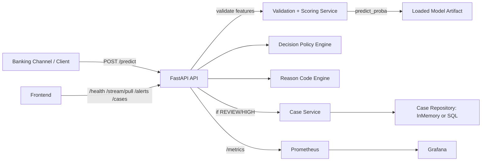
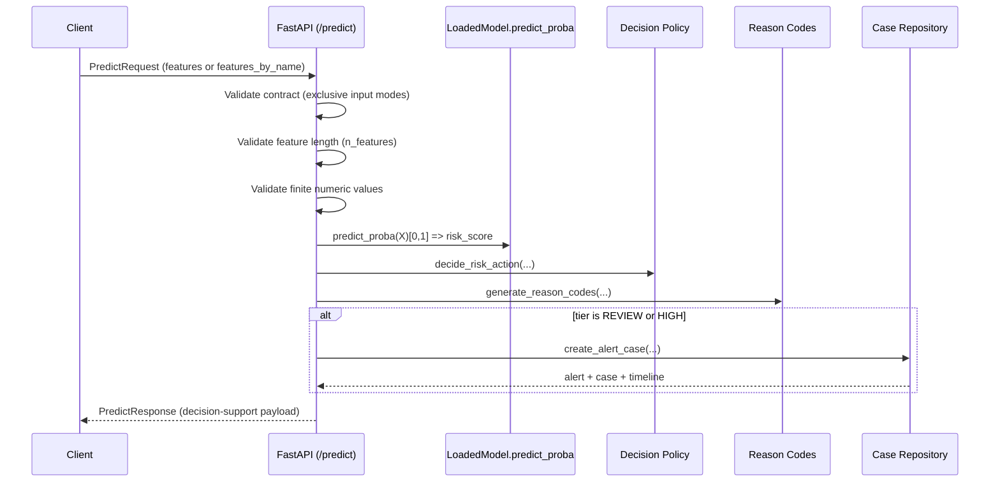

# Complete System Specification (Extracted From Code + Project Docs)

Repository: `Final_Project_DMM501_Group1`  
Role: Senior ML Engineer • Backend Architect • Technical Auditor  
Generated: 2026-04-20  
Scope: This document reconstructs the system as actually implemented in this repository (code is source-of-truth; docs are cross-referenced).

---

## 1. SYSTEM OVERVIEW

### 1.1 Purpose (Business + Technical)

This system is a **real-time banking fraud decision-support platform**. It is explicitly designed to support **operational decision-making** and **analyst workflows**, not to claim calibrated fraud probability or fully autonomous irreversible adjudication.

Core purpose:
- Accept transaction features (Credit Card Fraud feature schema) plus optional transaction context.
- Compute an **uncalibrated ranking score** (`risk_score_uncalibrated`) using a trained model artifact.
- Apply a deterministic **decision policy engine** to map score → tier → recommended handling.
- Generate **reason codes** (policy + heuristics) to improve interpretability for operations.
- For suspicious tiers (`REVIEW`, `HIGH`), create an **alert and case**, track **case lifecycle**, and record a **timeline** for auditability.
- Expose **metrics** for observability, with Prometheus alert rules and Grafana dashboards.
- Provide a **frontend dashboard** for live monitoring + queue handling.

Primary code references:
- API entrypoint: `src/api/main.py`
- API schemas: `src/api/schemas.py`
- Scoring: `src/services/scoring_service.py`
- Policy: `src/services/decision_service.py`
- Reason codes: `src/services/reason_code_service.py`
- Case ops: `src/services/case_service.py`
- Persistence: `src/repositories/*`
- Model loader: `src/models/loader.py`
- Streaming simulator: `src/streaming/simulator.py`
- Metrics: `src/monitoring/metrics.py`
- Compose stack: `deployment/docker-compose.yml`
- Frontend: `frontend/*`

### 1.2 Key Components

| Component | Responsibility | Implementation |
|---|---|---|
| Model artifact loader | Load joblib model + metadata | `src/models/loader.py`, `src/models/registry.py` |
| Scoring service | Validate finite numeric features; call `predict_proba` | `src/services/scoring_service.py` |
| Decision policy engine | Tiering + action + recommendation mapping | `src/services/decision_service.py` |
| Reason code engine | Policy + heuristic reason codes + summary | `src/services/reason_code_service.py` |
| Case service | Alert/case creation + workflow operations | `src/services/case_service.py` |
| Repository layer | In-memory or SQL persistence + migrations | `src/repositories/*` |
| FastAPI API | HTTP contract + validation + metrics | `src/api/main.py`, `src/api/schemas.py` |
| Streaming simulator | Bursty traffic + rare “attack windows” + sampling | `src/streaming/simulator.py` |
| Monitoring | Prometheus scrape + alerts + Grafana dashboards | `deployment/prometheus/*`, `deployment/grafana/*` |
| Frontend dashboard | Live view + queue handling + timeline | `frontend/*` |

### 1.3 End-to-End Flow

#### Topology + data flow

#### `/predict` sequence

---

## 2. DATASET & FEATURES

### 2.1 Dataset

Primary dataset expected by the artifact metadata:
- Kaggle Credit Card Fraud dataset: `data/archive/creditcard.csv`

Training also supports synthetic fallback:
- Synthetic dataset generated by `sklearn.datasets.make_classification` in `src/data/dataset.py`.

### 2.2 Feature contract (creditcard schema)

The canonical feature schema is **30 numeric features**:

| Position | Feature | Notes |
|---:|---|---|
| 0 | `Time` | elapsed seconds from first transaction |
| 1..28 | `V1..V28` | PCA-transformed features |
| 29 | `Amount` | transaction amount |

Authoritative definitions:
- `artifacts/models/model_info.json` → `feature_columns` and `n_features`
- API schema endpoints: `GET /features/schema`

### 2.3 Imbalance

The trained artifact records:
- `fraud_base_rate` in `artifacts/models/model_info.json`

The committed value is ~0.17% (`0.001727...`), which implies:
- PR-AUC is the primary offline quality metric.
- Thresholds are meaningful only as operating points under a stated policy.

### 2.4 Preprocessing (what is actually applied)

Two layers exist in this repo:

1) **Deployed artifact preprocessing** (actual inference behavior):
- For `model_type=logistic_regression_pipeline`, the model is a scikit-learn pipeline: `StandardScaler()` + `LogisticRegression(...)` (constructed in `src/pipelines/run_model_workflow.py`).

2) **Utility preprocessing** (minimal helper):
- `src/features/preprocess.py` only reshapes to `(1, n_features)`.
- Scaling is not performed there; it is performed inside the pipeline artifact when applicable.

---

## 3. MODEL DETAILS (VERY IMPORTANT)

### 3.1 Artifact inventory (committed)

Directory: `artifacts/models/`

| Path | Meaning |
|---|---|
| `artifacts/models/final_model.joblib` | Final deployable model artifact used by API/tests |
| `artifacts/models/baseline_logistic_regression_pipeline.joblib` | Baseline logistic regression pipeline artifact |
| `artifacts/models/improved_lightgbm.joblib` | Tuned LightGBM candidate artifact |
| `artifacts/models/model_info.json` | Runtime metadata: thresholds, feature_columns, semantics, etc. |

### 3.2 Model types implemented in code

#### A) Benchmark workflow (selection + artifact build)
File: `src/pipelines/run_model_workflow.py`

Baseline:
- `Pipeline([("scaler", StandardScaler()), ("classifier", LogisticRegression(max_iter=2000, class_weight="balanced", random_state=seed))])`

Improved candidate:
- `LGBMClassifier(objective="binary", subsample=0.9, colsample_bytree=0.9, random_state=seed, n_jobs=-1, **params)`
- Hyperparameter grid:
  - `n_estimators: [250, 450]`
  - `learning_rate: [0.03, 0.08]`
  - `num_leaves: [31, 63]`
  - `scale_pos_weight: [10.0, natural_ratio]`

Selection rule:
- Primary: validation PR-AUC
- Tie-break: recall at REVIEW operating point

Threshold policy:
- Capacity-driven top-K thresholds:
  - `review_top_rate` default `0.01` (top 1%)
  - `high_top_rate` default `0.002` (top 0.2%)

Explainability artifacts:
- LightGBM SHAP summary plot: `figures/shap_summary.png` (computed in workflow)
- Logistic regression proxy importance uses absolute coefficients.

#### B) Fast training pipeline (synthetic-friendly)
File: `src/pipelines/train_pipeline.py`

Behavior:
- Uses LightGBM if import succeeds; else RandomForest fallback.
- Builds a final scikit-learn pipeline with `StandardScaler()` + classifier.
- Tunes thresholds by scanning values and maximizing recall subject to min precision constraints.

### 3.3 Deployed model metadata (runtime behavior)

Metadata path:
- `artifacts/models/model_info.json`

Key extracted fields (committed):

| Field | Value |
|---|---:|
| `model_type` | `logistic_regression_pipeline` |
| `selected_model` | `logistic_regression` |
| `dataset_path` | `data\\archive\\creditcard.csv` |
| `fraud_base_rate` | `0.001727485630620034` |
| `n_features` | `30` |
| `threshold_review` | `0.7391262534904803` |
| `threshold_high` | `0.9999047447184487` |
| `threshold_policy.type` | `top_k_rate` |
| `threshold_policy.review_top_rate` | `0.01` |
| `threshold_policy.high_top_rate` | `0.002` |
| `score_semantics` | `risk_score_uncalibrated` |
| `score_percentiles` | list of reference values (UI percentile rank) |
| `selection_timestamp_utc` | present |
| `metrics.*` | validation/test metrics at several operating points |

Versioning:
- `model_version` is not present in the committed `model_info.json`.
- Runtime `model_version` resolves via `src/models/loader.py`:
  - env `MODEL_VERSION` if set, else
  - metadata `model_version` if present, else
  - `Path(model_path).stem` (e.g., `"final_model"`).

### 3.4 Scoring mechanism

At runtime (`POST /predict`):
- Features are validated (finite numeric values).
- Features are reshaped to 2D (`(1, n)`) by `src/features/preprocess.py`.
- Scoring uses `predict_proba`:
  - `risk_score = float(model.predict_proba(X)[0][1])`

Score semantics:
- The system labels the score as `risk_score_uncalibrated`.
- Operational interpretation is via tiers + thresholds, not probability claims.

---

## 4. DECISION POLICY ENGINE

File: `src/services/decision_service.py`

### 4.1 Score → Tier mapping
- If `score >= threshold_high` → `risk_tier = "HIGH"`
- Else if `score >= threshold_review` → `risk_tier = "REVIEW"`
- Else → `risk_tier = "LOW"`

### 4.2 Tier → Legacy action mapping
- `HIGH` → `action="block"`
- `REVIEW` → `action="review"`
- `LOW` → `action="allow"`

### 4.3 Tier → Decision recommendation mapping

Inputs affecting recommendation:
- `amount` (explicit request amount or feature-derived fallback)
- `channel` (normalized)

Rules:
- `HIGH`:
  - If `amount >= 1500` → `BLOCK`
  - Else → `HOLD`
- `REVIEW`:
  - If `channel` in `{mobile_app, internet_banking, web, api, card_not_present}` → `STEP_UP_AUTH`
  - Else → `MANUAL_REVIEW`
- `LOW`:
  - `ALLOW`

Outputs include:
- `decision_label` (ALLOW/REVIEW/BLOCK)
- `decision_explanation` (plain-language)
- `fraud_label` (heuristic; not ground truth)

---

## 5. REASON CODE ENGINE

File: `src/services/reason_code_service.py`

### 5.1 Inputs used
- Score/tier/thresholds
- Feature vector + optional feature names
- Amount and timestamp (explicit or derived)
- Channel
- Optional metadata flags:
  - `velocity_1h`, `high_velocity_txns`, `new_beneficiary`, `device_mismatch`, `geo_anomaly`, `ato_pattern`

### 5.2 Rules (code-exact)

Policy-based:
- `MODEL_HIGH_RISK_SCORE` if HIGH and score>=threshold_high
- `MODEL_REVIEW_RISK_SCORE` if REVIEW and score>=threshold_review
- else `MODEL_LOW_RISK_SCORE`

Heuristics:
- `HIGH_AMOUNT_ANOMALY` if amount>=1000 (amount resolved from request or features)
- `UNUSUAL_TIME_PATTERN` if hour<5 or >=23 (from timestamp or Time feature modulo 24h)
- `HIGH_VELOCITY_TXNS` if `high_velocity_txns` or `velocity_1h>=5`
- Metadata flags: `NEW_BENEFICIARY`, `DEVICE_MISMATCH`, `GEO_ANOMALY`, `ATO_PATTERN`
- `CHANNEL_ANOMALY` if channel not in known set

### 5.3 Output
- `reason_codes: list[str]` (deduped, order-preserving)
- `reason_summary: str` derived by mapping codes to phrases and joining.

### 5.4 Limitations
- Declared demo-level heuristic; not causal explanation.
- PCA features reduce interpretability.

---

## 6. API CONTRACT (FULL)

Schemas: `src/api/schemas.py`  
Handlers: `src/api/main.py`

### 6.1 Cross-cutting behavior
- Root `/` redirects to `/docs`.
- CORS: allowlist via `CORS_ALLOW_ORIGINS` or default localhost regex.
- Metrics: `GET /metrics` returns Prometheus exposition format.
- Auth (optional): `API_AUTH_ENABLED`, `API_TOKENS`.
- Rate limiting (optional): `RATE_LIMIT_ENABLED` with standard headers and exemptions.

### 6.2 Endpoints list (public)

| Endpoint | Method | Purpose |
|---|---:|---|
| `/health` | GET | Model + thresholds + repo mode + queue size |
| `/metrics` | GET | Prometheus metrics |
| `/features/schema` | GET | Feature names + count |
| `/features/random` | GET | Generate random valid features |
| `/predict` | POST | Score transaction + decision + case creation |
| `/stream/pull` | GET | Pull simulated scored events (no labels) |
| `/alerts` | GET | List alerts |
| `/alerts/{alert_id}` | GET | Alert detail |
| `/alerts/{alert_id}/status` | POST | Update linked case status (analyst) |
| `/cases` | GET | List cases |
| `/cases/{case_id}` | GET | Case detail |
| `/cases/{case_id}/status` | POST | Update case status (analyst) |
| `/cases/{case_id}/resolve` | POST | Resolve case (analyst) |
| `/cases/{case_id}/timeline` | GET | Case timeline |
| `/audit/events` | GET | List audit events (admin) |
| `/dataset/samples` | GET | Return dataset samples without labels |

### 6.3 Internal-only endpoint (hidden from OpenAPI)
- `/internal/dataset/samples` (GET): returns dataset samples including `class_label`; requires `INTERNAL_EVAL_TOKEN` via `x-internal-token`.

### 6.4 Request/response schemas (authoritative)

The full Pydantic schema definitions are in `src/api/schemas.py`:
- `PredictRequest`, `PredictResponse`
- `FeatureSchemaResponse`, `RandomFeaturesResponse`
- `DatasetSamplesResponse`, `DatasetSamplesWithLabelResponse`
- `StreamPullResponse`, `StreamScoredEvent`
- `AlertListResponse`, `AlertResponseItem`
- `CaseListResponse`, `CaseResponseItem`, `CaseTimelineResponse`
- `AuditEventListResponse`, `AuditEventResponse`

Validation rules are enforced by:
- schema constraints (e.g. `amount >= 0`)
- API handler checks (mutually exclusive features inputs, finite values, feature length, etc.)
- repository checks (case_status membership in allowed set)

---

## 7. CASE & ALERT SYSTEM

### 7.1 Creation logic
- Only created when `risk_tier in {"REVIEW","HIGH"}` (`src/services/case_service.py`).

### 7.2 Lifecycle states (authoritative)
File: `src/repositories/case_lifecycle.py`

`VALID_CASE_STATUSES`:
- `NEW`, `QUEUED`, `IN_REVIEW`, `ESCALATED`, `CONFIRMED_FRAUD`, `FALSE_POSITIVE`, `BLOCKED`, `RELEASED`, `RESOLVED`

Active review (for queue gauge):
- `{"NEW","QUEUED","IN_REVIEW","ESCALATED"}`

### 7.3 Timeline events
Initial timeline (on create):
- `TRANSACTION_RECEIVED`
- `RISK_SCORED`
- `FLAGGED`
- `ALERT_CREATED`
- `CASE_ASSIGNED`

Status transition events:
- Derived by `status_to_event(status)` (see `src/repositories/case_lifecycle.py`)

Resolution closure:
- For resolved outcomes, repository appends explicit `CASE_CLOSED`.

### 7.4 Persistence modes
- In-memory demo: `src/repositories/in_memory_case_repository.py`
- SQL (SQLite/Postgres): `src/repositories/sql_case_repository.py`
- Selection: `src/repositories/factory.py` via env vars.

---

## 8. BACKEND ARCHITECTURE

### 8.1 Structure
- `src/api/` → FastAPI routes + schemas
- `src/services/` → scoring, decision, reason code, case service
- `src/models/` → artifact loader + loaded model contract
- `src/repositories/` → persistence implementations + migrations
- `src/security/` → optional auth/RBAC, audit hooks, rate limit middleware
- `src/monitoring/` → Prometheus metric definitions
- `src/streaming/` → stream simulator
- `src/data/` → dataset loading/sampling (including internal labeled sampling)

### 8.2 Repository migrations
- Migration runner: `src/repositories/migrations.py`
- SQL scripts: `src/repositories/migrations/001_case_lifecycle.sql`
  - creates `alerts`, `cases`, `case_timeline`, `audit_events` tables + indexes

---

## 9. FRONTEND SYSTEM

### 9.1 Overview
Static HTML/JS dashboard served by:
- `python -m http.server` (local)
- or docker container (`deployment/frontend/Dockerfile`)

### 9.2 Features
- Live connection + health polling (`/health`)
- Stream pull UI (`/stream/pull`)
- Alerts list (`/alerts`)
- Case queue + filtering (`/cases`)
- Case handling actions (`/cases/{id}/status`, `/cases/{id}/resolve`, `/alerts/{id}/status`)
- Timeline view (`/cases/{id}/timeline`)
- Chart + KPIs

### 9.3 Frontend files (source-of-truth)
- `frontend/index.html`
- `frontend/styles.css`
- `frontend/app.js`
- `frontend/api-client.js`
- `frontend/ui.js`
- `frontend/demo-data.js` (optional demo generator)

---

## 10. STREAMING SYSTEM

File: `src/streaming/simulator.py`

Core behavior:
- Pull-based streaming with time simulation
- Bursty TPS windows
- Rare “attack windows” raising fraud rate
- Dataset-backed sampling if dataset exists; else synthetic generation
- No label leakage in returned events

Key defaults (`StreamConfig`):
- base TPS: 1.2
- burst TPS: 14.0
- base fraud rate: 0.0017
- attack fraud rate: 0.01

---

## 11. MONITORING & METRICS

### 11.1 API metrics (Prometheus)
Defined in `src/monitoring/metrics.py`:
- `api_requests_total{endpoint,method,http_status}`
- `api_request_latency_seconds_bucket{endpoint,method}`
- `fraud_predictions_total{tier}`
- `risk_tier_total{tier}`
- `fraud_actions_total{action}`
- `decision_recommendations_total{decision}`
- `fraud_alerts_total{tier}`
- `fraud_cases_total{status}`
- `fraud_case_status_total{status}`
- `confirmed_fraud_total`
- `false_positive_total`
- `review_queue_size`
- `risk_scores_sum_total`
- `risk_scores_count_total`

### 11.2 Prometheus scrape + alert rules
- Scrape config: `deployment/prometheus/prometheus.yml`
- Alert rules: `deployment/prometheus/alerts.yml`
  - 5xx rate, p95 latency, prediction traffic anomalies, review backlog, false positive spike

### 11.3 Grafana dashboards
- Provisioning: `deployment/grafana/provisioning/*`
- Dashboards:
  - `deployment/grafana/dashboards/fraud_api.json`
  - `deployment/grafana/dashboards/mlflow.json`

---

## 12. DEPLOYMENT

### 12.1 Compose services + ports
File: `deployment/docker-compose.yml`

Services:
- `postgres`
- `api`
- `frontend`
- `mlflow` (with exporter on 5001)
- `prometheus`
- `grafana`

Ports (defaults):
- API: 8000
- Frontend: 8082
- Prometheus: 9090
- Grafana: 3000
- MLflow: 5000

### 12.2 Dockerfiles
- API: `deployment/api/Dockerfile`
- Frontend: `deployment/frontend/Dockerfile`
- MLflow: `deployment/mlflow/Dockerfile`

---

## 13. SECURITY & CONFIG

### 13.1 Auth/RBAC (env-gated)
File: `src/security/auth.py`

Env vars:
- `API_AUTH_ENABLED` (default false)
- `API_TOKENS="viewer-token:viewer,analyst-token:analyst,admin-token:admin"`

Roles:
- viewer: read endpoints
- analyst: case mutation endpoints
- admin: audit endpoints

### 13.2 Audit trail
- Audit events are appended via `src/security/audit.py` into repository.
- Admin endpoint: `GET /audit/events`

### 13.3 Rate limiting (env-gated)
File: `src/security/rate_limit.py`

Env vars:
- `RATE_LIMIT_ENABLED`
- `RATE_LIMIT_REQUESTS`
- `RATE_LIMIT_WINDOW_SECONDS`

Behavior:
- sliding window limiter keyed by token or IP
- exemptions for health/metrics/docs

### 13.4 Full env var list (code-referenced)
- `MODEL_PATH`, `MODEL_VERSION`, `FRAUD_THRESHOLD`, `REVIEW_THRESHOLD`
- `INTERNAL_EVAL_TOKEN`
- `CASE_REPOSITORY_MODE`, `CASE_DB_URL`, `DATABASE_URL`, `CASE_DB_AUTO_MIGRATE`
- `API_AUTH_ENABLED`, `API_TOKENS`
- `RATE_LIMIT_ENABLED`, `RATE_LIMIT_REQUESTS`, `RATE_LIMIT_WINDOW_SECONDS`
- `STREAM_BASE_FRAUD_RATE`, `STREAM_BASE_TPS`, `STREAM_BURST_TPS`, `STREAM_SEED`
- `CORS_ALLOW_ORIGINS`
- MLflow exporter: `MLFLOW_URL`, `MLFLOW_DB_PATH`, `MLFLOW_EXPORTER_PORT`, `MLFLOW_EXPORTER_INTERVAL_SECONDS`, `MLFLOW_EXPORTER_HTTP_TIMEOUT_SECONDS`

---

## 14. TESTING

### 14.1 Test suite layout
- Unit/data/model tests: `tests/unit/*`, `tests/data/*`, `tests/model/*`
- Integration tests: `tests/integration/*`
- Runnable local E2E scripts: `tests/test_frontend_api.py`, `tests/verify_system.py`

### 14.2 CI
- Python tests + coverage: `.github/workflows/ci.yml`
- Docker build + compose validation: `.github/workflows/docker.yml`

---

## 15. LIMITATIONS (AUDIT)

### 15.1 Score calibration
- `risk_score` is declared uncalibrated (`risk_score_uncalibrated`).
- No calibration component is implemented.

### 15.2 Reason codes
- Heuristic/policy-derived; not causal.

### 15.3 Streaming
- Simulator only; no event bus, dedupe, or delivery guarantees.

### 15.4 Dataset-path portability bug (confirmed)

The committed artifact metadata contains:
- `dataset_path: "data\\archive\\creditcard.csv"` (Windows separators)

On Linux/macOS, this resolves to a path containing a literal backslash and does not exist, causing:
- `GET /dataset/samples` → 404 dataset not found
- `GET /internal/dataset/samples` → 404 dataset not found (even with token)

This is reproducible by running:
- `python -m pytest -q tests/integration/test_api_dataset_samples.py`

The actual dataset path in this repo is:
- `data/archive/creditcard.csv`

---

## 16. BUSINESS LOGIC INTERPRETATION

### 16.1 Business value
- Converts ML output into tiered operational actions aligned to capacity constraints.
- Provides workflow primitives: alerts, cases, statuses, timeline → supports analyst operations and auditability.

### 16.2 Fraud prevention mechanism
- Uses top-K thresholds to allocate scarce interventions:
  - REVIEW: broader net aligned to review capacity
  - HIGH: narrow net for high-confidence containment actions

### 16.3 Analyst workflow improvements
- Queue visibility (`review_queue_size`)
- Explicit lifecycle statuses and resolution outcomes
- Timeline events for traceability
- Monitoring alerts for backlog and false-positive spikes

