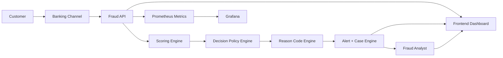
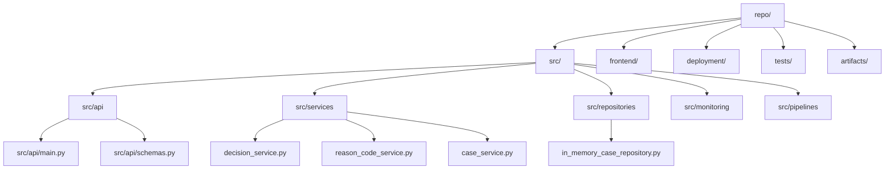
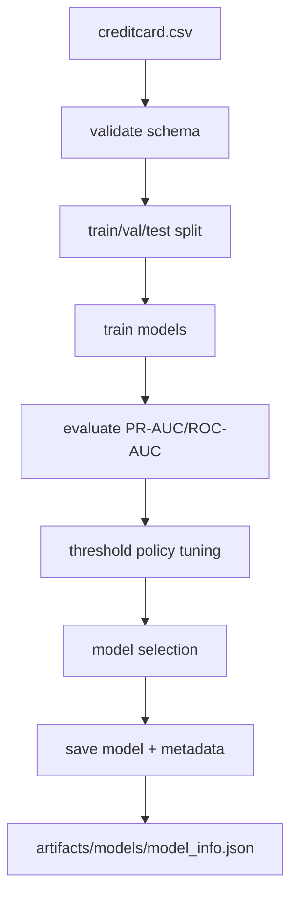
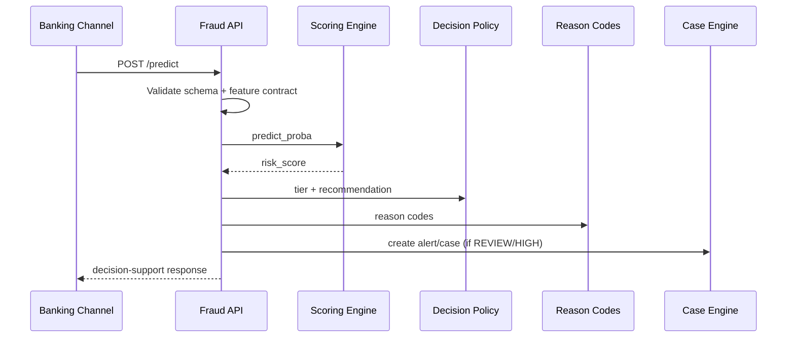
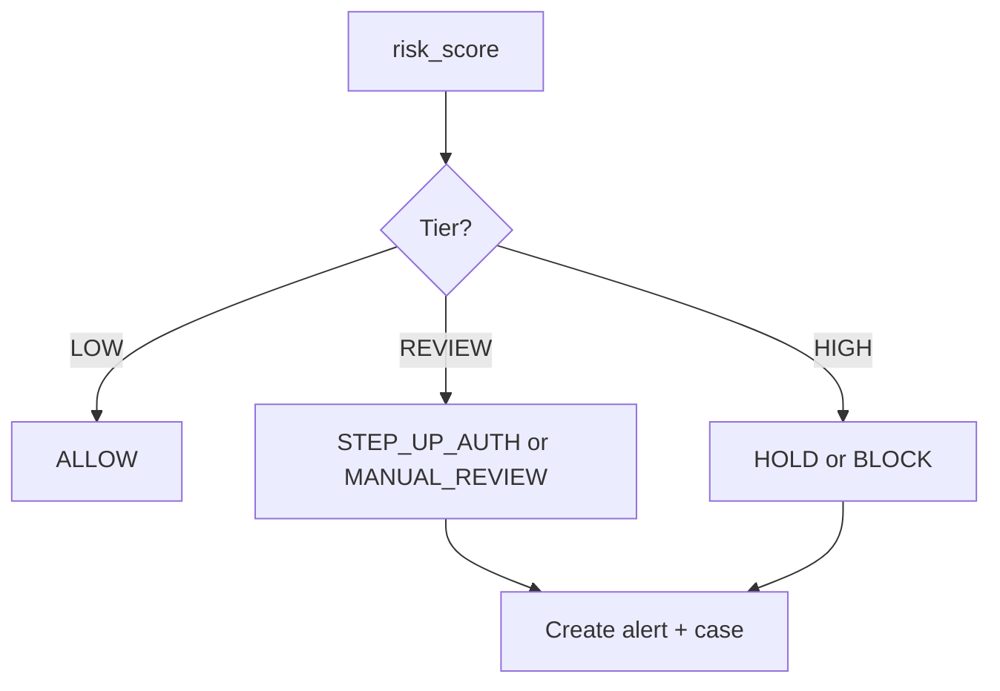
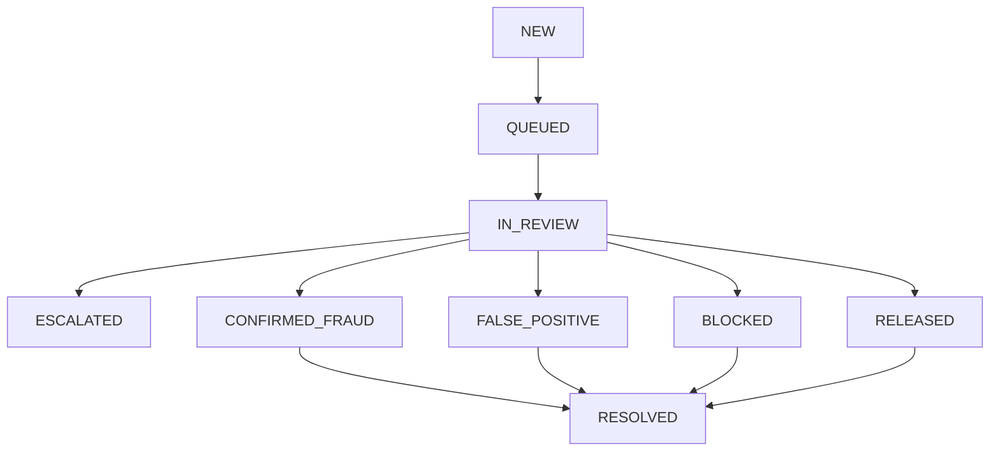
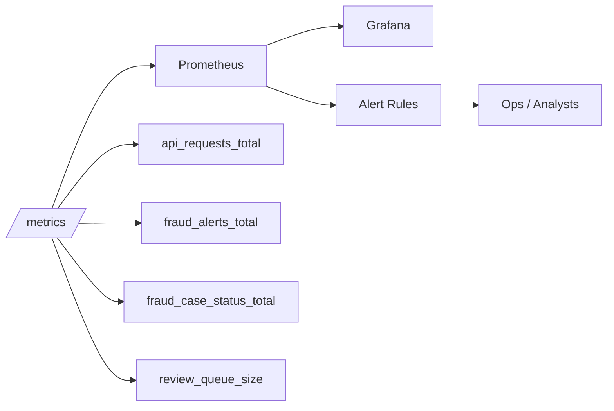
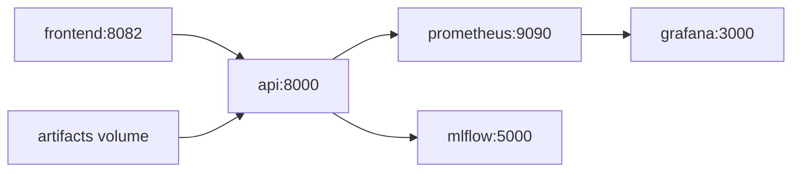
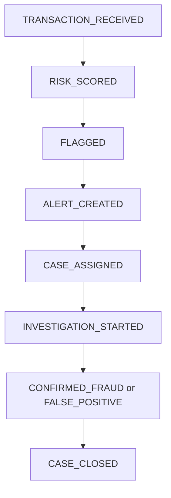
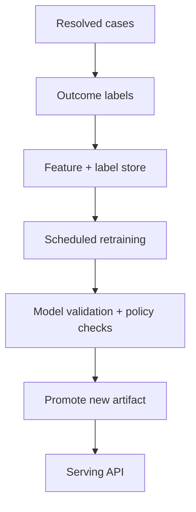

# Final Decision-Support Upgrade Report

## Scope
This report captures the repository audit, implemented upgrades, and residual gaps for transforming the project into a real-time banking fraud decision-support system.

System name used after alignment:
Real-Time Banking Transaction Fraud Detection and Decision Support System

Date:
2026-04-18

Branch:
develop

## Runtime Verification Status
- Verified in this environment:
  - Backend API integration tests including alert/case/timeline workflow
  - Full pytest suite
  - Docker Compose configuration rendering (`docker compose config`)
- Not executed in this environment:
  - Full `docker compose up` stack runtime with all services live simultaneously
  - Manual browser E2E of updated frontend against live backend
- Honest labels used in this report:
  - Implemented
  - Partially implemented
  - Demo-level simulated
  - Proposed future enhancement

## Repository Audit (Phase 1)

| Area | Current State | Evidence | Problem | Priority | Fix Recommendation |
|---|---|---|---|---|---|
| Documentation alignment | Multiple docs existed but had contradictions in model choice, file paths, and endpoint scope | `README.md`, `PROJECT_OVERVIEW.md`, `ARCHITECTURE.md`, `SYSTEM_SPECIFICATION_DOCUMENT.md` | Overclaims and mismatches (for example XGBoost claims while deployed metadata selected logistic regression) | P0 | Align docs to artifact-backed truth; classify implemented vs demo vs proposed |
| Backend API | Originally scoring-focused (`/predict`, `/health`, `/stream/pull`) without persistent case lifecycle endpoints | `src/api/main.py` (pre-upgrade), `src/api/schemas.py` (pre-upgrade) | Frontend case handling was browser memory only; no alert/case contracts | P0 | Add alert/case/timeline API contracts and persistence layer |
| Input validation | Feature vector validation existed; banking metadata validation absent | `src/api/main.py` | Missing transaction_id/timestamp/channel/amount validation paths | P1 | Extend request schema and validation logic with optional banking metadata |
| Decision policy | Tier mapping existed with LOW/REVIEW/HIGH | `src/api/main.py`, `artifacts/models/model_info.json` | Decision recommendation layer not explicit (STEP_UP_AUTH, HOLD, etc.) | P1 | Add decision recommendation engine while preserving legacy `action` for compatibility |
| Reason codes | Not present as explicit API field | `src/api/schemas.py` (pre-upgrade) | No interpretable reasons in contract | P1 | Implement demo-level reason code engine with honest labeling |
| Alert/case engine | Missing | No `/alerts` or `/cases` endpoints pre-upgrade | No case lifecycle state tracking | P0 | Implement in-memory repository + case service + lifecycle transitions |
| Timeline | Missing | No `/cases/{id}/timeline` endpoint pre-upgrade | No investigation history for analysts | P1 | Add timeline events and timeline endpoint |
| Monitoring | Core API metrics existed; no operational case metrics | `src/monitoring/metrics.py`, `deployment/prometheus/alerts.yml` | Operational visibility gap for queue/backlog and outcomes | P1 | Add fraud alert/case/status/review queue metrics + new alert rules |
| Frontend | Good visual dashboard but case flow was local-only and not API-backed | `frontend/app.js`, `frontend/ui.js`, `frontend/index.html` | Analyst actions did not persist to backend | P0 | Align frontend to backend lifecycle endpoints and timeline rendering |
| Artifacts | Rich benchmark/report artifacts exist; some docs referenced non-existing files | `artifacts/` inventory, e.g. missing `artifacts/reports/metrics_report.json` | Documentation drift against actual artifact names | P1 | Update docs to use existing artifacts (`model_selection_summary.json`, metrics tables) |
| Deployment/infra | Compose stack and health checks exist | `deployment/docker-compose.yml` | Observability rules did not include queue/case lifecycle metrics | P2 | Extend Prometheus alerts for review backlog and false-positive spikes |
| Tests/CI | Strong baseline; no case lifecycle integration test before upgrade | `tests/`, `.github/workflows/ci.yml` | Missing contract tests for `/alerts` and `/cases` workflows | P0 | Add integration test for alert/case/timeline transitions |

## Implemented Backend Upgrade (Phases 2-4)

### New Modules
- `src/services/decision_service.py`
- `src/services/reason_code_service.py`
- `src/services/scoring_service.py`
- `src/services/case_service.py`
- `src/repositories/in_memory_case_repository.py`
- `src/services/__init__.py`
- `src/repositories/__init__.py`

### Backend Contract Changes
- Extended `POST /predict` request with optional banking metadata:
  - `transaction_id`
  - `timestamp`
  - `amount`
  - `channel`
  - `metadata`
- Extended `POST /predict` response with decision-support fields:
  - `decision_recommendation`
  - `decision_explanation`
  - `reason_codes`
  - `reason_summary`
  - `case_status`
  - `alert_id`
  - `case_id`
  - `fraud_label` (heuristic compatibility field; not ground truth)
- Added alert and case endpoints:
  - `GET /alerts`
  - `GET /alerts/{alert_id}`
  - `POST /alerts/{alert_id}/status`
  - `GET /cases`
  - `GET /cases/{case_id}`
  - `POST /cases/{case_id}/status`
  - `POST /cases/{case_id}/resolve`
  - `GET /cases/{case_id}/timeline`
- Extended `GET /stream/pull` event payload with:
  - `decision_recommendation`
  - `decision_explanation`
  - `reason_codes`
  - `case_status`
  - `alert_id`
  - `case_id`

### Decision Policy Engine Behavior
- Tiering remains threshold-driven from artifact metadata:
  - LOW: below `threshold_review`
  - REVIEW: `threshold_review` to `threshold_high`
  - HIGH: above/equal `threshold_high`
- New recommendation mapping:
  - LOW -> `ALLOW`
  - REVIEW -> `STEP_UP_AUTH` or `MANUAL_REVIEW` (channel-aware)
  - HIGH -> `HOLD` or `BLOCK` (amount-aware)
- Backward-compatible fields preserved:
  - `action` remains `allow|review|block`
  - `decision_label` remains `ALLOW|REVIEW|BLOCK`

### Reason Code Engine (Honest Labeling)
Reason-code generation is implemented as demo-level heuristic + policy-derived signals, including:
- `MODEL_HIGH_RISK_SCORE`
- `MODEL_REVIEW_RISK_SCORE`
- `HIGH_AMOUNT_ANOMALY`
- `UNUSUAL_TIME_PATTERN`
- `HIGH_VELOCITY_TXNS`
- `NEW_BENEFICIARY`
- `DEVICE_MISMATCH`
- `GEO_ANOMALY`
- `ATO_PATTERN`

Limitation:
These reason codes are not causal explanations and are partly metadata-driven heuristics.

### Case Lifecycle and Timeline
Implemented statuses:
- `NEW`, `QUEUED`, `IN_REVIEW`, `ESCALATED`, `CONFIRMED_FRAUD`, `FALSE_POSITIVE`, `BLOCKED`, `RELEASED`, `RESOLVED`

Implemented timeline events include:
- `TRANSACTION_RECEIVED`
- `RISK_SCORED`
- `FLAGGED`
- `ALERT_CREATED`
- `CASE_ASSIGNED`
- `INVESTIGATION_STARTED`
- `CONFIRMED_FRAUD`
- `FALSE_POSITIVE`
- `CASE_CLOSED`

Persistence mode:
- In-memory repository (`in_memory_demo`)
- Honest classification: Demo-level simulated persistence (non-durable)

### Model Framing Alignment
Artifact-backed deployed metadata currently indicates:
- `selected_model`: logistic regression
- `model_type`: logistic_regression_pipeline
- `score_semantics`: `risk_score_uncalibrated`
- thresholds loaded from `artifacts/models/model_info.json`

Correction made:
No calibrated-probability claims are made. Score semantics are preserved as uncalibrated ranking.

## Frontend Alignment and UX Upgrade (Phases 5-6)

Implemented frontend changes:
- API client now supports:
  - alerts list/get/update
  - cases list/get/status/resolve/timeline
- Review page now reflects case lifecycle status and decision recommendation
- Case detail panel includes:
  - case/alert/request/transaction identifiers
  - case status
  - decision recommendation
  - reason codes
  - timeline visualization
- New analyst actions wired to backend:
  - set `IN_REVIEW`
  - mark `CONFIRMED_FRAUD`
  - mark `FALSE_POSITIVE`
  - mark `RESOLVED`

Honest limitation:
- Full manual browser E2E not executed in this environment after UI update.

## Monitoring and Observability Upgrade (Phase 7)

### Added Metrics
Implemented in `src/monitoring/metrics.py`:
- `risk_tier_total{tier}`
- `decision_recommendations_total{decision}`
- `fraud_alerts_total{tier}`
- `fraud_cases_total{status}`
- `fraud_case_status_total{status}`
- `confirmed_fraud_total`
- `false_positive_total`
- `review_queue_size`

### Added Prometheus Alerts
Implemented in `deployment/prometheus/alerts.yml`:
- `FraudReviewQueueBacklogHigh`
- `FraudFalsePositiveSpike`

## Deployment and E2E Readiness (Phase 8)

What was verified now:
- `docker compose -f deployment/docker-compose.yml config` succeeds
- API tests and lifecycle integration tests pass

What remains unverified now:
- Live `docker compose up --build` runtime validation for all services in this execution window
- Grafana dashboard panel updates for newly added metrics (dashboard JSON not fully remapped)

## Testing and Quality (Phase 9)

### Added/Updated Tests
- Updated:
  - `tests/integration/test_api_predict_happy_path.py`
  - `tests/integration/test_api_stream_pull.py`
- Added:
  - `tests/integration/test_api_alert_case_workflow.py`

### Test Execution Results (Verified)
- Focused integration subset: passed
- Full test suite:
  - `30 passed`
  - warnings only (scikit-learn feature-name warnings)

## API Contract Summary

| Endpoint | Purpose | Request | Response | Status |
|---|---|---|---|---|
| `POST /predict` | Score transaction and map to decision workflow | features/features_by_name + optional transaction metadata | risk score, tier, recommendation, reason codes, alert/case IDs | Implemented |
| `GET /health` | Health and model metadata | none | model/threshold metadata + queue size + persistence mode | Implemented |
| `GET /stream/pull` | Demo stream of scored events | pace/max_events query | enriched events with decision + optional case IDs | Implemented |
| `GET /alerts` | Alert queue listing | status, limit | alert list | Implemented |
| `GET /alerts/{alert_id}` | Alert detail | path | alert detail | Implemented |
| `POST /alerts/{alert_id}/status` | Update linked case status via alert | case_status, analyst_note | updated case | Implemented |
| `GET /cases` | Case listing | status, limit | case list | Implemented |
| `GET /cases/{case_id}` | Case detail | path | case detail + timeline | Implemented |
| `POST /cases/{case_id}/status` | Case transition | case_status, analyst_note | updated case | Implemented |
| `POST /cases/{case_id}/resolve` | Case resolution | resolution, analyst_note | updated case | Implemented |
| `GET /cases/{case_id}/timeline` | Investigation timeline | path | timeline events | Implemented |
| `GET /metrics` | Prometheus scraping | none | metrics text | Implemented |

## Functional and Non-Functional Requirements Snapshot (Phase 12)

### Functional Requirements
- The system shall score incoming banking transactions. Implemented.
- The system shall assign risk tiers. Implemented.
- The system shall provide decision recommendations. Implemented.
- The system shall generate alerts for suspicious/high-risk transactions. Implemented.
- The system shall display a fraud alert queue. Implemented (backend + frontend integration).
- The system shall display reason codes for flagged transactions. Implemented (demo-level heuristics).
- The system shall track case lifecycle states. Implemented.
- The system shall visualize fraud investigation timelines. Implemented.

### Non-Functional Requirements
- Performance: API supports fast single inference path; latency metrics present. Partially verified now.
- Reliability: health checks + tests + contract validation. Implemented.
- Maintainability: modular service/repository split. Implemented.
- Observability: technical + operational metrics. Implemented.
- Scalability: single-instance demo architecture only. Partially implemented.
- Security: no auth/rate limit in API. Proposed future enhancement.
- Analyst usability: queue/detail/timeline actions implemented in UI. Implemented (runtime-manual unverified now).

### Business Requirements
- Reduce fraud loss: decision and resolution workflow implemented; impact not quantified in production yet. Partially implemented.
- Reduce false positives: explicit case outcomes and false-positive metric added. Implemented (operational evidence pending).
- Support operational review: alert/case/timeline endpoints implemented. Implemented.
- Improve visibility: queue, status metrics, and timelines implemented. Implemented.
- Reduce response time: direct recommendation mapping and queue API implemented. Implemented.

### Model Requirements
- Handle class imbalance: existing training approach already includes imbalance-aware evaluation. Implemented.
- Preserve feature schema: strict feature length/name checks retained. Implemented.
- Persist threshold metadata: loaded from model metadata. Implemented.
- Expose score semantics honestly: uncalibrated semantics preserved. Implemented.
- Support policy mapping: explicit decision engine implemented. Implemented.

## Implemented vs Proposed Matrix (Phase 13)

| Feature | Description | Backend Status | Frontend Status | Deployment Status | Documentation Status | Overall Status |
|---|---|---|---|---|---|---|
| Fraud risk scoring | Model scoring API and streaming scoring | Fully implemented | Fully consumed | Compose-ready | Updated | Fully implemented |
| Decision recommendations | Tier-to-action mapping (`ALLOW`, `STEP_UP_AUTH`, `MANUAL_REVIEW`, `HOLD`, `BLOCK`) | Fully implemented | Displayed in case/review views | Service-ready | Updated | Fully implemented |
| Reason codes | Policy + heuristic reason code generation | Fully implemented (demo-level semantics) | Displayed in case details | Service-ready | Updated with caveat | Partially implemented |
| Alert queue | Server-side alert list and detail APIs | Fully implemented | Queue panel aligned | Service-ready | Updated | Fully implemented |
| Case lifecycle tracking | Status transitions and resolution endpoints | Fully implemented | Action buttons wired | Service-ready | Updated | Fully implemented |
| Investigation timeline | Event history per case | Fully implemented | Timeline rendered | Service-ready | Updated | Fully implemented |
| Durable persistence | DB-backed case storage | Not implemented | N/A | Not ready | Marked future | Proposed future enhancement |
| Feedback loop retraining | Closed-loop label ingestion/retraining | Not implemented | N/A | Not ready | Marked future | Proposed future enhancement |
| Security controls | Auth, RBAC, rate limiting, audit logging | Not implemented | Not implemented | Not ready | Marked future | Proposed future enhancement |
| Grafana operational dashboards | Panels for new case metrics | Partially implemented | N/A | Partial (rules added) | Partial | Partially implemented |

## Architecture and Flow Diagrams (Phase 10)

### 1) High-Level System Architecture
Purpose: Show end-to-end decision-support components and actors.
Why it matters: Clarifies this is more than a classifier API.



### 2) Folder Structure Diagram
Purpose: Show code organization after service/repository modularization.
Why it matters: Improves maintainability and ownership boundaries.



### 3) ML Pipeline Flow
Purpose: Summarize training/evaluation/selection lifecycle.
Why it matters: Keeps model claims tied to artifact evidence.



### 4) Model Artifact Flow
Purpose: Show what serving consumes from training outputs.
Why it matters: Prevents drift between training claims and runtime behavior.

```mermaid
flowchart LR
  TRAIN[Training workflow] --> MODEL[final_model.joblib]
  TRAIN --> META[model_info.json]
  TRAIN --> REPORTS[benchmark/reports]
  META --> API[API loader]
  MODEL --> API
  API --> HEALTH[/health metadata]
  API --> PRED[/predict metadata fields]
```

### 5) Runtime Transaction Flow
Purpose: Show synchronous decision path for incoming transaction.
Why it matters: Defines real operational sequence for analysts.



### 6) Fraud Response Flow
Purpose: Show operational action mapping by tier.
Why it matters: Makes intervention logic explicit and auditable.



### 7) Case Management Flow
Purpose: Show lifecycle transitions and resolution outcomes.
Why it matters: Supports analyst operations and SLA tracking.



### 8) Monitoring Flow
Purpose: Show technical + operational observability paths.
Why it matters: Enables reliability and workflow health monitoring.



### 9) Deployment Diagram
Purpose: Show compose-level service wiring.
Why it matters: Defines deployable runtime topology.



### 10) Investigation Timeline Flow
Purpose: Show event sequence displayed in case timeline.
Why it matters: Supports explainability and auditability of operations.



### 11) Feedback Loop / Retraining Flow
Purpose: Show proposed closed-loop improvement architecture.
Why it matters: Connects analyst outcomes to future model improvement.



Status: Proposed future enhancement (not implemented).

## Honest Production Gap Summary

### Implemented Today
- Decision-support API contracts
- Alert/case lifecycle engine (in-memory)
- Timeline events and retrieval
- Frontend lifecycle controls and timeline panel
- Operational metrics and additional Prometheus rules
- Integration tests for lifecycle workflows

### Remaining Gaps Before Production
- Durable persistence (PostgreSQL or equivalent)
- Authentication, RBAC, rate limiting, audit logs
- Durable event bus and idempotent ingestion
- Drift monitoring and feedback-loop retraining automation
- Full Grafana dashboard updates for new metrics
- Staging/prod environment parity and load testing

## Recommended Rollout Stages
1. Stage 1 (done): API + frontend contract upgrade with in-memory persistence.
2. Stage 2: Add durable DB repository and migration-backed schema.
3. Stage 3: Add auth/RBAC and secured analyst actions.
4. Stage 4: Add closed-loop retraining with case outcome ingestion.
5. Stage 5: Production SLO/load tests and runbook hardening.
