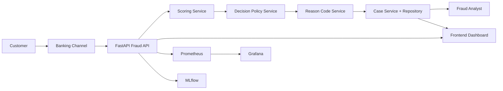
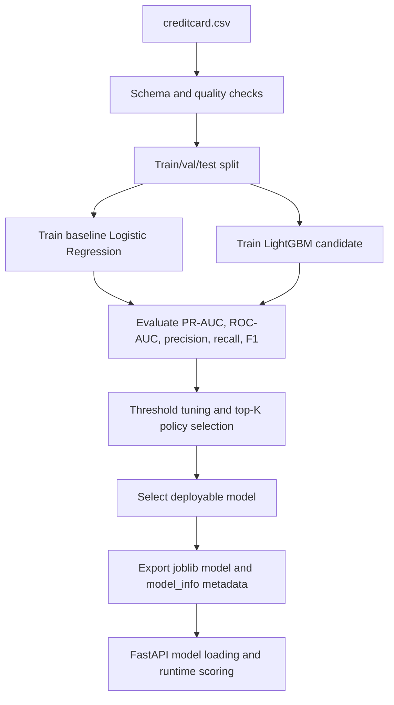
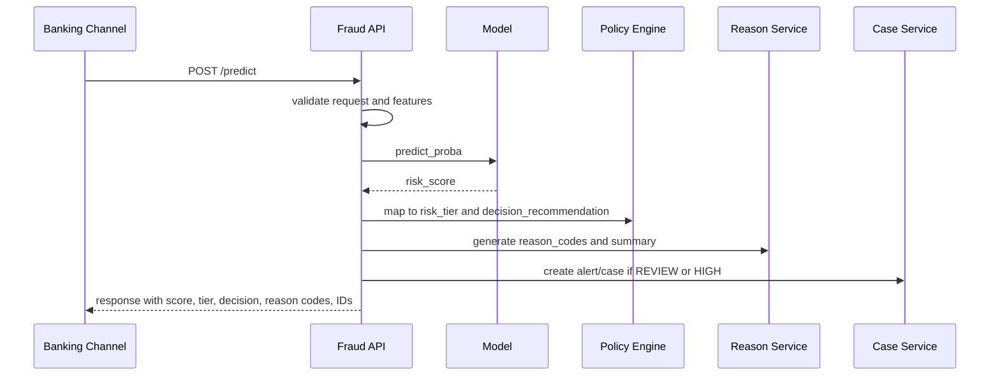
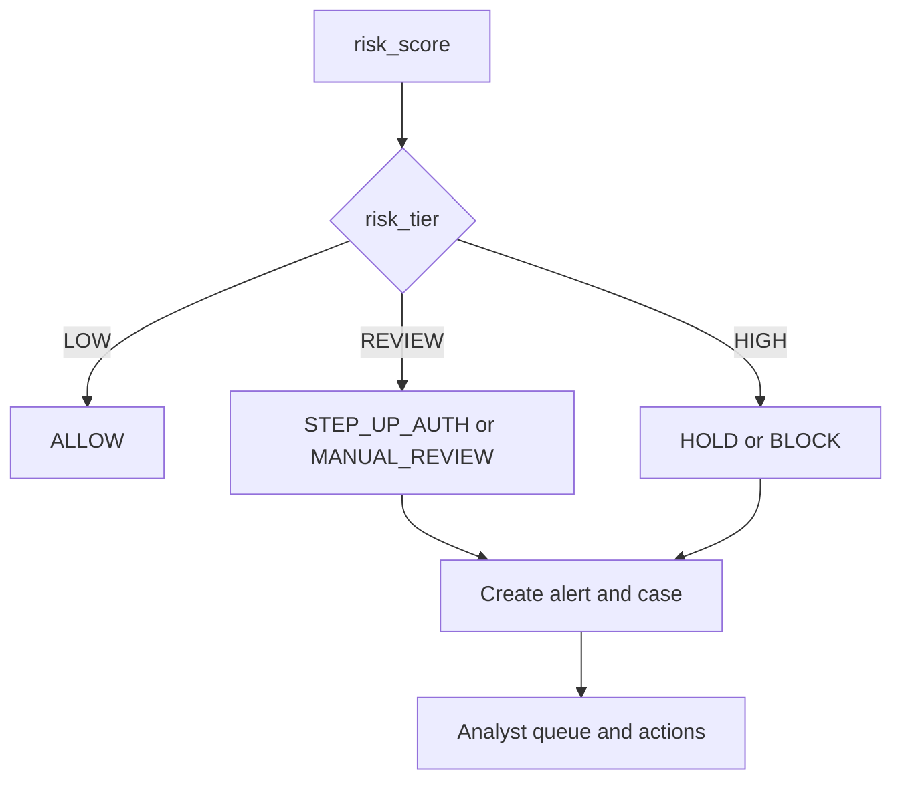
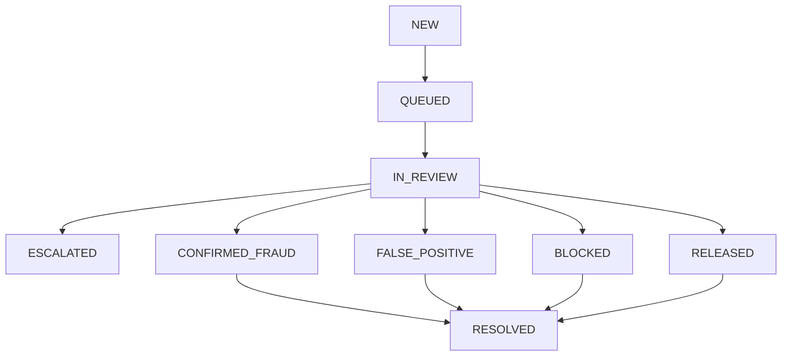
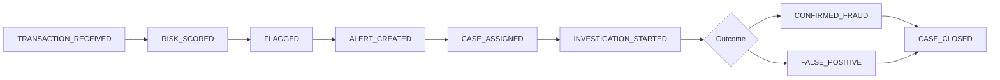
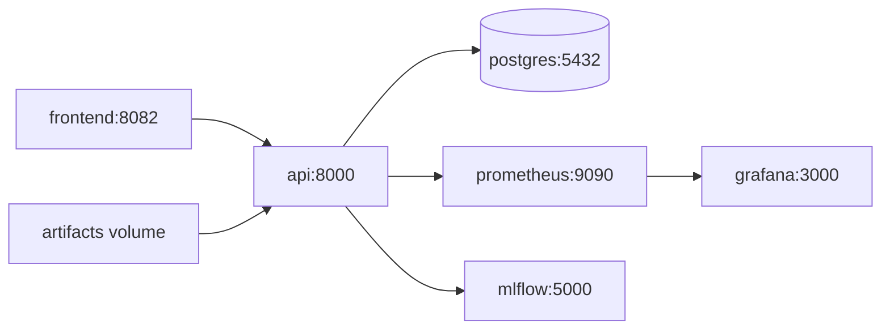

<!-- markdownlint-disable -->

# Real-Time Banking Transaction Fraud Detection and Decision Support System
## Final Evidence-Based Report

Date: 2026-04-19  
Repository: Final_Project_DMM501_Group1  
Report type: Technical and business-aligned final submission report

---

## 1. Executive Summary

This project implements an end-to-end fraud decision-support system for banking transactions, not only a fraud classifier. The current repository includes an ML scoring pipeline, deployable model artifacts, a FastAPI backend, an analyst-facing frontend dashboard, decision policy logic, alert and case lifecycle handling, investigation timelines, monitoring via Prometheus and Grafana, Docker Compose deployment definitions, and automated testing with CI workflows.

The implemented runtime flow is:

Incoming transaction -> validation -> feature preparation -> risk scoring -> policy decision -> reason codes -> alert/case creation -> analyst handling -> timeline events -> monitoring metrics.

The system demonstrates strong implementation maturity for backend workflows, API contracts, model loading, and case operations. Remaining maturity limits are mostly around production hardening and runtime verification breadth (for example, full live-stack runtime verification in this report window, long-horizon drift governance, and full enterprise controls).

---

## 2. Problem Definition and Business Context

Banking fraud detection is a high-cost, high-friction decision problem with asymmetric risks:

- False negatives increase direct fraud loss.
- False positives increase customer friction and operational costs.
- High alert volume can overload analyst teams.

Fraud detection is difficult because:

- Fraud is rare (severe class imbalance).
- Attack patterns evolve quickly.
- Operational capacity constraints require selective intervention.

In this context, decision support is more useful than raw classification. A practical system must connect model outputs to operational actions such as ALLOW, STEP_UP_AUTH, MANUAL_REVIEW, HOLD, and BLOCK.

Key trade-offs handled by this system:

- Fraud loss reduction vs customer experience
- Precision vs recall at selected thresholds
- Review queue volume vs analyst capacity
- Immediate containment vs escalation workflow

---

## 3. Project Scope

### In scope (implemented)

- Artifact-backed ML inference service
- Tiered policy decisions using risk thresholds
- Reason-code generation (heuristic and policy-derived)
- Alert and case creation for REVIEW/HIGH outcomes
- Case lifecycle transitions and resolution endpoints
- Investigation timeline retrieval
- Frontend workflow integration for queue, status, and case detail
- Prometheus metrics and alert rules
- Dockerized multi-service local deployment definitions
- Unit and integration tests with CI execution

### Out of scope or not fully verified in this report window

- Enterprise-grade production controls (full IAM integration, SIEM integration, tamper-proof audit infrastructure)
- Fully automated closed-loop retraining from confirmed outcomes
- Formal calibration pipeline proving risk_score as a true probability
- Full multi-day soak and scale performance verification

### Current boundaries

- The system is suitable as a robust academic and demonstration-grade end-to-end platform.
- Certain production-hardening controls are partially implemented or planned.

---

## 4. System Vision

The intended operational lifecycle is:

Incoming Transaction  
-> Validation  
-> Feature Preparation  
-> Risk Scoring  
-> Decision Policy  
-> Reason Codes  
-> Alert/Case Creation  
-> Analyst Review  
-> Case Resolution  
-> Monitoring  
-> Future Feedback Loop

Current implementation covers this flow at API and data-contract level, with monitoring hooks and analyst operations integrated.

---

## 5. Actors and Stakeholders

- Customer: initiates banking transactions.
- Banking Channel: source channels such as mobile app, internet banking, branch, ATM, API.
- Fraud API: receives transactions and orchestrates scoring, policy, and case workflow.
- Fraud Scoring Engine: model inference path producing risk_score.
- Decision Policy Engine: maps risk_score to risk_tier and decision_recommendation.
- Fraud Analyst: reviews and resolves cases.
- Monitoring/Ops: tracks service and operational health via metrics and alerts.
- ML/Model Ops: maintains model artifacts, thresholds, and experiment tracking.

---

## 6. Functional Requirements

The implemented system satisfies the following functional requirements:

- The system shall score transaction inputs using deployed model artifacts.
- The system shall validate feature contracts and reject malformed input.
- The system shall assign risk_tier values (LOW, REVIEW, HIGH).
- The system shall provide decision_recommendation outputs (ALLOW, STEP_UP_AUTH, MANUAL_REVIEW, HOLD, BLOCK).
- The system shall generate reason codes for scored transactions.
- The system shall create alerts/cases for REVIEW and HIGH outcomes.
- The system shall support case status transitions and case resolution.
- The system shall expose per-case investigation timeline events.
- The frontend shall display queue and case state information.
- The system shall expose operational and technical metrics.
- The system shall provide containerized deployment definitions for local multi-service execution.

---

## 7. Non-Functional Requirements

### Performance
- Low-latency online scoring path is implemented.
- Latency metrics are exposed via histogram instrumentation.

### Reliability
- Health endpoint and integration tests support correctness checks.
- Validation guards prevent invalid contract inputs.

### Maintainability
- Modular service and repository layers are used.
- Typed schemas provide explicit API contracts.

### Observability
- Prometheus metrics include both technical and fraud-operations signals.
- Alert rules include queue and false-positive behaviors.

### Scalability
- Compose topology supports local service decomposition.
- Durability and horizontal scaling are limited without production data infrastructure patterns.

### Security
- Auth, RBAC, and rate limiting are implemented in code paths.
- Runtime security verification in all deployment modes should still be treated as environment-dependent.

### Usability
- Frontend supports queue review, case details, actions, and timeline views.

### Testability
- Unit and integration tests are present and CI-enforced.

---

## 8. System Architecture

Major components:

- API orchestrator (`src/api/main.py`)
- Scoring service (`src/services/scoring_service.py`)
- Decision policy service (`src/services/decision_service.py`)
- Reason-code service (`src/services/reason_code_service.py`)
- Case service and repository abstraction (`src/services/case_service.py`, `src/repositories/*`)
- Monitoring instrumentation (`src/monitoring/metrics.py`)
- Frontend dashboard (`frontend/*`)
- Deployment and monitoring stack (`deployment/*`)

### High-level architecture diagram



---

## 9. Repository and Component Mapping

| Folder / Area | Layer | Responsibility | Key Files | Notes |
|---|---|---|---|---|
| src/api | Application/API | REST endpoints, orchestration, request handling | `src/api/main.py`, `src/api/schemas.py` | Primary runtime entrypoint |
| src/services | Domain logic | Scoring, policy, reason codes, case workflow | `src/services/scoring_service.py`, `src/services/decision_service.py`, `src/services/reason_code_service.py`, `src/services/case_service.py` | Clear separation of concerns |
| src/repositories | Persistence abstraction | In-memory and SQL-backed case storage | `src/repositories/in_memory_case_repository.py`, `src/repositories/sql_case_repository.py`, `src/repositories/factory.py` | In-memory and SQL modes |
| src/monitoring | Observability | Prometheus metric definitions | `src/monitoring/metrics.py` | Technical + operational metrics |
| src/pipelines | ML workflow | Training, evaluation, thresholding, artifact export | `src/pipelines/run_model_workflow.py` | Produces benchmark/report artifacts |
| src/security | API security controls | Auth/RBAC, rate limiting, audit hooks | `src/security/auth.py`, `src/security/rate_limit.py`, `src/security/audit.py` | Configurable via env vars |
| frontend | UI layer | Analyst dashboard, queue handling, API client | `frontend/index.html`, `frontend/app.js`, `frontend/ui.js`, `frontend/api-client.js`, `frontend/demo-data.js` | Uses API-backed and demo stream modes |
| artifacts/models | Model artifacts | Deployable model binaries and metadata | `artifacts/models/final_model.joblib`, `artifacts/models/model_info.json` | Source-of-truth for thresholds and score semantics |
| artifacts/benchmarks | Evaluation evidence | Model comparison and threshold tables | `artifacts/benchmarks/model_comparison_table.csv`, `artifacts/benchmarks/threshold_comparison_table.csv` | Evidence for model trade-offs |
| deployment | Runtime deployment | Dockerfiles, compose topology, monitoring configs | `deployment/docker-compose.yml`, `deployment/api/Dockerfile`, `deployment/frontend/Dockerfile`, `deployment/prometheus/prometheus.yml`, `deployment/prometheus/alerts.yml` | Full local stack definitions |
| tests | Verification | Unit and integration tests | `tests/unit/*`, `tests/integration/*`, `tests/verify_system.py` | Includes API workflow and local E2E script |
| .github/workflows | CI/CD automation | Test and container validation pipelines | `.github/workflows/ci.yml`, `.github/workflows/docker.yml` | CI checks without deployment rollout |
| docs | Documentation | Specifications, upgrades, audits, quick starts | `docs/QUICK_START.md`, `docs/FINAL_DECISION_SUPPORT_UPGRADE_REPORT.md`, `docs/SYSTEM_SPECIFICATION_DOCUMENT.md` | Multiple reports; some historical duplication exists |

---

## 10. Data Design and Dataset Analysis

The repository is built around the Credit Card Fraud dataset schema:

- Features: 30 (`Time`, `V1..V28`, `Amount`)
- Target: binary fraud label (`Class`)
- Class imbalance: severe (fraud base rate around 0.17%)

Evidence:

- `artifacts/models/model_info.json` reports `fraud_base_rate: 0.001727485630620034`.
- API schema and validation enforce 30-feature consistency (`src/api/main.py`, `src/api/schemas.py`).

Dataset limitations for production banking use:

- PCA-transformed feature set limits direct interpretability.
- No explicit account history, beneficiary graph, device fingerprint confidence, KYC context, sanctions exposure, or customer behavior history dimensions.

Potential real-bank feature categories not present:

- Account tenure and profile velocity baselines
- Beneficiary relationship graph risk
- Device trust and session risk signals
- IP intelligence and geolocation confidence
- Historical dispute and chargeback context
- Payment rail and merchant risk context

---

## 11. ML Pipeline Design

The implemented pipeline in `src/pipelines/run_model_workflow.py` includes:

- Data ingestion and schema checks
- Exploratory statistics and report exports
- Stratified train/validation/test split
- Baseline and improved model tracks
- Threshold sweeping and policy-threshold derivation
- Artifact export (`final_model.joblib`, metadata, benchmark tables)
- MLflow logging path and local tracking support

### ML pipeline flow diagram



---

## 12. Model Evaluation and Selection

Models considered and benchmarked:

- Logistic Regression
- LightGBM

Selected deployed artifact:

- `selected_model`: logistic_regression
- metadata source: `artifacts/models/model_info.json`

### Model metrics summary table

| Model | Threshold (table) | Precision | Recall | F1 | ROC-AUC | PR-AUC | Evidence |
|---|---:|---:|---:|---:|---:|---:|---|
| logistic_regression | 0.99 | 0.6742 | 0.8108 | 0.7362 | 0.9680 | 0.7929 | `artifacts/benchmarks/model_comparison_table.csv` |
| lightgbm | 0.84 | 0.8852 | 0.7297 | 0.8000 | 0.8828 | 0.7161 | `artifacts/benchmarks/model_comparison_table.csv` |

Threshold policy evidence from model metadata:

- threshold_review: 0.7391262534904675
- threshold_high: 0.9999047447184487
- threshold policy type: top_k_rate

Score semantics:

- `risk_score` is explicitly labeled as `risk_score_uncalibrated`.
- Therefore, this report treats risk_score as a ranking and prioritization signal, not a calibrated fraud probability.

Why PR-AUC matters:

- In extreme class imbalance, PR-AUC better reflects positive-class retrieval performance than accuracy.
- Operational policy is then applied on top of score rankings using threshold and capacity constraints.

---

## 13. Decision Logic and Fraud Response Workflow

Decision is derived from score and policy thresholds:

- LOW: score < threshold_review -> decision_recommendation = ALLOW
- REVIEW: threshold_review <= score < threshold_high -> decision_recommendation = STEP_UP_AUTH (digital channel) or MANUAL_REVIEW
- HIGH: score >= threshold_high -> decision_recommendation = HOLD or BLOCK (amount-aware)

Reason codes are generated as policy/heuristic signals and attached to API responses.

### Runtime transaction flow diagram



### Fraud response flow diagram



### Case lifecycle diagram



### Investigation timeline diagram



---

## 14. Backend Design

Backend responsibilities:

- Input validation and schema enforcement
- Feature vector preparation and consistency checks
- ML scoring
- Decision policy mapping
- Reason code generation
- Case and alert orchestration
- Timeline retrieval
- Audit event append hooks
- Metrics capture and exposure

### Endpoint summary table

| Endpoint | Method | Purpose | Key Response Fields | Status |
|---|---|---|---|---|
| /health | GET | service and model health | model_loaded, model_version, thresholds, review_queue_size | Implemented |
| /metrics | GET | Prometheus metrics export | metric text payload | Implemented |
| /features/schema | GET | expected feature contract | n_features, feature_names | Implemented |
| /features/random | GET | random feature generation | mode, features, time_s, amount | Implemented |
| /predict | POST | risk scoring + policy + case creation | risk_score, risk_tier, decision_recommendation, reason_codes, alert_id, case_id | Implemented |
| /stream/pull | GET | pull scored stream events | events with score/tier/recommendation and optional case IDs | Implemented |
| /alerts | GET | list alerts | total, alerts[] | Implemented |
| /alerts/{alert_id} | GET | alert details | alert record fields | Implemented |
| /alerts/{alert_id}/status | POST | update linked case via alert | updated case object | Implemented |
| /cases | GET | list cases | total, cases[] | Implemented |
| /cases/{case_id} | GET | case details | case fields and optional timeline | Implemented |
| /cases/{case_id}/status | POST | case status update | updated case object | Implemented |
| /cases/{case_id}/resolve | POST | case resolution transition | updated case object | Implemented |
| /cases/{case_id}/timeline | GET | timeline retrieval | case_id, timeline[] | Implemented |
| /audit/events | GET | audit event listing | events[] | Implemented |
| /dataset/samples | GET | unlabeled sample pull | feature samples | Implemented |
| /internal/dataset/samples | GET | internal labeled samples | labeled samples | Implemented (token-protected) |

---

## 15. Frontend Design and UI/UX

Frontend structure includes:

- Dashboard and review tabs
- Live feed and queue views
- Case detail panel with reason codes and timeline
- Analyst actions for status and resolution transitions
- API token and actor controls

Capability classification:

- Alert queue display: implemented
- Decision recommendation display: implemented
- Reason code display: implemented
- Case status tracking and action buttons: implemented
- Investigation timeline display: implemented
- Demo/random stream support: implemented as simulation mode for demo traffic
- Full browser runtime verification in this report window: unverified runtime (code evidence present)

---

## 16. Monitoring and Observability

### Technical metrics

- api_requests_total
- api_request_latency_seconds
- fraud_predictions_total
- fraud_actions_total

### Operational metrics

- risk_tier_total
- decision_recommendations_total
- fraud_alerts_total
- fraud_cases_total
- fraud_case_status_total
- review_queue_size
- confirmed_fraud_total
- false_positive_total

Prometheus setup:

- scrape targets include API and MLflow exporter (`deployment/prometheus/prometheus.yml`)
- alert rules include API reliability and fraud-operations signals (`deployment/prometheus/alerts.yml`)

Why this matters:

- Technical telemetry supports reliability and latency objectives.
- Operational telemetry supports fraud queue management and policy tuning.

---

## 17. Deployment Design

Deployment design is containerized and compose-driven.

Services in `deployment/docker-compose.yml`:

- api
- frontend
- postgres
- prometheus
- grafana
- mlflow

Design features:

- dedicated Dockerfiles for API and frontend
- artifact mounting into API container
- environment-driven runtime configuration
- health checks per service where configured

### Deployment architecture diagram



Runtime verification status in this report:

- Compose configuration validity: verified
- Full simultaneous runtime for all services in current report window: unverified runtime

---

## 18. Testing and CI/CD

Test assets include:

- Unit tests (`tests/unit`, `tests/data`)
- Integration tests (`tests/integration`)
- Local E2E scripts (`tests/verify_system.py`, `tests/test_frontend_api.py`)

CI workflows:

- `.github/workflows/ci.yml`: unit tests, integration tests, and coverage gate
- `.github/workflows/docker.yml`: container build and compose configuration validation

Coverage and verification honesty:

- CI enforces coverage gate (`--cov-fail-under=80`).
- This report does not claim production deployment automation; workflows focus on quality gates and build validation.

---

## 19. Responsible AI

Responsible AI posture in this repository includes:

- Honest score semantics (uncalibrated ranking signal)
- Human oversight through analyst workflow and case resolution
- Reason code transparency with explicit caveat that explanations are heuristic/policy-derived
- Internal labeled endpoint protection for controlled usage

Limitations:

- Fairness cannot be comprehensively evaluated from available dataset features alone.
- No claim is made that reason codes are causal or sufficient for autonomous adjudication.
- Governance and monitoring processes need extension for production policy oversight.

---

## 20. Implementation Status Matrix

| Feature | Backend Status | Frontend Status | Deployment Status | Evidence | Final Status |
|---|---|---|---|---|---|
| ML risk scoring | Implemented | Integrated | Compose-defined | `src/api/main.py`, `artifacts/models/final_model.joblib` | Fully implemented |
| risk_tier assignment | Implemented | Displayed | Compose-defined | `src/services/decision_service.py` | Fully implemented |
| decision_recommendation mapping | Implemented | Displayed | Compose-defined | `src/services/decision_service.py`, `frontend/app.js` | Fully implemented |
| Reason codes | Implemented (heuristic) | Displayed | Compose-defined | `src/services/reason_code_service.py` | Partially implemented |
| Alert generation | Implemented | Displayed | Compose-defined | `/predict` + `/alerts` flow in `src/api/main.py` | Fully implemented |
| Case lifecycle tracking | Implemented | Implemented | Compose-defined | `src/repositories/*case_repository*`, `frontend/app.js` | Fully implemented |
| Investigation timeline | Implemented | Implemented | Compose-defined | `/cases/{id}/timeline`, UI timeline rendering | Fully implemented |
| Durable persistence | Implemented path present | N/A | Compose postgres present | `src/repositories/sql_case_repository.py` + `deployment/docker-compose.yml` | Partially implemented |
| Monitoring metrics | Implemented | N/A | Prometheus/Grafana configured | `src/monitoring/metrics.py`, `deployment/prometheus/*` | Fully implemented |
| Auth/RBAC/rate limiting | Implemented in backend | Token input in UI | Env-driven | `src/security/auth.py`, `src/security/rate_limit.py`, `frontend/index.html` | Partially implemented |
| CI quality gates | Implemented | N/A | GitHub workflows | `.github/workflows/ci.yml`, `.github/workflows/docker.yml` | Fully implemented |
| Full live-stack runtime verification in this report window | Partial evidence only | Partial evidence only | Partial evidence only | config and code-level checks | Unverified runtime |

---

## 21. Gaps and Limitations

| Gap / Limitation | Current State | Impact | Classification |
|---|---|---|---|
| risk_score calibration | Not calibrated in evidence | score should not be treated as probability | Known limitation |
| Full live-stack runtime proof in this report window | Config/build evidence stronger than live run evidence | limits operational certainty claims | Unverified runtime |
| Production-grade data governance | Not fully implemented in repo | compliance and audit risk in real deployment | Future enhancement |
| Long-horizon drift detection and automated retraining | Not end-to-end automated | potential model degradation risk over time | Future enhancement |
| Enterprise identity integration | Not fully integrated with external IAM | security operations maturity gap | Future enhancement |
| Durable persistence verification breadth | SQL path exists; broad runtime validation not exhaustively documented here | persistence confidence depends on environment run | Partially implemented |

---

## 22. Future Improvements

### Future improvement roadmap

| Roadmap Item | Priority | Description | Expected Benefit |
|---|---|---|---|
| Calibrate risk scores | High | Add calibration pipeline and validation artifacts | Better risk interpretation and policy setting |
| Durable PostgreSQL-first operations mode | High | Make SQL mode the default in deployment profiles | Operational continuity and auditability |
| Role-based access hardening | High | Expand RBAC policies, token rotation, secret management | Security and governance improvement |
| Audit logging and retention policy | High | Add immutable and queryable operational audit trails | Compliance readiness |
| Drift detection and alerting | Medium | Add statistical drift checks and model health dashboards | Earlier model degradation detection |
| Outcome-driven retraining workflow | Medium | Build closed loop from confirmed case outcomes to retraining | Continuous model improvement |
| Advanced analyst tooling | Medium | Add triage prioritization, assignment, and SLA tracking | Better analyst throughput and decision quality |
| Feature-store aligned production data model | Medium | Introduce reproducible online/offline feature consistency | Reduced training-serving skew |

---

## 23. Conclusion

This repository has moved beyond a standalone fraud classifier into a coherent fraud decision-support platform with strong end-to-end coverage at code and contract level. The project demonstrates integrated ML scoring, policy-driven risk handling, alert and case lifecycle management, timeline visibility, monitoring, containerized deployment definitions, and test automation.

The strongest aspects are backend completeness, explicit decision-support semantics, artifact-backed model metadata, and operational observability design. The principal constraints are production-hardening depth and runtime verification breadth in this specific reporting window.

Overall, the implemented system is a meaningful and defensible end-to-end banking fraud decision-support platform for academic evaluation and project defense, with a clear path to production-grade maturation.

---

## Appendix A: Optional Monitoring Flow Diagram

```mermaid
flowchart LR
  API[Fraud API] --> METRICS[/metrics endpoint]
  METRICS --> PROM[Prometheus scrape]
  PROM --> ALERTS[Alert rule evaluation]
  PROM --> GRAF[Grafana dashboards]
  ALERTS --> OPS[Ops and analyst response]
```
