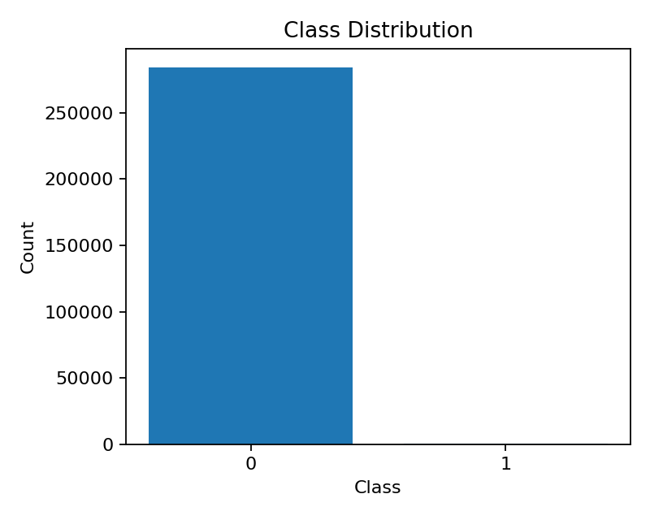
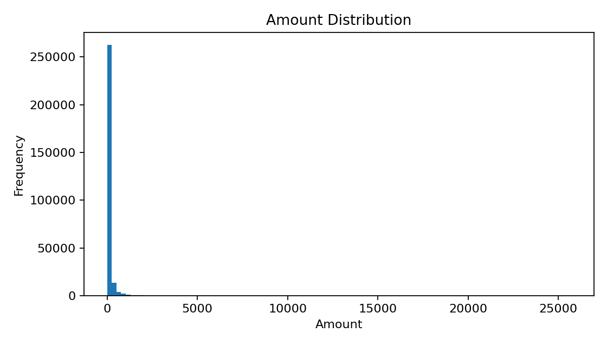
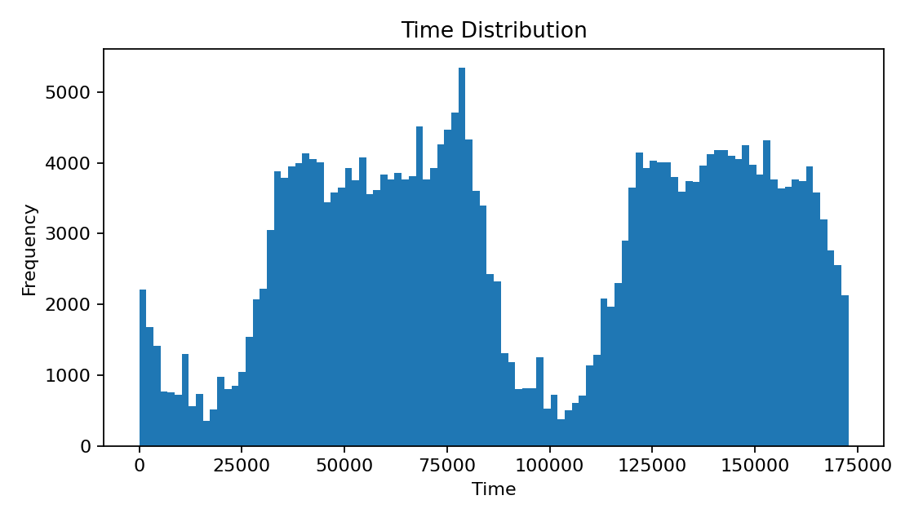
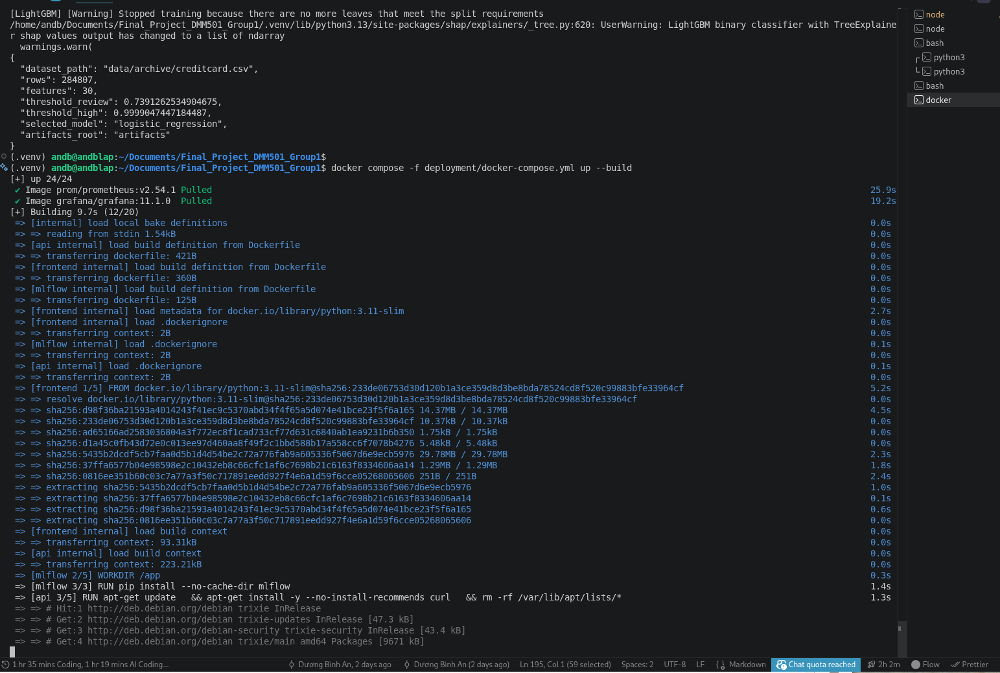
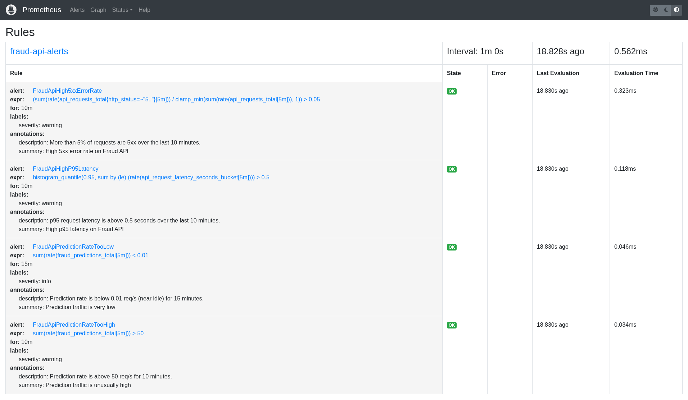

# Phân Tích Chuyên Sâu Theo Kiểu Giảng Giải
## Real-Time Banking Fraud Detection and Decision Support System

Tài liệu này không chỉ “tóm tắt dự án”, mà giải thích từng phần như một buổi giảng kỹ thuật.
Mục tiêu là trả lời 3 câu hỏi cốt lõi:

1. **Dataset này có gì đặc biệt?**
2. **Vì sao bài toán này cần machine learning?**
3. **Vì sao cuối cùng dự án lại dùng logistic regression, ngưỡng quyết định, và một hệ thống case/alert hoàn chỉnh?**

> Nói ngắn gọn: đây không phải chỉ là một model dự đoán fraud, mà là một **hệ thống ra quyết định** cho nghiệp vụ ngân hàng.

---

## 1) Bức tranh tổng thể: dự án này thực sự làm gì?

Nếu nhìn ở tầng nghiệp vụ, hệ thống làm 4 việc:

- **Scoring**: chấm điểm rủi ro cho từng giao dịch.
- **Policy**: chuyển điểm rủi ro thành hành động nghiệp vụ như `ALLOW`, `STEP_UP_AUTH`, `MANUAL_REVIEW`, `HOLD`, `BLOCK`.
- **Workflow**: tạo alert/case để analyst xử lý.
- **Observability**: ghi metric, dashboard, audit trail để vận hành.

Điểm hay của dự án là nó không dừng ở “dự đoán đúng hay sai”, mà đi tiếp một bước:  
**“Nếu giao dịch này đáng ngờ, hệ thống phải làm gì tiếp theo?”**

Đó mới là tư duy đúng của fraud detection trong thực tế.

---

## 2) Dataset này như thế nào, và vì sao nó thú vị?

Dataset chính là file `data/archive/creditcard.csv`.

### 2.1 Cấu trúc dữ liệu

Theo artifact schema:

- **284,807** giao dịch
- **31 cột**
- Trong đó:
  - `Time`
  - `V1` đến `V28`
  - `Amount`
  - `Class` là nhãn mục tiêu

Bảng tóm tắt:

| Thành phần | Ý nghĩa |
|---|---|
| `Time` | Thời gian trôi qua từ giao dịch đầu tiên, tính theo giây |
| `Amount` | Số tiền giao dịch |
| `V1..V28` | Biến ẩn danh, gần như PCA/anonymized |
| `Class` | 0 = bình thường, 1 = fraud |

### 2.2 Cái “hay” của dataset

Dataset này rất nổi tiếng trong fraud detection vì nó có 3 đặc điểm cực kỳ giáo dục:

#### a) Cực kỳ mất cân bằng

Từ artifact EDA:

- Fraud: **492**
- Non-fraud: **284,315**
- Fraud ratio: **0.001727...** tức khoảng **0.17%**

Nói theo ngôn ngữ thực tế:

> Cứ khoảng 1,000 giao dịch thì chỉ có khoảng 1–2 giao dịch gian lận.

Đây là lý do vì sao bài toán fraud **không thể xử lý như bài toán classification thông thường**.

Nếu anh/chị đo “accuracy” thôi, một model ngớ ngẩn luôn đoán “không fraud” cũng đã đạt gần **99.83%** accuracy.  
Nhưng model đó vô dụng.

#### b) Feature bị ẩn danh

`V1..V28` không mang nghĩa nghiệp vụ trực tiếp.

Đây là điểm rất thú vị:

- Với bài toán thông thường, bạn có thể giải thích theo kiểu “đơn hàng lớn”, “địa chỉ khác”, “người dùng mới”.
- Nhưng ở đây, phần lớn tín hiệu đã bị biến đổi ẩn danh.

Điều đó làm cho bài toán này giống một tình huống thật trong ngân hàng:

> ML phải học ra tín hiệu mà con người không nhìn thấy trực tiếp.

#### c) Có cả biến dễ hiểu lẫn biến khó hiểu

- `Time` và `Amount` là hai biến dễ hiểu.
- `V1..V28` là vùng “ẩn”.

Sự kết hợp này rất hay vì nó phản ánh đúng thực tế:

- Có tín hiệu nghiệp vụ rõ ràng
- Có tín hiệu thống kê khó giải thích
- Có nhãn fraud để học có giám sát

### 2.3 Dataset này khó ở đâu?

Về mặt học máy, đây là bài toán khó vì:

- **Imbalance cực mạnh**
- **Không thể nhìn nhãn và feature bằng trực giác**
- **Ngưỡng quyết định phải gắn với chi phí vận hành**
- **PR-AUC quan trọng hơn accuracy**
- **Ngưỡng tốt cho fraud không phải 0.5**

Đây chính là kiểu dataset mà ML tỏa sáng:

> Con người không thể viết đủ luật cho mọi mẫu gian lận, nhưng mô hình có thể học pattern từ dữ liệu lịch sử.

---

## 3) Vì sao bài toán này cần machine learning?

Nếu ta chỉ dùng rule-based system, ví dụ:

- giao dịch > X tiền thì nghi ngờ
- giao dịch ban đêm thì nghi ngờ
- giao dịch từ kênh lạ thì nghi ngờ

thì sẽ gặp ngay 4 vấn đề:

### 3.1 Fraud thay đổi liên tục

Fraudster không đứng yên.  
Hôm nay họ dùng pattern A, ngày mai họ đổi sang pattern B.

Rule-based system thường:

- chậm thích nghi
- khó mở rộng
- dễ sinh quá nhiều false positive

### 3.2 Không thể viết tay hết các tương tác

Gian lận không chỉ là một feature lớn hay một feature lạ.
Nó là **sự kết hợp** của nhiều tín hiệu:

- score cao
- amount bất thường
- thời gian lạ
- channel lạ
- hành vi chuỗi

Machine learning giỏi ở chỗ nó học được **tương tác đa chiều** này.

### 3.3 Cần triage, không chỉ prediction

Ngân hàng không cần câu trả lời “fraud / not fraud” một cách tuyệt đối.
Ngân hàng cần:

- cái nào cho qua luôn
- cái nào cho step-up auth
- cái nào analyst phải xem
- cái nào phải block ngay

Đây là bài toán **decision support**, không phải chỉ là classification.

### 3.4 Cần một thang đo rủi ro liên tục

Model cho ra một score liên tục từ 0 đến 1.
Score này rất hữu ích để:

- xếp hạng
- chọn top-K
- đặt ngưỡng theo năng lực team review
- so sánh giữa các giao dịch

Nói đơn giản:

> ML ở đây không thay analyst. ML giúp analyst biết nên nhìn chỗ nào trước.

---

## 4) Vì sao dự án dùng logistic regression?

Đây là câu hỏi rất hay, vì nhiều người sẽ nghĩ:

> Fraud detection mà dùng logistic regression thì có “quá đơn giản” không?

Câu trả lời ngắn: **không đơn giản, mà là hợp lý**.

### 4.1 Logistic regression là model nền tảng rất mạnh cho tabular data

Trong dự án này, logistic regression được dùng như baseline và cuối cùng là model được chọn.

Điều này có 3 lý do chính:

#### a) Dữ liệu dạng bảng, numeric, sạch

Dataset đã là numeric feature vector.
Không có text, không có image, không có sequence phức tạp.

Với dữ liệu như vậy:

- logistic regression
- random forest
- gradient boosting / LightGBM

thường là những ứng viên đầu tiên rất mạnh.

#### b) Mô hình ổn định, nhanh, dễ triển khai

Logistic regression:

- train nhanh
- predict nhanh
- dễ đóng gói
- dễ debug
- dễ theo dõi trong production

Với một hệ thống real-time, đây là lợi thế lớn.

#### c) Có tính giải thích tương đối tốt

Khi dùng logistic regression, các hệ số có thể được xem như một dạng “độ nghiêng” của feature đối với risk score.

Dù không phải explanation hoàn hảo, nó vẫn dễ hiểu hơn nhiều so với model phức tạp.

### 4.2 Tại sao logistic regression thắng trong repo này?

Trong artifact hiện tại:

- logistic regression baseline validation PR-AUC: **0.630087...**
- LightGBM candidate validation PR-AUC: **0.628929...**

Tức là **baseline logistic regression tốt hơn nhẹ** trên validation.

Đây là chi tiết rất đáng chú ý.

Nó nói rằng:

> Với cấu trúc dữ liệu hiện tại, một ranh giới tuyến tính sau khi chuẩn hóa feature đã bắt được tín hiệu rất tốt.

Đây là một kết quả hoàn toàn thực tế.
Không phải lúc nào model “phức tạp hơn” cũng thắng.

### 4.3 Vai trò của StandardScaler

Pipeline logistic regression trong dự án có `StandardScaler`.

Điều đó quan trọng vì:

- `Time` và `Amount` có scale khác nhau
- `V1..V28` lại nằm quanh các giá trị chuẩn hóa/ẩn danh
- logistic regression nhạy với scale của feature

Nếu không scale, model có thể học lệch hoặc tối ưu kém ổn định.

### 4.4 Một cách hiểu rất trực quan

Bạn có thể hình dung logistic regression như sau:

> Nó vẽ một mặt phẳng ranh giới trong không gian feature, rồi ước lượng xem giao dịch đang nằm về phía “an toàn” hay “rủi ro”.

Đây là model “tuyến tính”, nhưng trong tabular fraud detection, tuyến tính không có nghĩa là yếu.
Rất nhiều tín hiệu fraud đủ mạnh để logistic bắt được.

### 4.5 Vì sao không chọn LightGBM cuối cùng?

LightGBM là candidate mạnh và rất hợp với tabular data.
Nhưng trong dự án này, nó không thắng validation PR-AUC.

Đó là một bài học tốt:

- không phải cứ model mới hơn là tốt hơn
- phải chọn theo metric phù hợp
- phải chọn theo dữ liệu thực tế, không theo cảm tính

Nói theo kiểu giảng viên:

> ML không phải thi xem model nào “ngầu” hơn, mà là model nào phục vụ tốt nhất mục tiêu vận hành.

---

## 5) Tại sao không dùng ngưỡng 0.5?

Đây là chỗ nhiều người mới học ML hay hiểu sai.

### 5.1 0.5 chỉ là một convention, không phải chân lý

Ngưỡng 0.5 là một mặc định tiện lợi, nhưng không hề tối ưu cho fraud detection.

Vì sao?

Vì fraud là bài toán cực kỳ mất cân bằng.

Nếu dùng 0.5:

- có thể bỏ sót rất nhiều fraud
- hoặc làm queue review quá nhẹ, không đủ nhạy

### 5.2 Dự án dùng ngưỡng theo capacity

Repo này chọn ngưỡng theo **top-K / top-rate policy**:

- `review_top_rate = 0.01`
- `high_top_rate = 0.002`

Điều này có nghĩa:

- khoảng top 1% score cao nhất đi vào review
- khoảng top 0.2% score cao nhất vào vùng high-risk

Đây là cách làm rất “thực chiến”:

> Ngân hàng không có vô hạn analyst. Ngưỡng phải khớp với năng lực con người.

### 5.3 Tư duy đúng ở đây là xếp hạng, không phải phân lớp cứng

Với fraud detection, model score thường được dùng như một **ranking score**.

Ví dụ:

- giao dịch A score 0.99
- giao dịch B score 0.81
- giao dịch C score 0.12

Điều quan trọng không phải score nào “đúng xác suất tuyệt đối”, mà là:

1. ai nguy hiểm hơn ai
2. ai cần review trước
3. ai nên block sớm

### 5.4 Vì sao score được ghi là “uncalibrated”?

Artifact của dự án nói rõ:

- `score_semantics = risk_score_uncalibrated`

Điều này rất quan trọng.

Nó có nghĩa là:

> Score chỉ nên đọc là mức rủi ro tương đối, không nên diễn giải như xác suất fraud tuyệt đối.

Đây là cách ghi chú đúng và trung thực.

### 5.5 Nhìn vào metric để hiểu ý nghĩa threshold

Ở operating point `threshold_review`, test precision thấp hơn nhưng recall cao:

- precision khoảng **14.6%**
- recall khoảng **85.1%**

Điều này hoàn toàn chấp nhận được nếu mục tiêu là **bắt thật nhiều case để analyst xem**.

Ở `threshold_high`, precision cao hơn rất nhiều:

- precision khoảng **84.3%**
- recall khoảng **79.7%**

Đây là vùng cho hành động mạnh hơn như hold/block.

Nói cách khác:

> `REVIEW` là vùng “hãy nhìn kỹ”, còn `HIGH` là vùng “hãy chặn/giữ lại ngay”.

### 5.6 Decision table

| Risk tier | Ý nghĩa vận hành | Hành động |
|---|---|---|
| `LOW` | Gần như an toàn | `ALLOW` |
| `REVIEW` | Có tín hiệu đáng nghi | `STEP_UP_AUTH` hoặc `MANUAL_REVIEW` |
| `HIGH` | Rủi ro rất cao | `HOLD` hoặc `BLOCK` |

---

## 6) Backend: model không chỉ dự đoán, mà còn ra quyết định

Phần backend là nơi hệ thống “sống”.

### 6.1 Luồng `/predict`

Khi có request prediction, backend thực hiện chuỗi bước:

1. Kiểm tra model đã load chưa
2. Validate feature vector
3. Tính `risk_score`
4. Map score → `LOW/REVIEW/HIGH`
5. Sinh reason codes
6. Nếu là `REVIEW` hoặc `HIGH`, tạo alert/case
7. Ghi metrics và audit trail

Đây không còn là một model đơn lẻ nữa.
Đây là một **decision pipeline**.

### 6.2 Vì sao tạo case chỉ khi REVIEW/HIGH?

Vì nếu mọi giao dịch đều tạo case, analyst sẽ bị ngập.

Chỉ những giao dịch vượt ngưỡng mới cần workflow xử lý.
Đây là triết lý rất quan trọng của fraud ops:

> ML phải tiết kiệm nguồn lực vận hành, không được tạo thêm noise.

### 6.3 Alert và case khác nhau thế nào?

- **Alert**: tín hiệu cảnh báo.
- **Case**: hồ sơ điều tra có trạng thái, timeline, note, kết quả.

Alert là “chuông báo”.
Case là “hồ sơ làm việc”.

### 6.4 Timeline là gì?

Timeline giúp nhìn toàn bộ vòng đời:

- giao dịch đến
- model chấm điểm
- alert tạo ra
- analyst bắt đầu review
- case được kết luận

Đây là điểm rất quan trọng trong hệ thống enterprise:

> Không chỉ biết kết quả, mà phải biết “đã xảy ra chuyện gì, theo thứ tự nào”.

### 6.5 Security và audit

Hệ thống có:

- token-based auth
- RBAC
- audit event
- rate limiting

Mức này đủ tốt cho demo và nội bộ, nhưng chưa phải production-grade IAM.

---

## 7) Frontend: không phải demo giả, mà là giao diện vận hành thật

Frontend của dự án là một static app, nhưng nó không phải “màn hình trang trí”.

Nó làm được 4 việc:

- xem live feed
- xem alert queue
- xem chi tiết case
- cập nhật trạng thái và note của analyst

### 7.1 Dashboard có ý nghĩa gì?

Dashboard giúp người vận hành trả lời nhanh:

- hiện hệ thống có sống không?
- traffic có đang vào không?
- score có bất thường không?
- backlog review có tăng không?

### 7.2 Chế độ real stream và random stream

Đây là thiết kế rất hay:

- **Real mode**: gọi `/stream/pull`
- **Random mode**: sinh giao dịch giả lập rồi gọi `/predict`

Điều này giúp:

- demo mượt
- test dễ
- không phụ thuộc hoàn toàn vào data feed thật

### 7.3 Điểm đáng khen

Frontend hiển thị rõ:

- model version
- thresholds
- score semantics
- expected features

Tức là UI không chỉ show số đẹp, mà còn show **ngữ cảnh mô hình**.

Đó là cách làm đúng.

---

## 8) Monitoring, deployment và test: vì sao đây là dự án “hệ thống”, không chỉ là notebook?

### 8.1 Monitoring

Project có:

- Prometheus
- Grafana
- MLflow runtime tracking

Đây là dấu hiệu của một dự án đã bước qua giai đoạn “chạy được” và đi vào “có thể vận hành”.

### 8.2 Deployment

Docker Compose dựng ra:

- `postgres`
- `api`
- `frontend`
- `mlflow`
- `prometheus`
- `grafana`

Điều này cho thấy dự án đã nghĩ theo kiểu platform, không phải chỉ một script model.

### 8.3 Testing

Có unit test, integration test, SQL persistence test, frontend smoke test.

Điều này rất quan trọng vì fraud system là hệ thống có rủi ro cao:

> Sai logic threshold hay sai auth là có thể gây hậu quả vận hành thật.

### 8.4 Điểm mạnh lớn nhất về kiến trúc

Dự án này biết tách:

- model
- decision
- workflow
- persistence
- monitoring
- UI

Đó là tư duy kiến trúc đúng.

---

## 9) Nếu giảng cho sinh viên: “bài học thật” của dự án này là gì?

### Bài học 1: Không phải bài toán nào cũng cần model phức tạp nhất

Logistic regression thắng LightGBM trong artifact hiện tại.
Đây là một bài học rất thực tế.

### Bài học 2: Fraud detection là bài toán của decision, không chỉ prediction

Model score chỉ là bước đầu.
Business cần action.

### Bài học 3: Threshold là một phần của mô hình

Model tốt nhưng ngưỡng đặt sai vẫn có thể phá hệ thống.

### Bài học 4: Dữ liệu mất cân bằng thì accuracy gần như vô nghĩa

Phải nhìn PR-AUC, precision, recall, queue capacity.

### Bài học 5: Một hệ thống ML tốt phải đi cùng workflow và observability

Không có case management và dashboard thì model khó dùng trong thực tế.

---

## 10) Hạn chế hiện tại và hướng phát triển

### Hạn chế

- `risk_score` chưa được calibration
- auth còn đơn giản
- streaming vẫn là mô phỏng pull-based
- frontend là static app
- có hai training flow tương đối chồng chéo
- chưa thấy fairness analysis chuyên sâu

### Hướng phát triển hợp lý

- Calibrate score hoặc tách rõ “ranking score” và “probability score”
- Chuẩn hóa một pipeline training duy nhất
- Nâng auth lên OIDC/SSO
- Bổ sung browser E2E test
- Thêm drift monitoring và calibration monitoring
- Nếu lên production thật, thay simulated stream bằng broker/queue thật

---

## Kết luận

Đây là một dự án **đáng học** vì nó không chỉ làm ML, mà làm đúng bài toán doanh nghiệp:

- có dữ liệu thật khó
- có model thật
- có threshold thật
- có workflow thật
- có alert/case thật
- có monitoring thật
- có deployment thật

Nếu phải tóm tắt bằng một câu:

> Dự án này cho thấy ML trong fraud detection không phải để “đoán nhãn”, mà để **xếp hạng rủi ro, hỗ trợ quyết định, và đưa giao dịch vào đúng luồng xử lý**.

---

### Phụ lục hình ảnh gợi ý để đọc cùng

